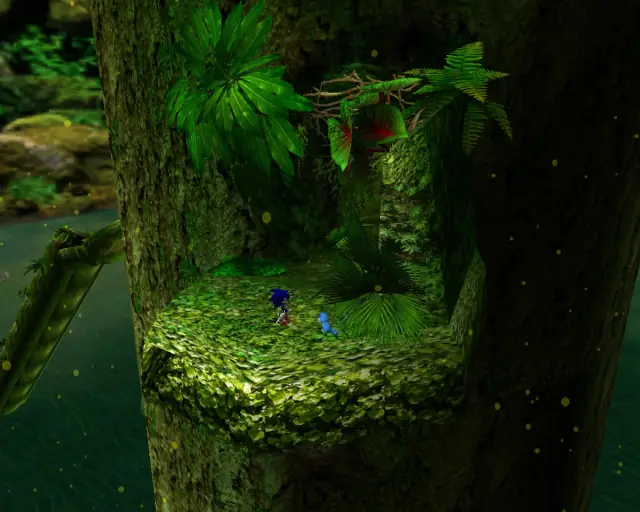
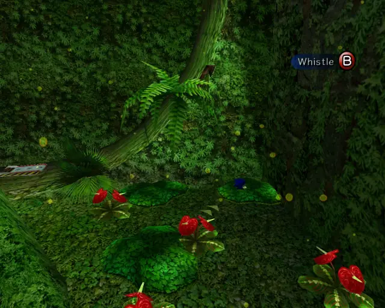
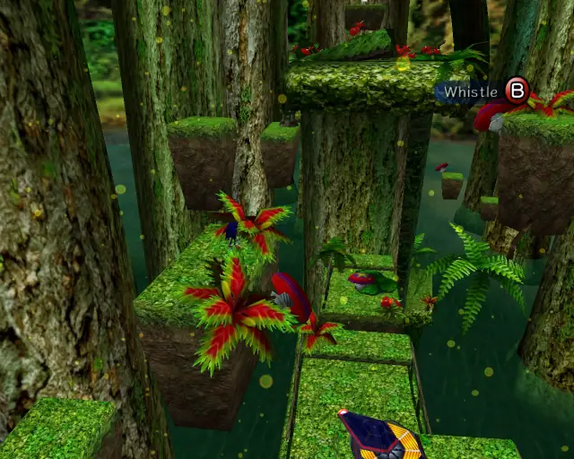
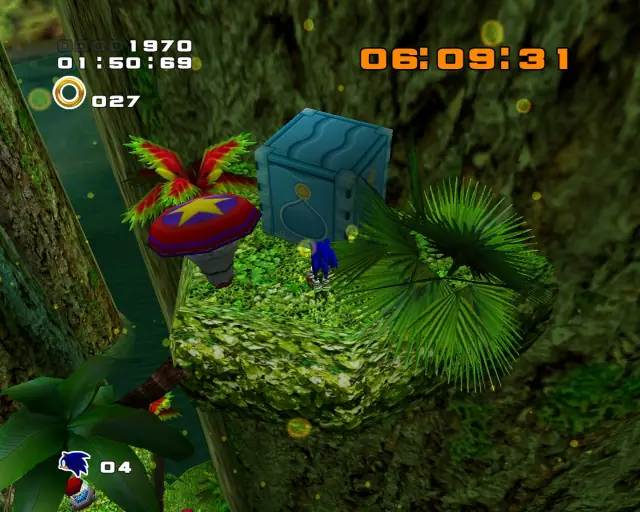
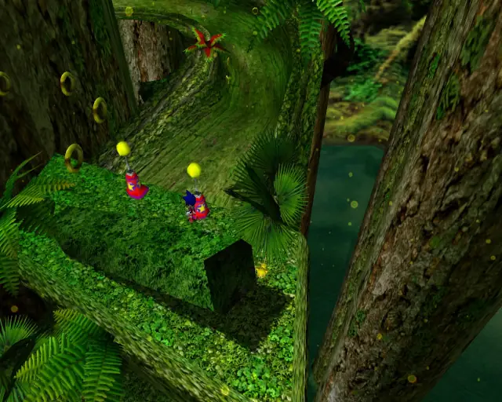

# Green Forest (Chronological)

## Green Forest Animal 1

[Back to Top](#)

## Green Forest Animal 2

[Back to Top](#)

## Green Forest Chao Box 1

[Back to Top](#)

## Green Forest Animal 3

[Back to Top](#)

## Green Forest Pipe 1 & Animal 4

[Back to Top](#)

## Green Forest Animal 5

[Back to Top](#)

## Green Forest Gold Beetle

[Back to Top](#)

## Green Forest Hidden 1 & Animal 6

[Back to Top](#)

## Green Forest Animal 7

[Back to Top](#)

## Green Forest Animal 8

[Back to Top](#)

## Green Forest Animal 9

[Back to Top](#)

## Green Forest Animal 10

[Back to Top](#)

## Green Forest Chao Box 2

[Back to Top](#)

## Green Forest Hidden 2 & Animal 11

[Back to Top](#)

## Green Forest Hidden 3 & Animal 12

[Back to Top](#)

## Green Forest Animal 13

[Back to Top](#)

## Green Forest Hidden 4 Animal 14

[Back to Top](#)

## Green Forest Chao Box 3

[Back to Top](#)

## Green Forest Pipe 2 & Animal 15

[Back to Top](#)

## Green Forest Animal 16

[Back to Top](#)

## Green Forest Animal 17

[Back to Top](#)

## Green Forest Animal 18

[Back to Top](#)
