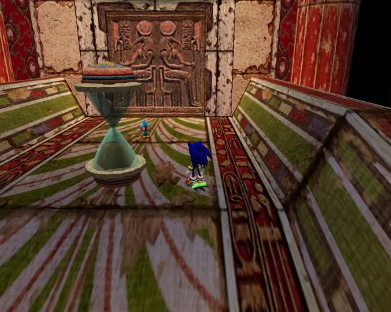
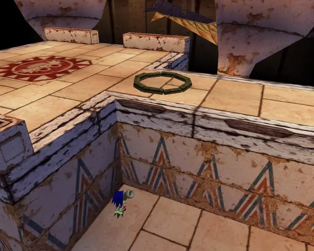
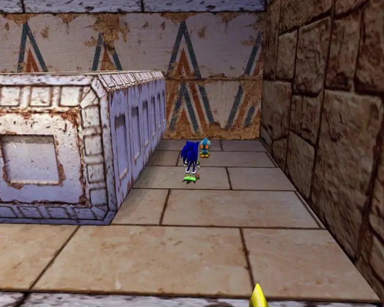
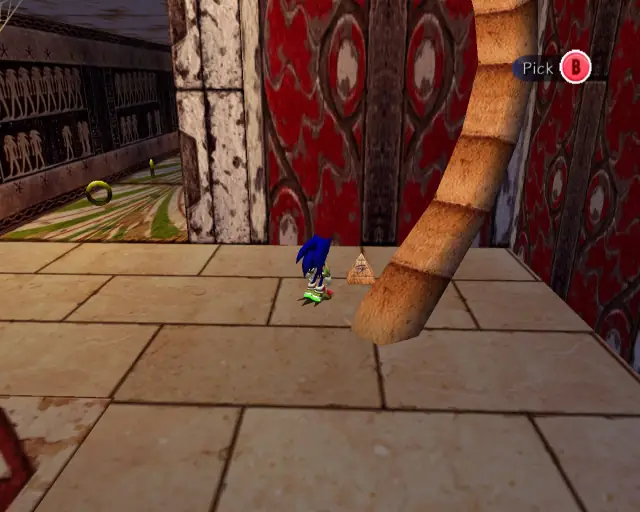
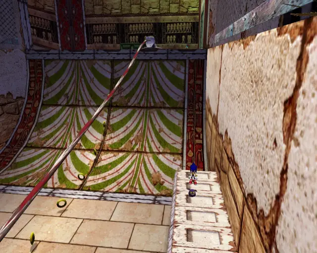
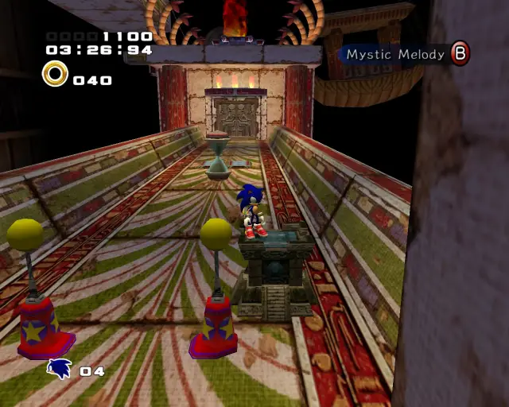
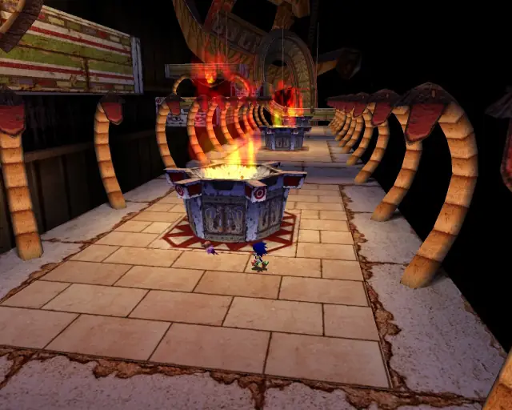
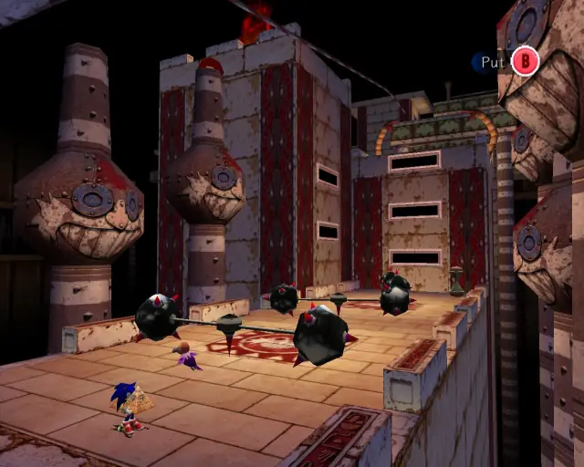
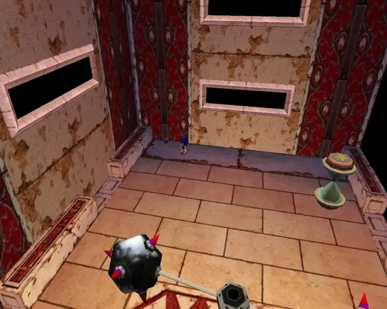

# Pyramid Cave (Chronological)

## Pyramid Cave Omochao 1

[Back to Top](#)

## Pyramid Cave Animal 1

[Back to Top](#)

## Pyramid Cave Chao Box 1

[Back to Top](#)

## Pyramid Cave Animal 2

[Back to Top](#)

## Pyramid Cave Animal 3

[Back to Top](#)

## Pyramid Cave Pipe 1 & Animal 4

[Back to Top](#)

## Pyramid Cave Pipe 2 & Animal 5

[Back to Top](#)

## Pyramid Cave Animal 6

[Back to Top](#)

## Pyramid Cave Pipe 3 & Animal 7

[Back to Top](#)

## Pyramid Cave Pipe 4 & Animal 8

[Back to Top](#)

## Pyramid Cave Chao Box 2

[Back to Top](#)

## Pyramid Cave Omochao 2

[Back to Top](#)

## Pyramid Cave Animal 9

[Back to Top](#)

## Pyramid Cave Omochao 3

[Back to Top](#)

## Pyramid Cave Animal 10

[Back to Top](#)

## Pyramid Cave Animal 11

[Back to Top](#)

## Pyramid Cave Omochao 4

[Back to Top](#)

## Pyramid Cave Animal 12

[Back to Top](#)

## Pyramid Cave Animal 13

[Back to Top](#)

## Pyramid Cave Animal 14

[Back to Top](#)

## Pyramid Cave Chao Box 3

[Back to Top](#)

## Pyramid Cave Animal 15

[Back to Top](#)

## Pyramid Cave Animal 16

[Back to Top](#)

## Pyramid Cave Animal 17

[Back to Top](#)

## Pyramid Cave Gold Beetle

[Back to Top](#)

## Pyramid Cave Animal 18

[Back to Top](#)

## Pyramid Cave Animal 19

[Back to Top](#)
