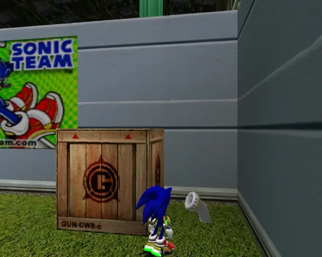
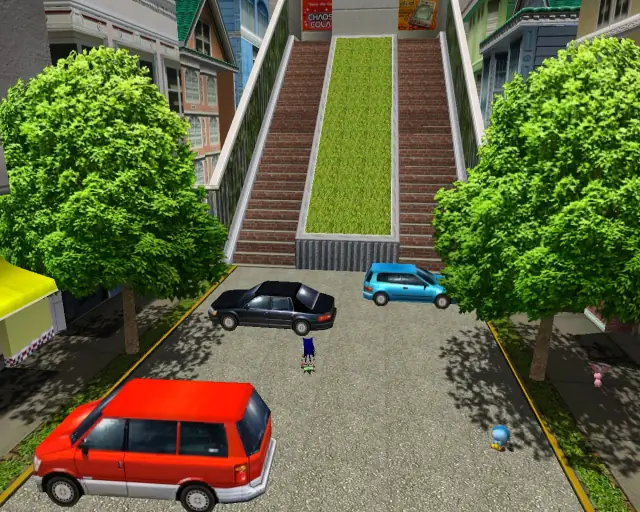
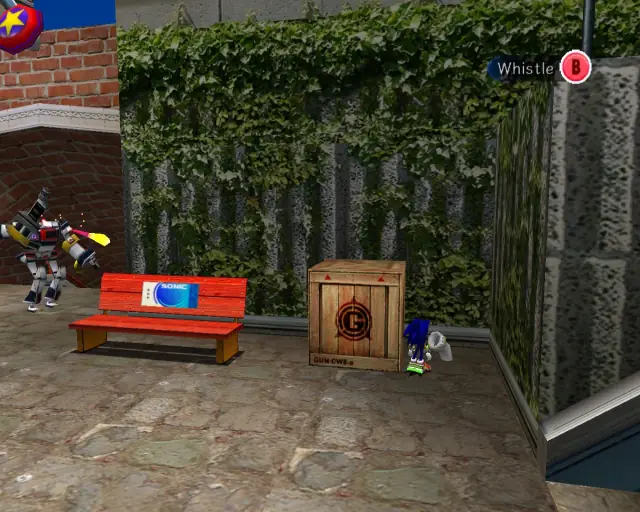
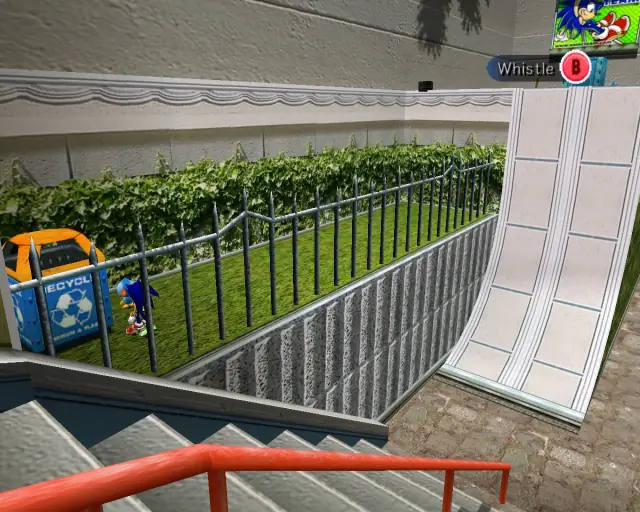
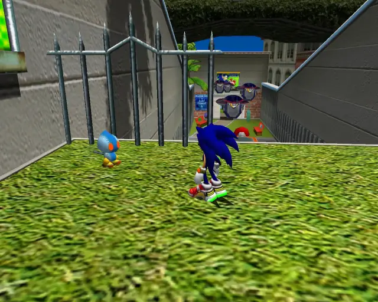

## animal 1

## omochao 1

## pipe 1

## animal 2

## omochao 2

## omochao 3

## omochao 4

## omochao 5

## pipe 2

## animal 3

## animal 4

## omochao 6

## animal 5

## omochao 7

## animal 6

## animal 7

## omochao 8

## chaobox 1

## animal 8

## animal 9

## hidden 1

## animal 10

## pipe 3

## animal 11

## goldbeetle 1

## omochao 10

## chaobox 2

## omochao 9

## hidden 2

## animal 12

## animal 13

## animal 14

## hidden 3

## animal 15

## animal 16

## hidden 4

## animal 17

## omochao 11

## chaobox 3

## omochao 12

## pipe 4

## animal 18

## animal 19

## omochao 13

## hidden 5

## animal 20

## omochao 14

