
## animal 1

## animal 2
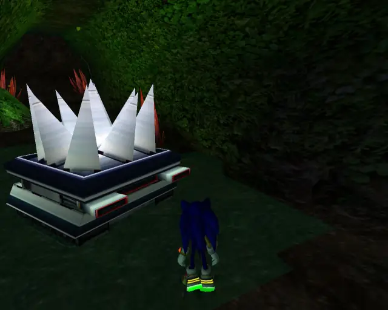

## chaobox 1

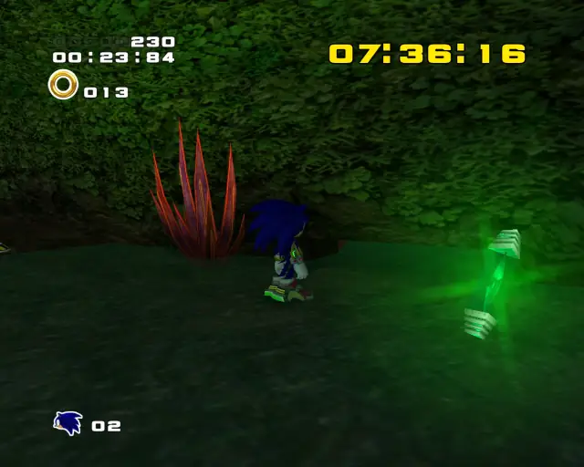

## animal 3

## pipe 1
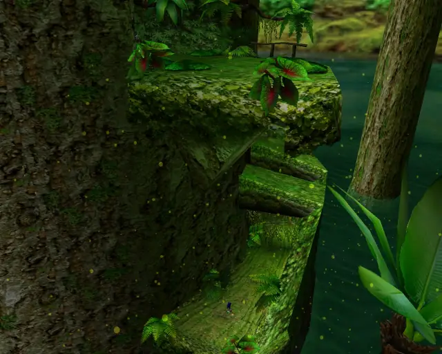

## animal 4
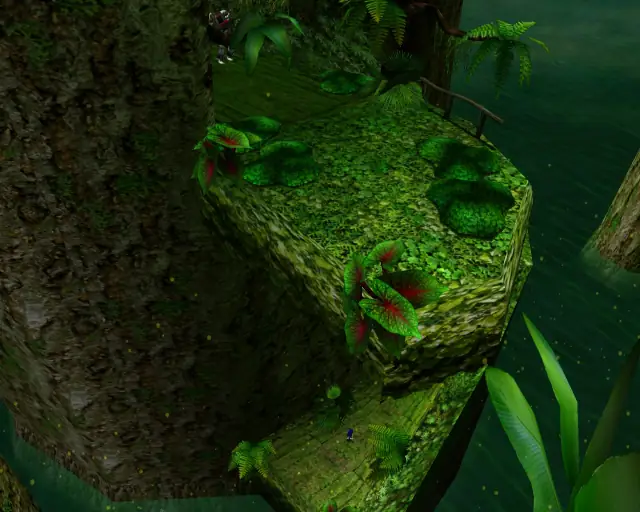
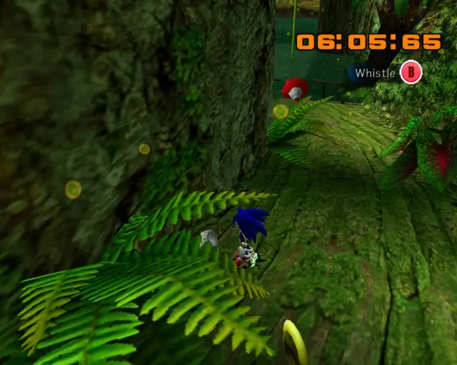

## animal 5
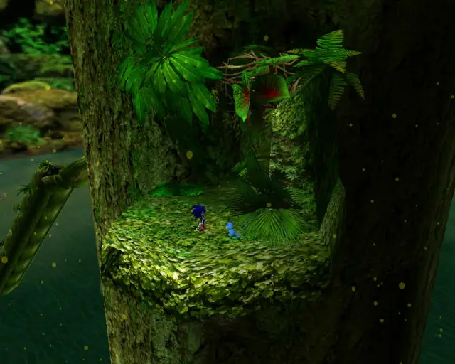

## goldbeetle 1

## hidden 1
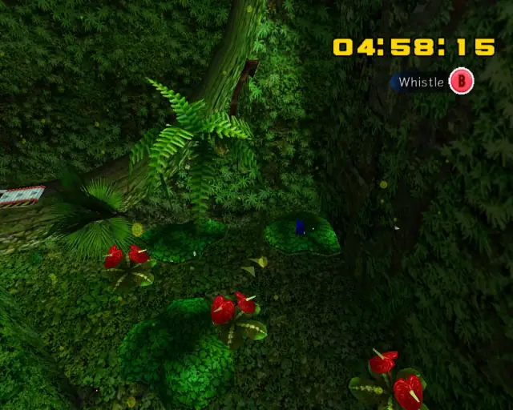

## animal 6

## animal 7
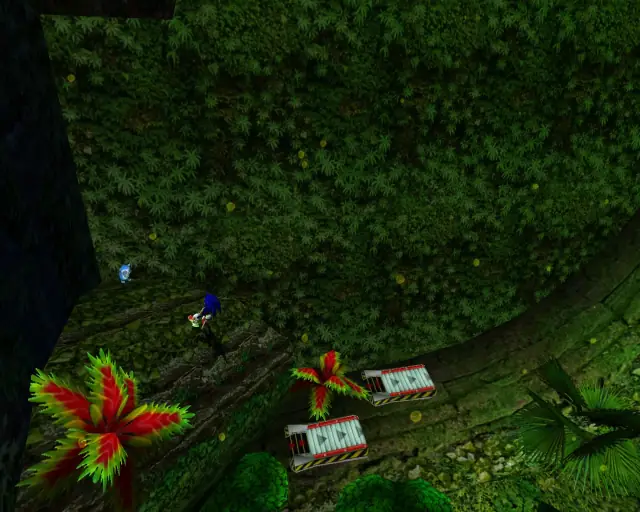

## animal 8

## animal 9
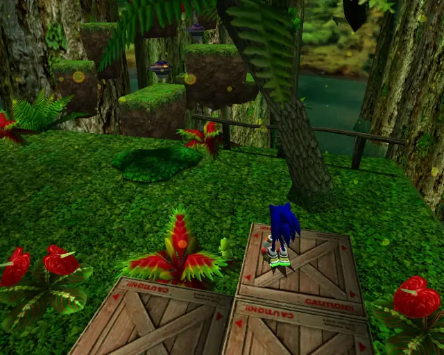

## animal 10

## chaobox 2

## hidden 2

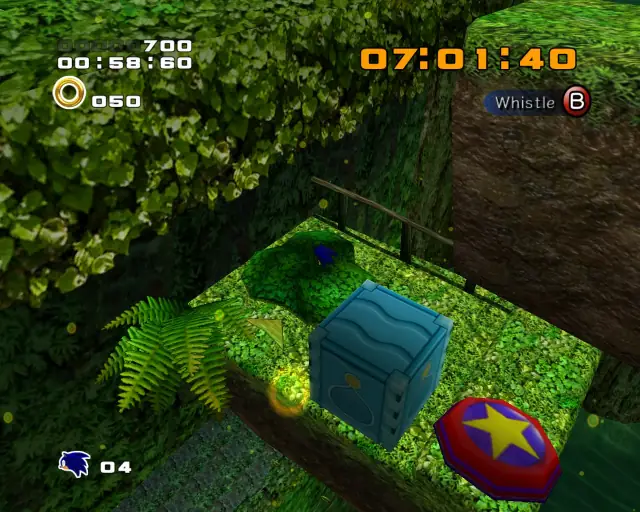

## animal 11

## hidden 3
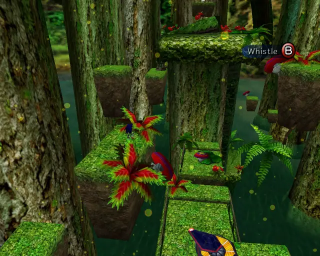

## animal 12
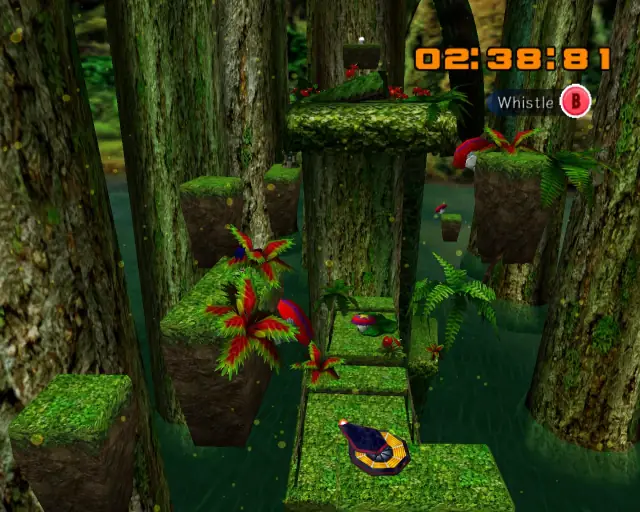

## animal 13
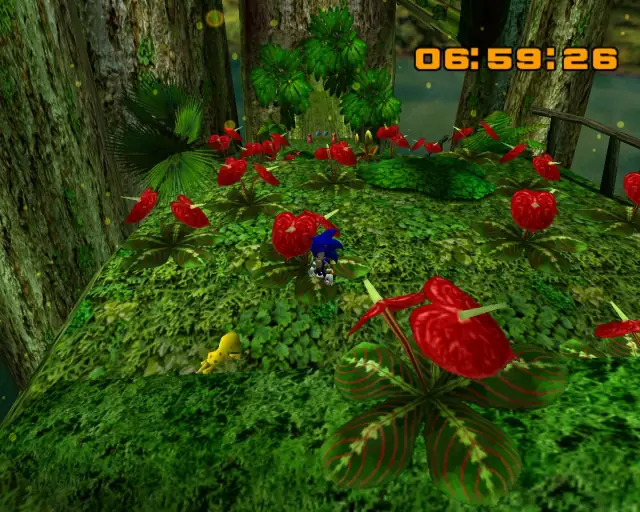

## hidden 4
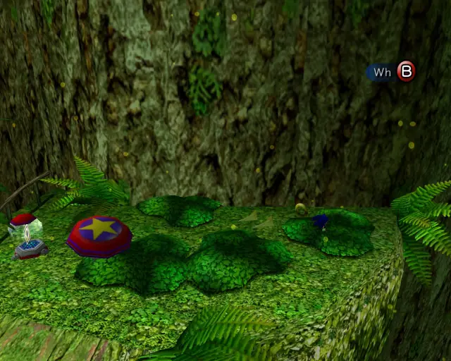

## chaobox 3
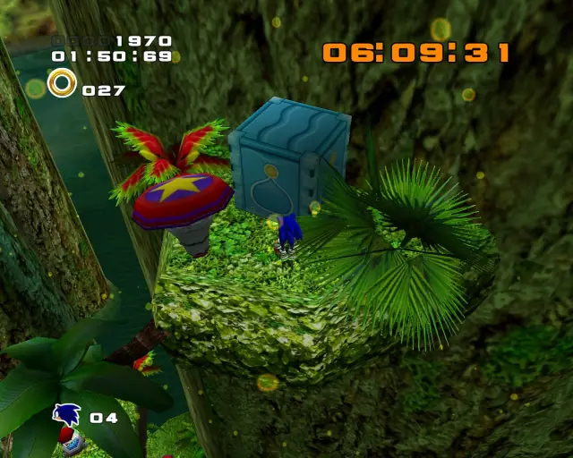

## pipe 2
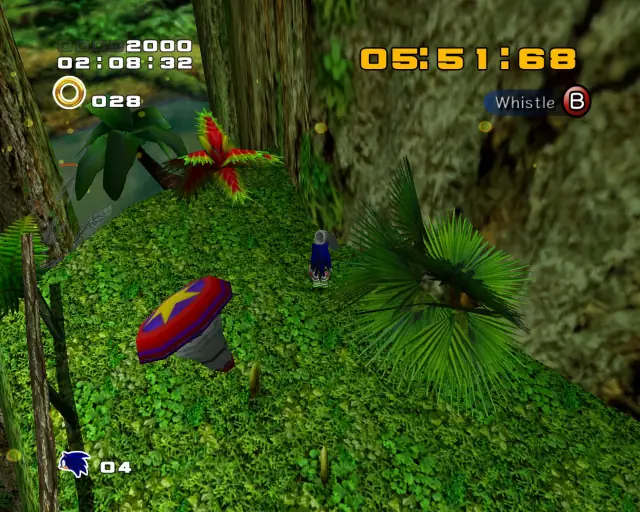

## animal 15

## animal 16
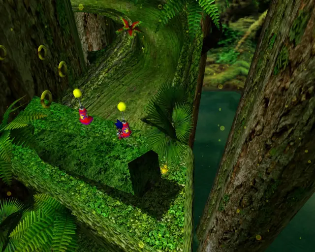

## animal 17
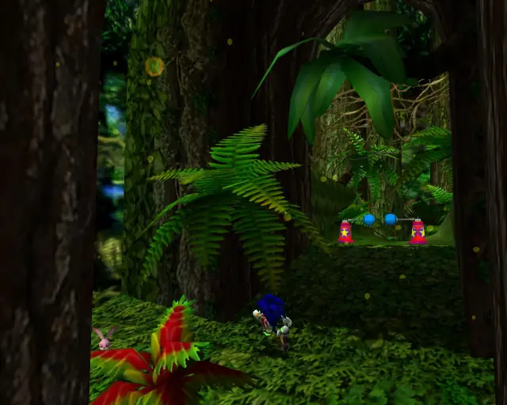

## animal 18
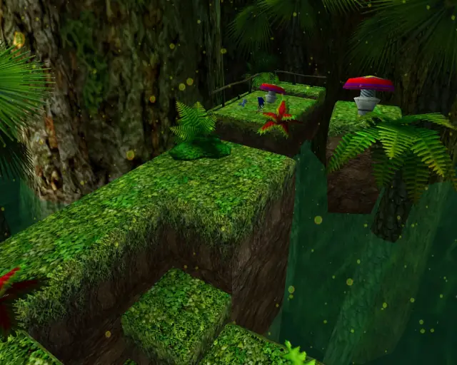

