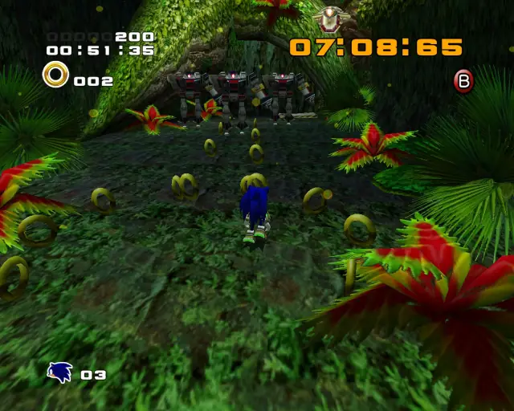

## animal 1

## animal 2

## chaobox 1

## animal 3

## pipe 1

## animal 4

## animal 5

## goldbeetle 1

## hidden 1

## animal 6

## animal 7

## animal 8

## animal 9

## animal 10

## chaobox 2

## hidden 2

## animal 11

## hidden 3

## animal 12

## animal 13

## hidden 4

## chaobox 3

## pipe 2

## animal 15

## animal 16

## animal 17

## animal 18

