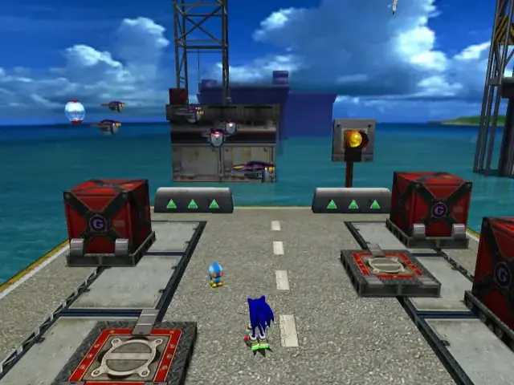
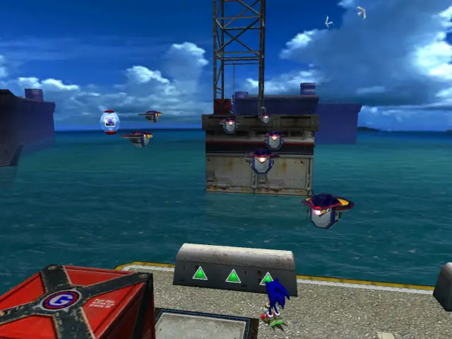
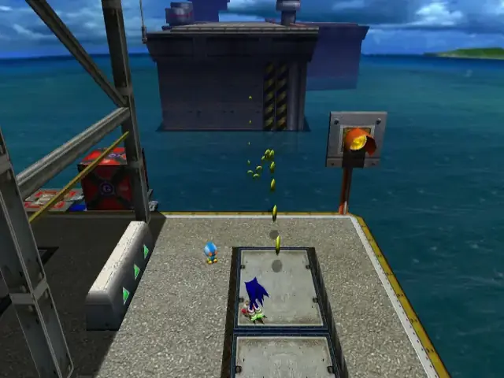
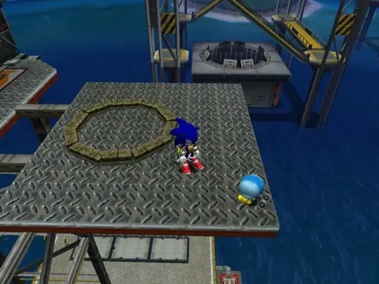
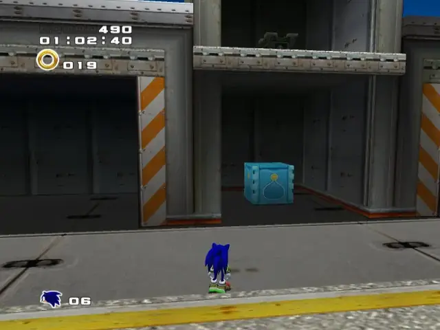
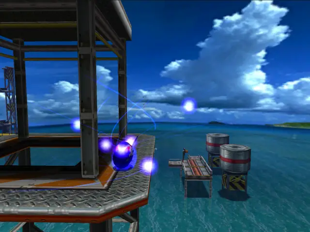
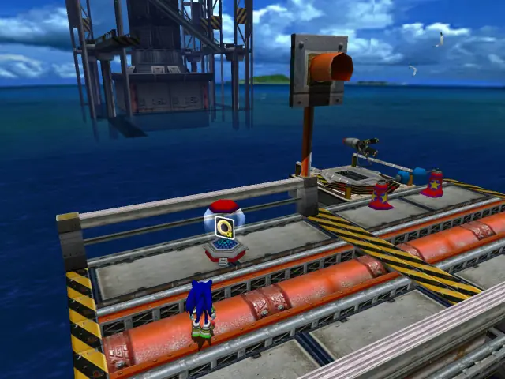
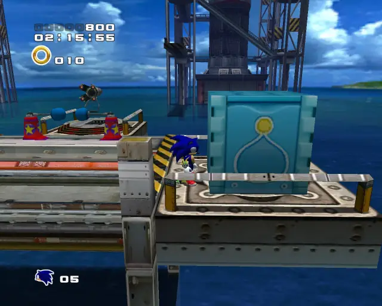

## animal 1

## animal 2

## animal 3

## pipe 1

## animal 4

## chaobox 1

## omochao 1

## animal 5

## goldbeetle 1

## life 1

## omochao 2

## omochao 3

## animal 6

## life 2

## animal 7

## chaobox 2

## animal 8

## omochao 4

## animal 9

## animal 10

## animal 11

## animal 12

## bignormal 1

## bighard 1

## item 1

## chaobox 3

## omochao 5

## animal 13

## animal 14

## item 2

## item 3

## item 4

## life 3

## item 5

