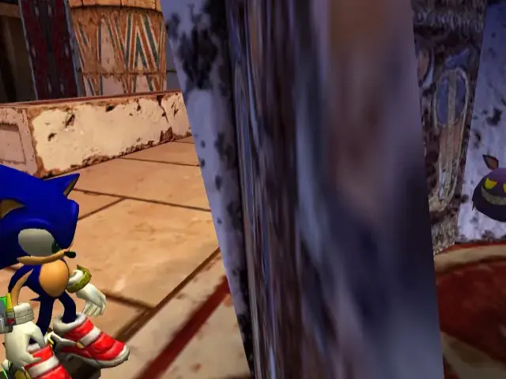

## omochao 1

## animal 1

## chaobox 1

## animal 2

## animal 3

## pipe 1

## animal 4

## pipe 2

## animal 5

## animal 6

## pipe 3

## animal 7

## pipe 4

## animal 8

## chaobox 2

## omochao 2

## animal 9

## omochao 3

## animal 10

## animal 11

## omochao 4

## animal 12

## animal 13

## animal 14

## chaobox 3

## animal 15

## animal 16

## animal 17

## goldbeetle 1

## animal 18

## animal 19

