
## omochao 1

## animal 1
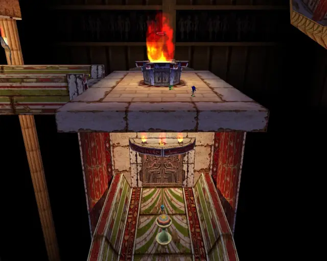
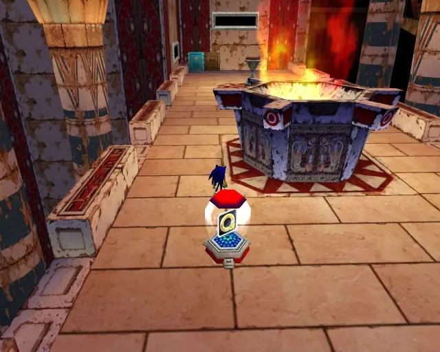

## chaobox 1

## animal 2

## animal 3
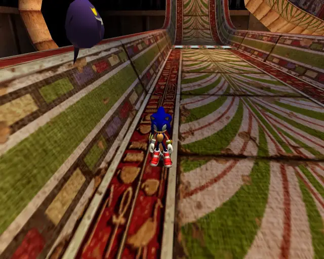

## pipe 1
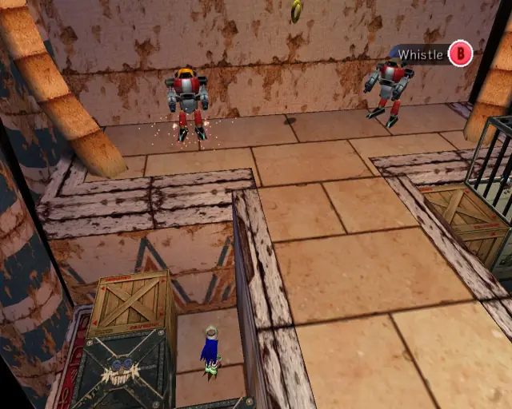

## animal 4

## pipe 2
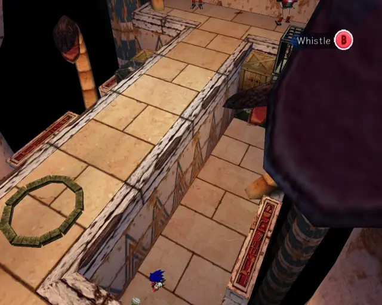

## animal 5

## animal 6
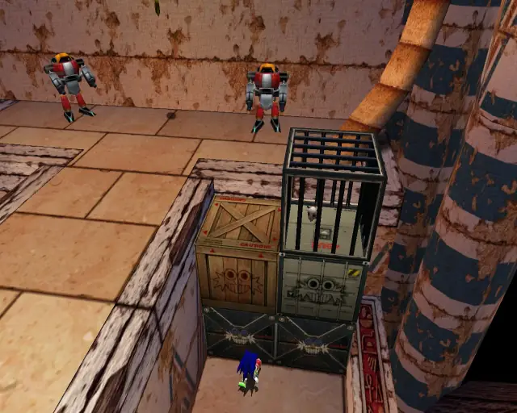

## pipe 3
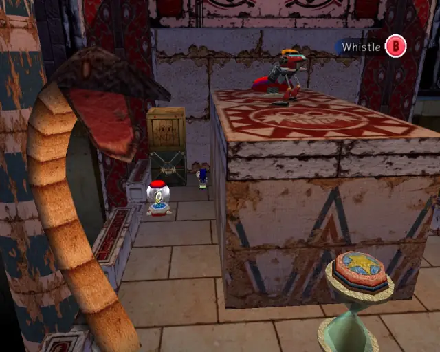

## animal 7

## pipe 4

## animal 8
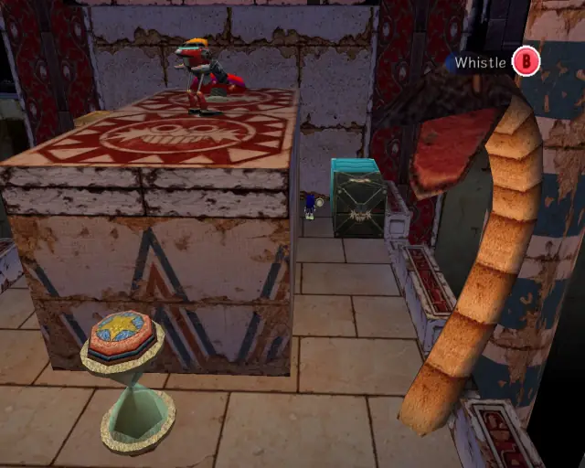

## chaobox 2

## omochao 2
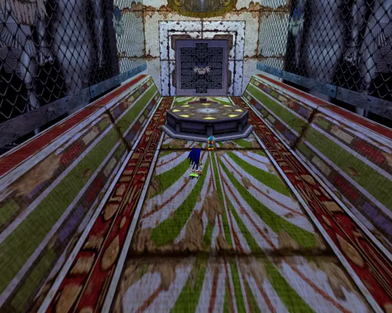

## animal 9

## omochao 3

## animal 10

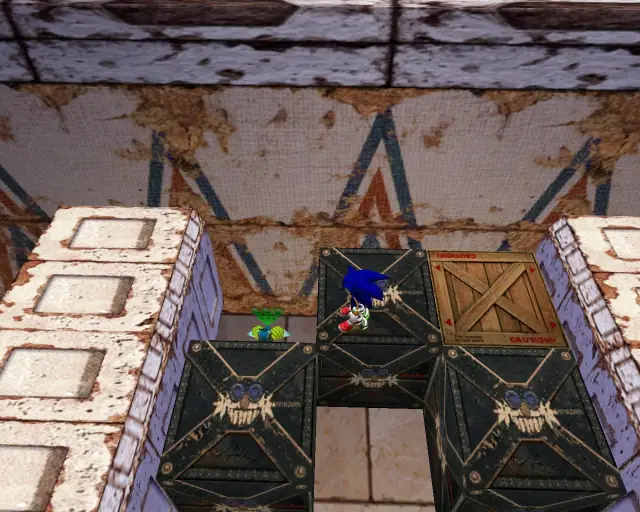

## animal 11
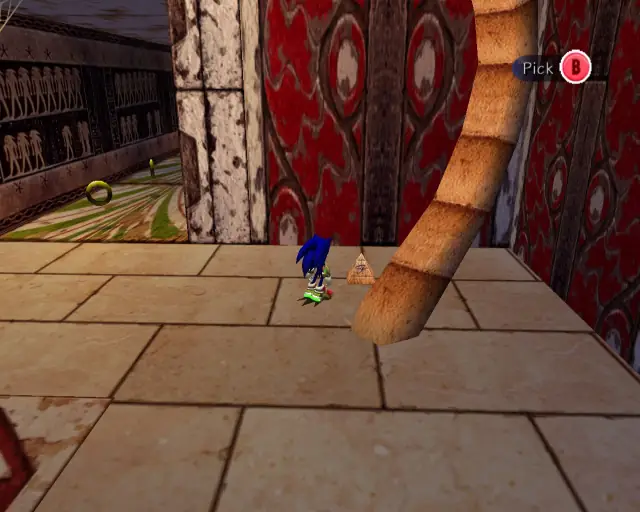
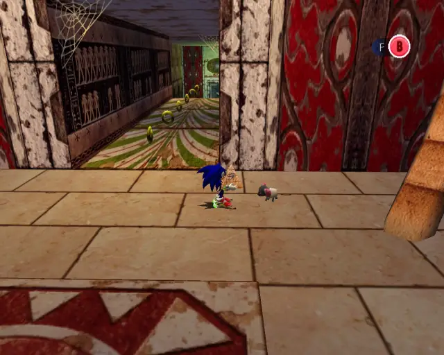

## omochao 4
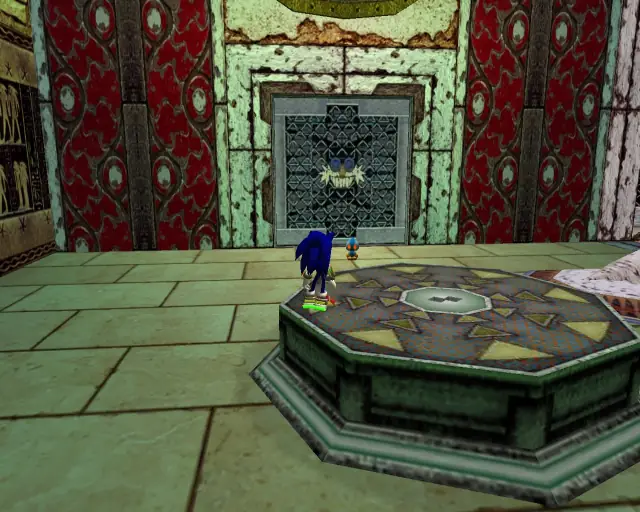

## animal 12

## animal 13

## animal 14

## chaobox 3

## animal 15
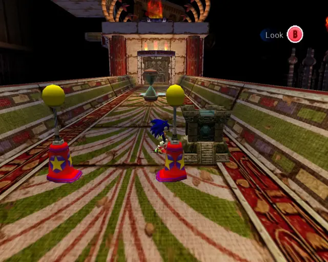

## animal 16
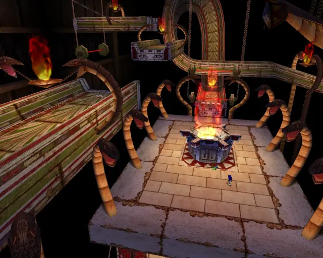

## animal 17

## goldbeetle 1
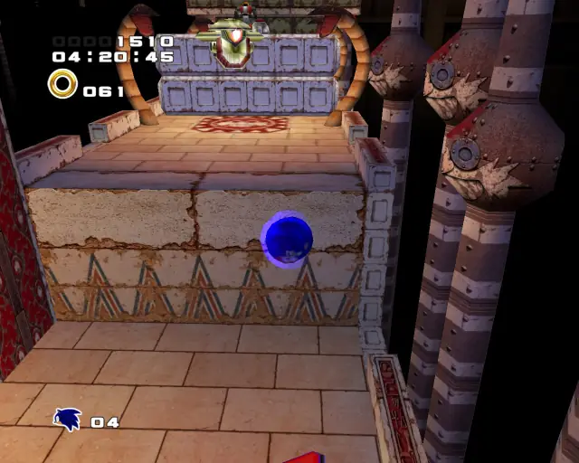

## animal 18

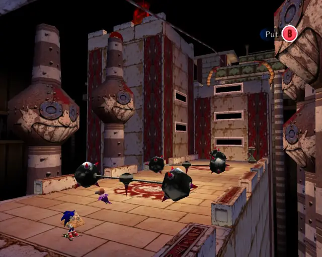

## animal 19

