
## big 1

## item 1
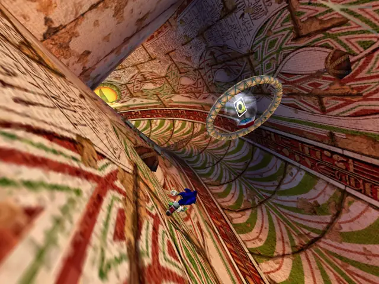

## item 2
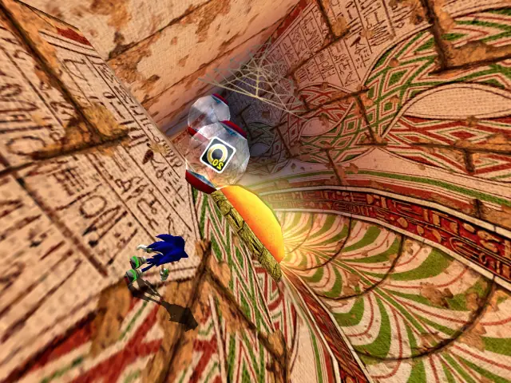

## item 3
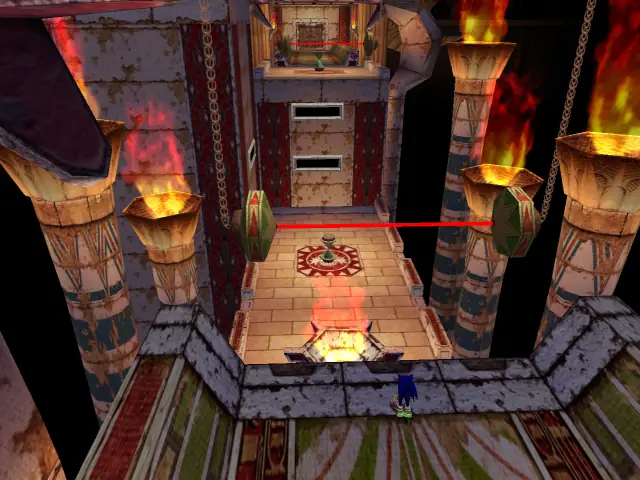
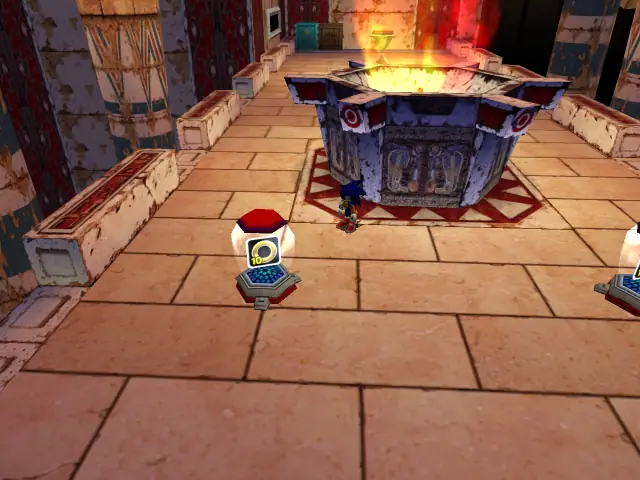

## item 4

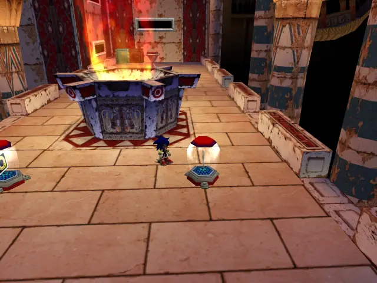

## item 5

## item 6
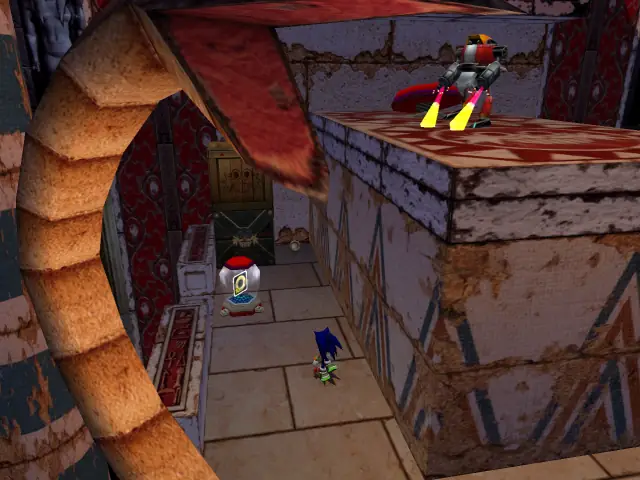

## item 7
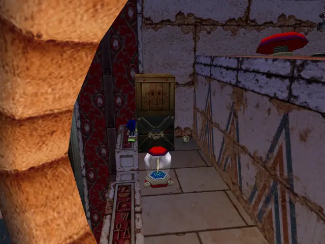
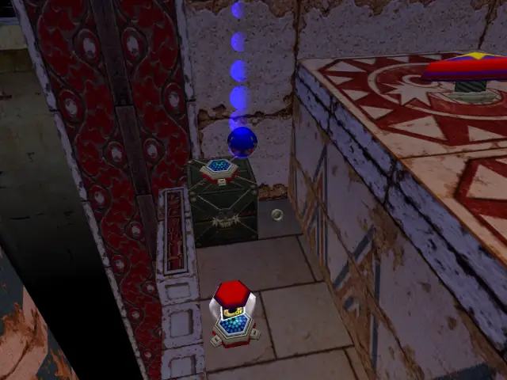

## item 8
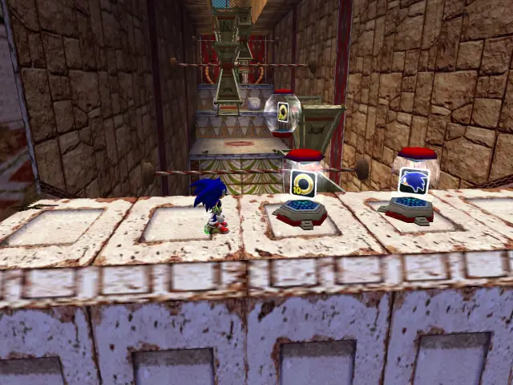

## item 9
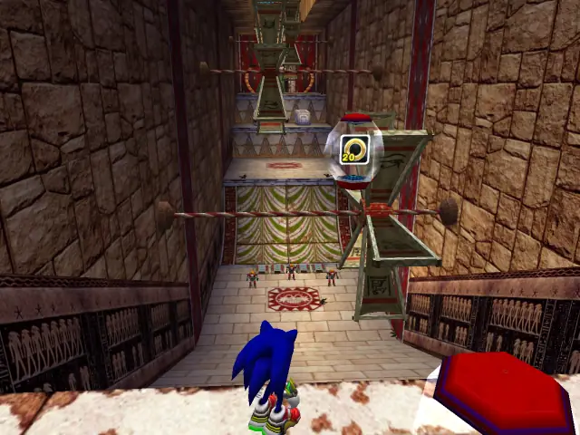

## item 10
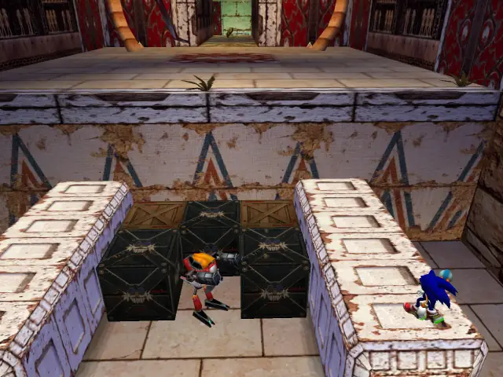
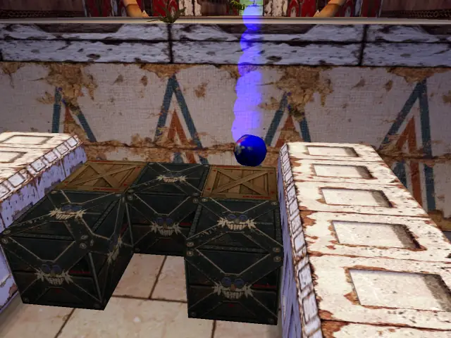

## item 11
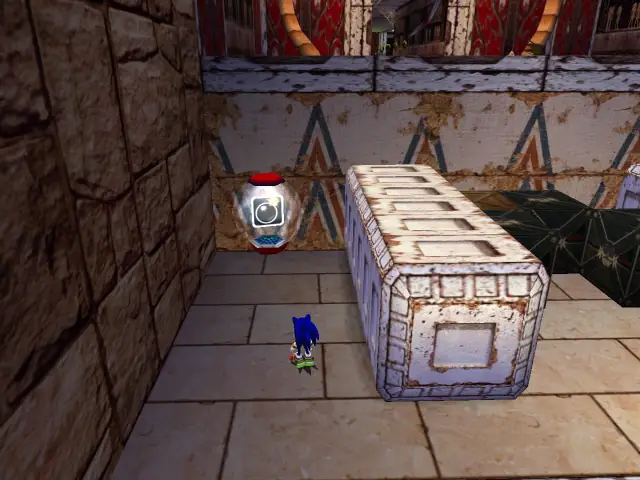

## item 12
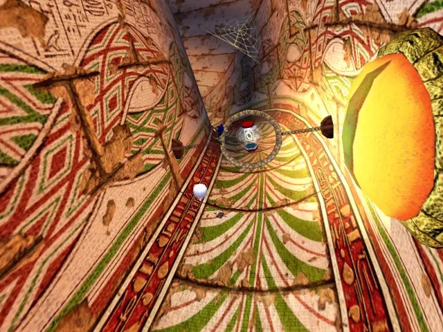

## item 13
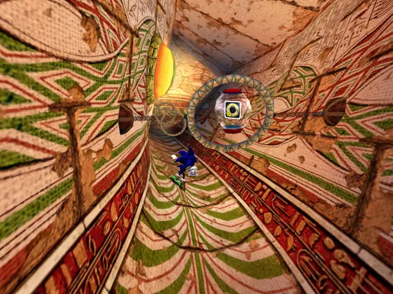

## item 14

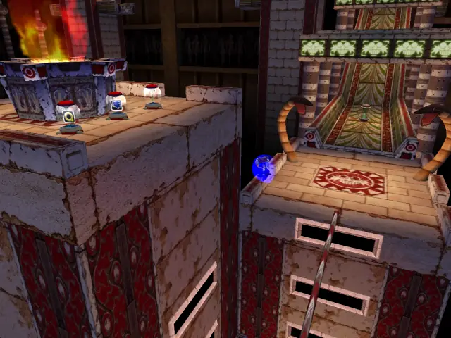
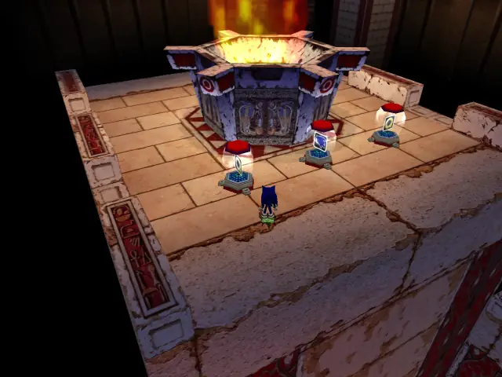

## item 15

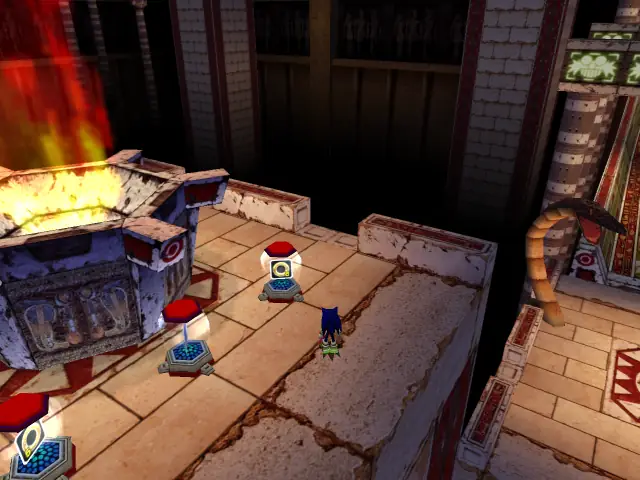

## life 1
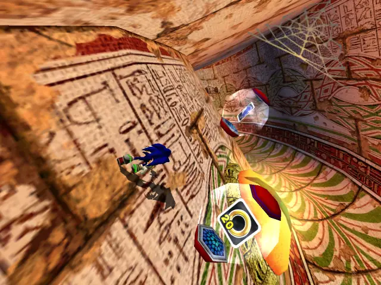

## life 2
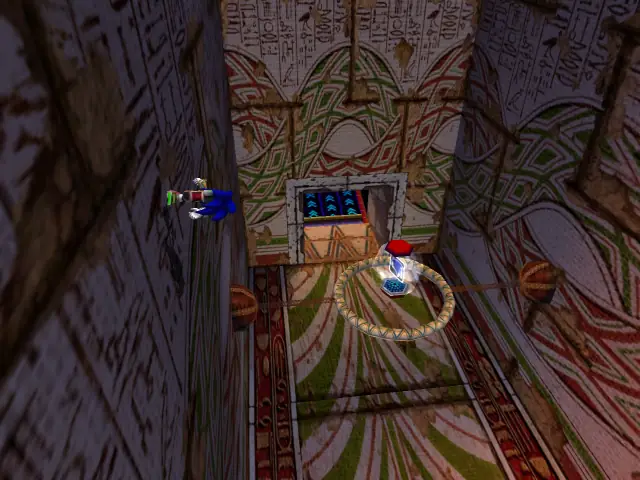

## life 3
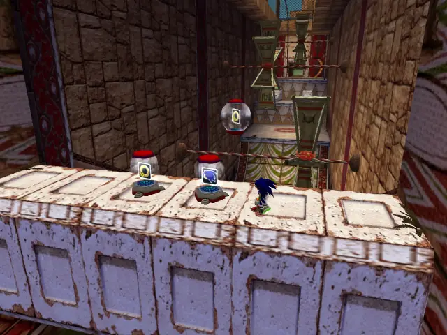

## life 4
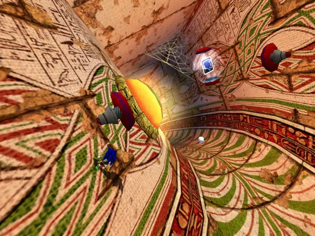

## life 5
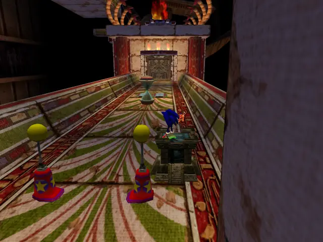
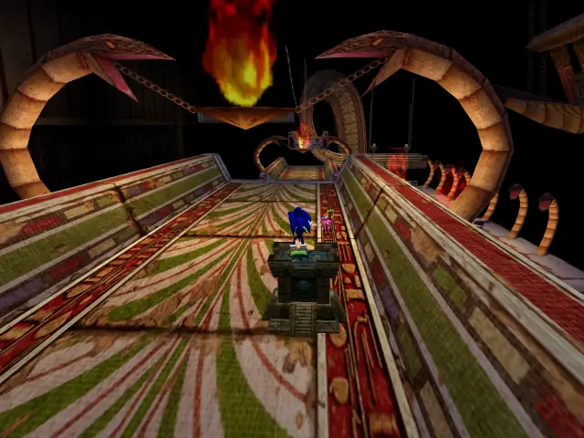

## life 6
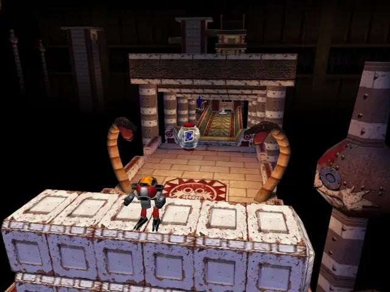

## life 7

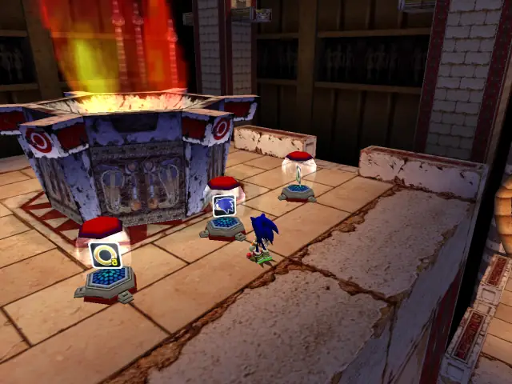

