# Sonic Stages (Animalsanity)

## Table of Contents:

1. [ City Escape ](#city-escape)
1. [ Metal Harbor ](#metal-harbor)
1. [ Green Forest ](#green-forest)
1. [ Pyramid Cave ](#pyramid-cave)
1. [ Crazy Gadget ](#crazy-gadget)
1. [ Final Rush ](#final-rush)
1. [ Green Hill ](#green-hill)

# City Escape

## City Escape Animal 1
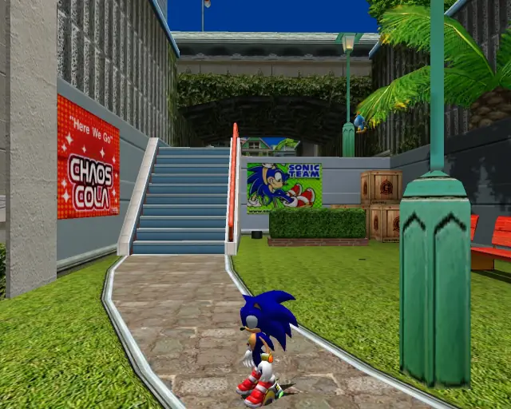
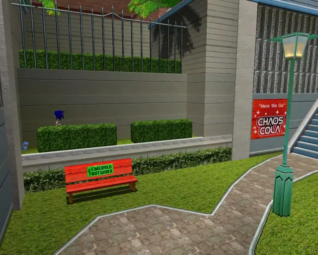

[Back to Top](#)

## City Escape Animal 2

[Back to Top](#)

## City Escape Animal 3

[Back to Top](#)

## City Escape Animal 4

[Back to Top](#)

## City Escape Animal 5
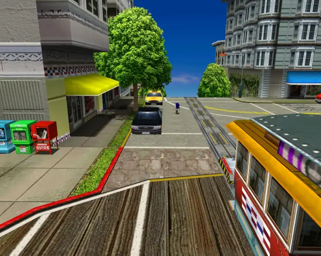
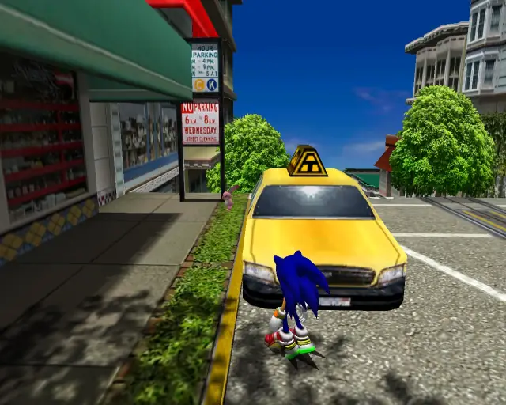

[Back to Top](#)

## City Escape Animal 6

[Back to Top](#)

## City Escape Animal 7

[Back to Top](#)

## City Escape Animal 8

[Back to Top](#)

## City Escape Animal 9

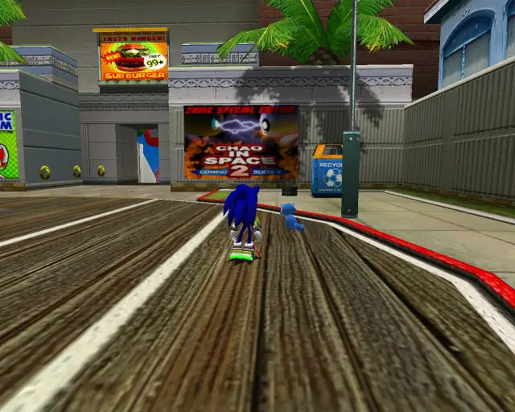

[Back to Top](#)

## City Escape Animal 10

[Back to Top](#)

## City Escape Animal 11
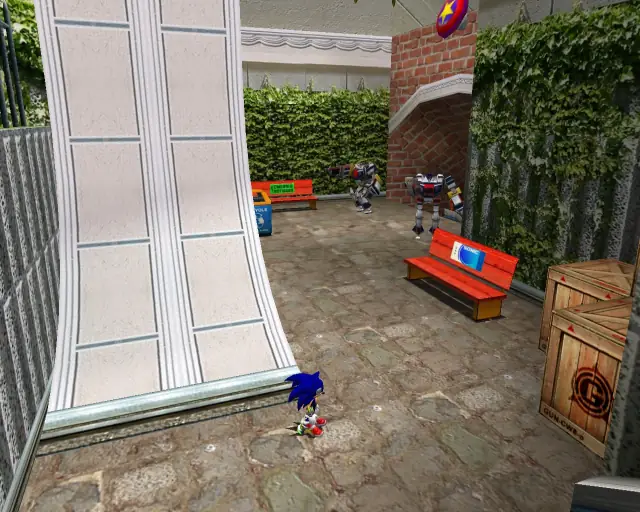

[Back to Top](#)

## City Escape Animal 12

[Back to Top](#)

## City Escape Animal 13

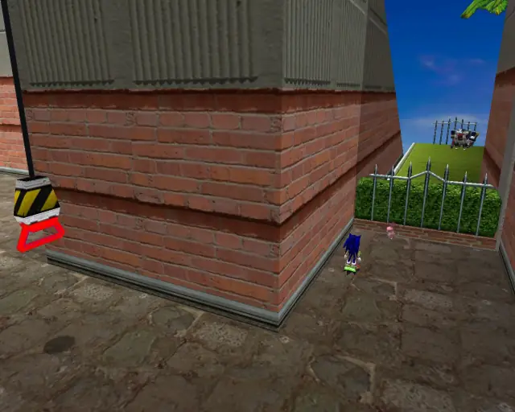

[Back to Top](#)

## City Escape Animal 14

[Back to Top](#)

## City Escape Animal 15

[Back to Top](#)

## City Escape Animal 16

[Back to Top](#)

## City Escape Animal 17

[Back to Top](#)

## City Escape Animal 18

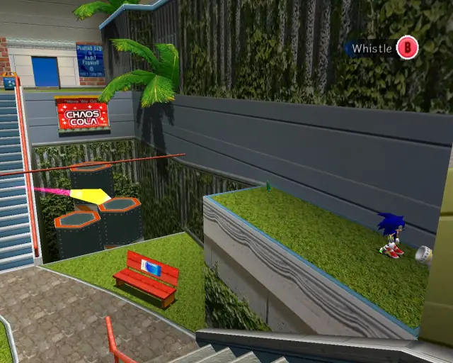

[Back to Top](#)

## City Escape Animal 19

[Back to Top](#)

## City Escape Animal 20

[Back to Top](#)

# Metal Harbor

## Metal Harbor Animal 1

[Back to Top](#)

## Metal Harbor Animal 2

[Back to Top](#)

## Metal Harbor Animal 3

[Back to Top](#)

## Metal Harbor Animal 4

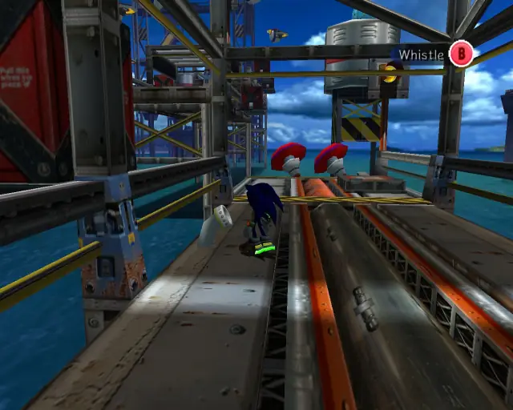

[Back to Top](#)

## Metal Harbor Animal 5

[Back to Top](#)

## Metal Harbor Animal 6

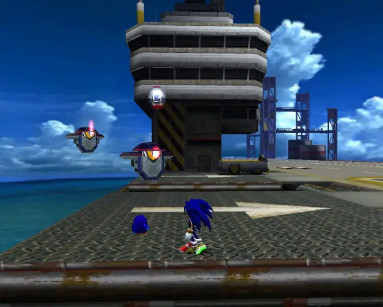

[Back to Top](#)

## Metal Harbor Animal 7

[Back to Top](#)

## Metal Harbor Animal 8

[Back to Top](#)

## Metal Harbor Animal 9

[Back to Top](#)

## Metal Harbor Animal 10

[Back to Top](#)

## Metal Harbor Animal 11

[Back to Top](#)

## Metal Harbor Animal 12

[Back to Top](#)

## Metal Harbor Animal 13

[Back to Top](#)

## Metal Harbor Animal 14

[Back to Top](#)

# Green Forest 

## Green Forest Animal 1

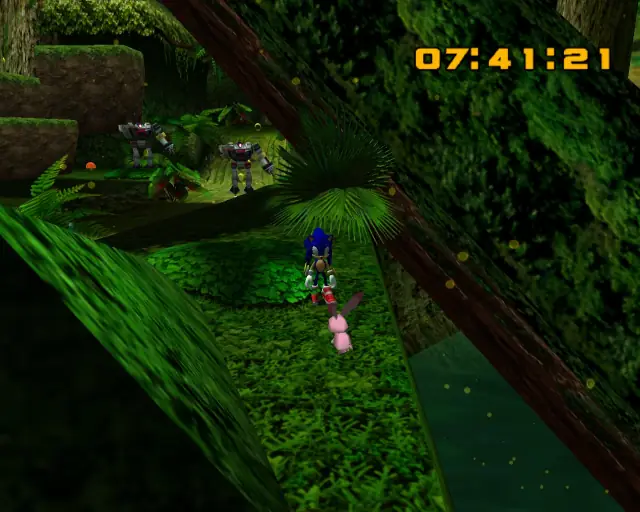

[Back to Top](#)

## Green Forest Animal 2

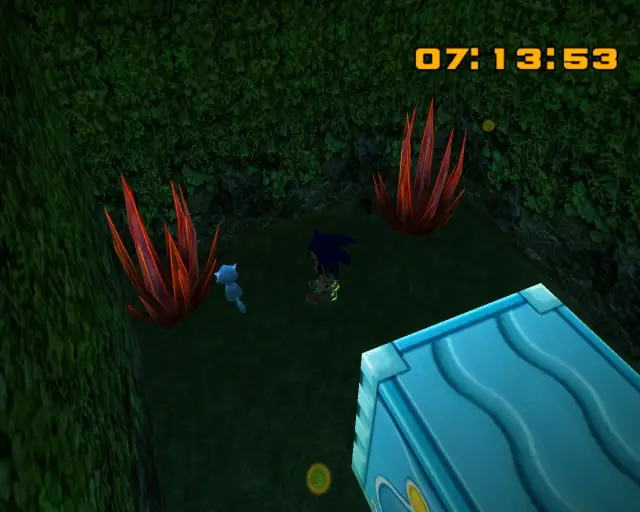

[Back to Top](#)

## Green Forest Animal 3

[Back to Top](#)

## Green Forest Animal 4

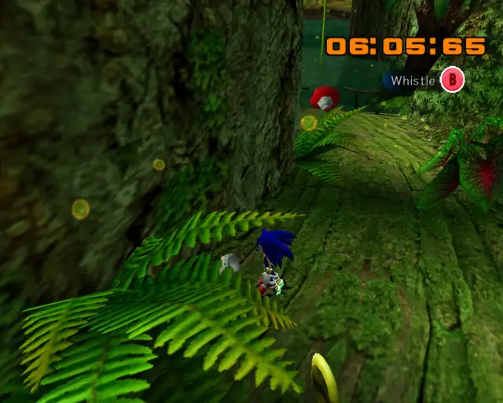

[Back to Top](#)

## Green Forest Animal 5

[Back to Top](#)

## Green Forest Animal 6

[Back to Top](#)

## Green Forest Animal 7

[Back to Top](#)

## Green Forest Animal 8

[Back to Top](#)

## Green Forest Animal 9

[Back to Top](#)

## Green Forest Animal 10

[Back to Top](#)

## Green Forest Animal 11

[Back to Top](#)

## Green Forest Animal 12

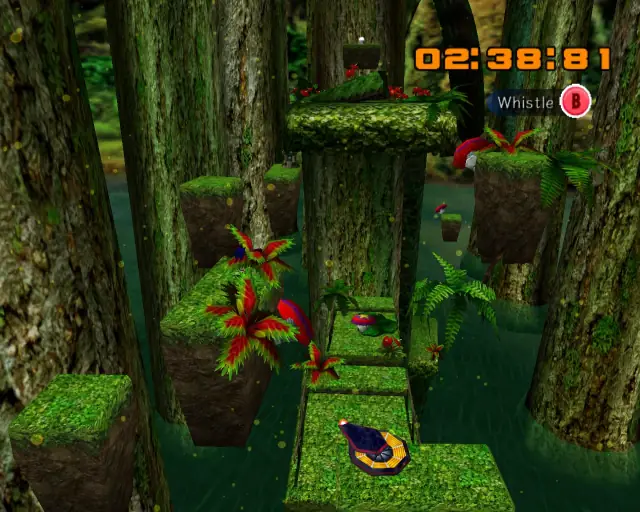

[Back to Top](#)

## Green Forest Animal 13

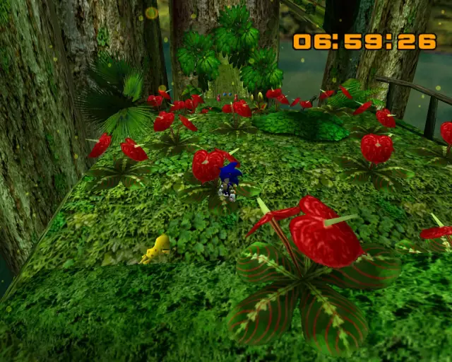

[Back to Top](#)

## Green Forest Animal 14

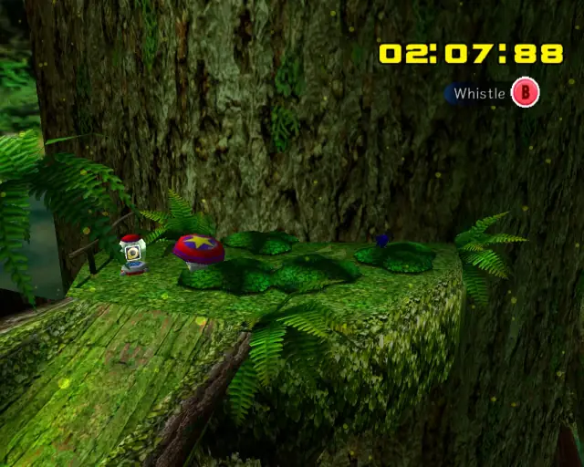

[Back to Top](#)

## Green Forest Animal 15

[Back to Top](#)

## Green Forest Animal 16

[Back to Top](#)

## Green Forest Animal 17

[Back to Top](#)

## Green Forest Animal 18

[Back to Top](#)

# Pyramid Cave

## Pyramid Cave Animal 1

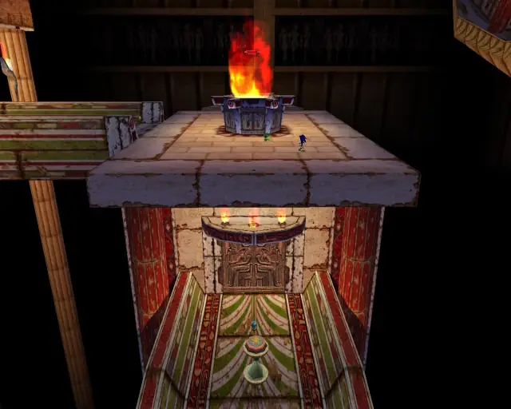

[Back to Top](#)

## Pyramid Cave Animal 2

[Back to Top](#)

## Pyramid Cave Animal 3

[Back to Top](#)

## Pyramid Cave Animal 4

[Back to Top](#)

## Pyramid Cave Animal 5

[Back to Top](#)

## Pyramid Cave Animal 6

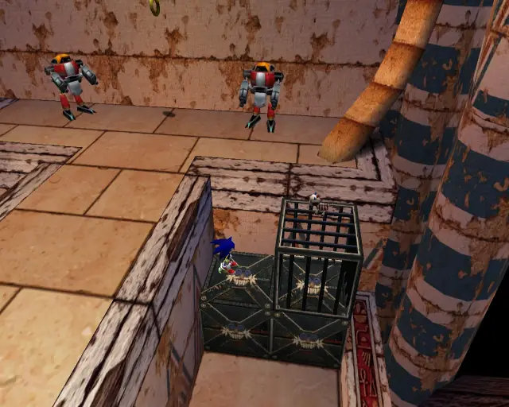

[Back to Top](#)

## Pyramid Cave Animal 7

[Back to Top](#)

## Pyramid Cave Animal 8

[Back to Top](#)

## Pyramid Cave Animal 9

[Back to Top](#)

## Pyramid Cave Animal 10
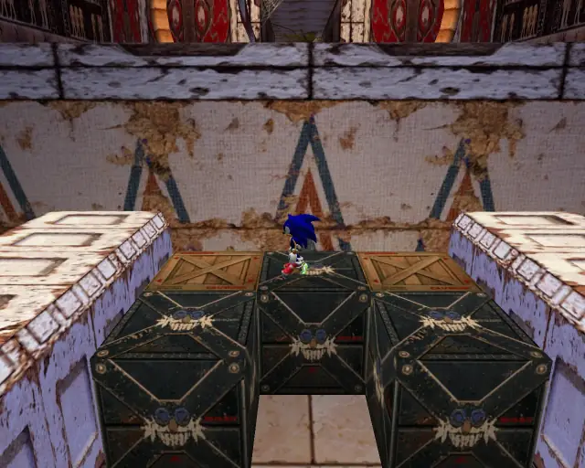

[Back to Top](#)

## Pyramid Cave Animal 11

[Back to Top](#)

## Pyramid Cave Animal 12

[Back to Top](#)

## Pyramid Cave Animal 13

[Back to Top](#)

## Pyramid Cave Animal 14

[Back to Top](#)

## Pyramid Cave Animal 15
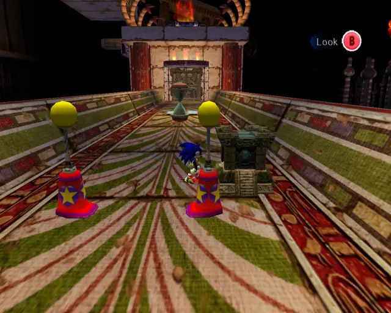

[Back to Top](#)

## Pyramid Cave Animal 16

[Back to Top](#)

## Pyramid Cave Animal 17

[Back to Top](#)

## Pyramid Cave Animal 18

[Back to Top](#)

## Pyramid Cave Animal 19

[Back to Top](#)

## Pyramid Cave Animal Bonus
- This animal isn't a check, but it is in the level.
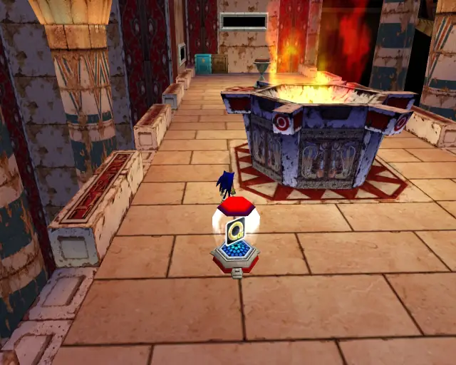

[Back to Top](#)

# Crazy Gadget

## Crazy Gadget Animal 1

[Back to Top](#)

## Crazy Gadget Animal 2

[Back to Top](#)

## Crazy Gadget Animal 3

[Back to Top](#)

## Crazy Gadget Animal 4

[Back to Top](#)

## Crazy Gadget Animal 5

[Back to Top](#)

## Crazy Gadget Animal 6
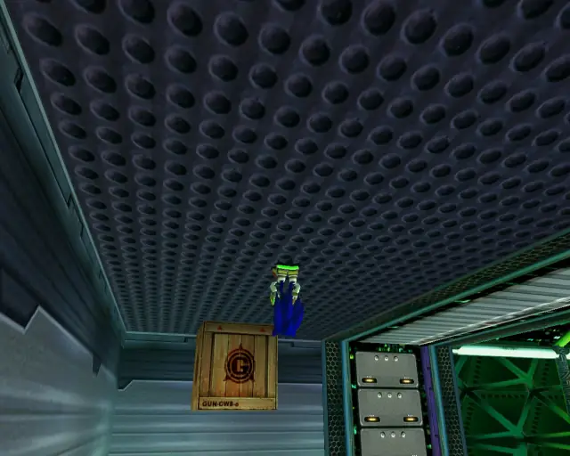

[Back to Top](#)

## Crazy Gadget Animal 7

[Back to Top](#)

## Crazy Gadget Animal 8

[Back to Top](#)

## Crazy Gadget Animal 9

[Back to Top](#)

## Crazy Gadget Animal 10

[Back to Top](#)

## Crazy Gadget Animal 11

[Back to Top](#)

## Crazy Gadget Animal 12

[Back to Top](#)

## Crazy Gadget Animal 13

[Back to Top](#)

## Crazy Gadget Animal 14

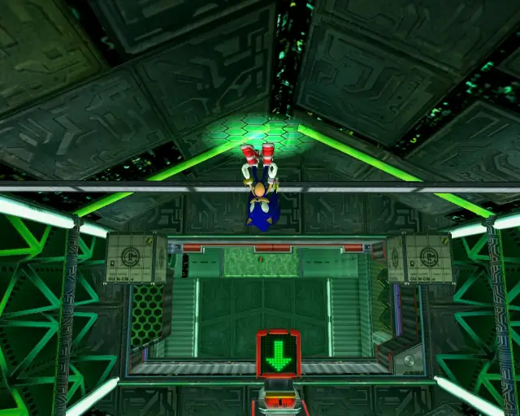

[Back to Top](#)

## Crazy Gadget Animal 15

[Back to Top](#)

## Crazy Gadget Animal 16

[Back to Top](#)

## Crazy Gadget Animal Bonus
- This animal isn't a check, but it is in the level.  

[Back to Top](#)

# Final Rush

## Final Rush Animal 1

[Back to Top](#)

## Final Rush Animal 2

[Back to Top](#)

## Final Rush Animal 3

[Back to Top](#)

## Final Rush Animal 4

[Back to Top](#)

## Final Rush Animal 5

[Back to Top](#)

## Final Rush Animal 6

[Back to Top](#)

## Final Rush Animal 7

[Back to Top](#)

## Final Rush Animal 8

[Back to Top](#)

## Final Rush Animal 9

[Back to Top](#)

## Final Rush Animal 10

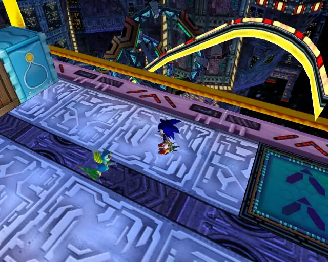

[Back to Top](#)

## Final Rush Animal 11

[Back to Top](#)

## Final Rush Animal 12

[Back to Top](#)

## Final Rush Animal 13

[Back to Top](#)

## Final Rush Animal 14

[Back to Top](#)

## Final Rush Animal 15

[Back to Top](#)

## Final Rush Animal 16

[Back to Top](#)

# Green Hill
No Animals in this stage  

[Back to Top](#)

