# Sonic Stages (Chronological)

## Table of Contents:

1. [ City Escape ](#city-escape)
1. [ Metal Harbor ](#metal-harbor)
1. [ Green Forest ](#green-forest)
1. [ Pyramid Cave ](#pyramid-cave)
1. [ Crazy Gadget ](#crazy-gadget)
1. [ Final Rush ](#final-rush)
1. [ Green Hill ](#green-hill)

# City Escape

## City Escape Omochao 1

[Back to Top](#)

## City Escape Pipe 1

[Back to Top](#)

## City Escape Omochao 2

[Back to Top](#)

## City Escape Omochao 3

[Back to Top](#)

## City Escape Omochao 4

[Back to Top](#)

## City Escape Omochao 5

[Back to Top](#)

## City Escape Pipe 2

[Back to Top](#)

## City Escape Omochao 6

[Back to Top](#)

## City Escape Omochao 7

[Back to Top](#)

## City Escape Omochao 8

[Back to Top](#)

## City Escape Chao Box 1
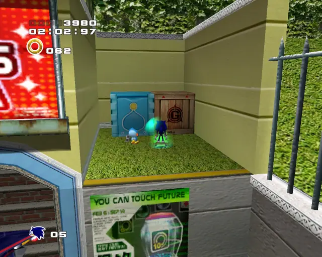  

[Back to Top](#)

## City Escape Hidden 1

[Back to Top](#)

## City Escape Pipe 3

[Back to Top](#)

## City Escape Gold Beetle
  

[Back to Top](#)

## City Escape Omochao 10

[Back to Top](#)

## City Escape Chao Box 2
  

[Back to Top](#)

## City Escape Omochao 9

[Back to Top](#)

## City Escape Hidden 2

[Back to Top](#)

## City Escape Hidden 3
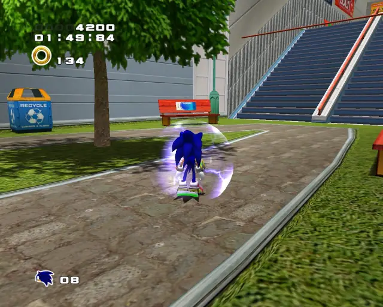

[Back to Top](#)

## City Escape Hidden 4

[Back to Top](#)

## City Escape Omochao 11

[Back to Top](#)

## City Escape Chao Box 3
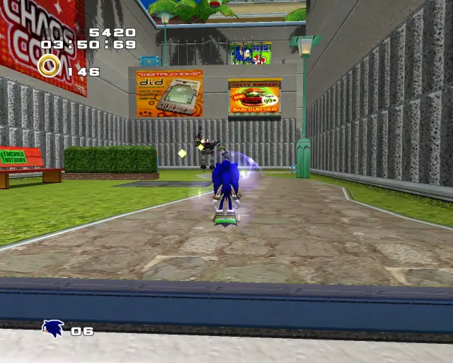  

[Back to Top](#)

## City Escape Omochao 12

[Back to Top](#)

## City Escape Pipe 4

[Back to Top](#)

## City Escape Omochao 13

[Back to Top](#)

## City Escape Hidden 5

[Back to Top](#)

## City Escape Omochao 14

[Back to Top](#)

# Metal Harbor

## Metal Harbor Pipe 1

[Back to Top](#)

## Metal Harbor Chao Box 1

[Back to Top](#)

## Metal Harbor Omochao 1

[Back to Top](#)

## Metal Harbor Gold Beetle

[Back to Top](#)

## Metal Harbor Omochao 2

[Back to Top](#)

## Metal Harbor Omochao 3

[Back to Top](#)

## Metal Harbor Chao Box 2

[Back to Top](#)

## Metal Harbor Omochao 4

[Back to Top](#)

## Metal Harbor Chao Box 3

[Back to Top](#)

## Metal Harbor Omochao 5

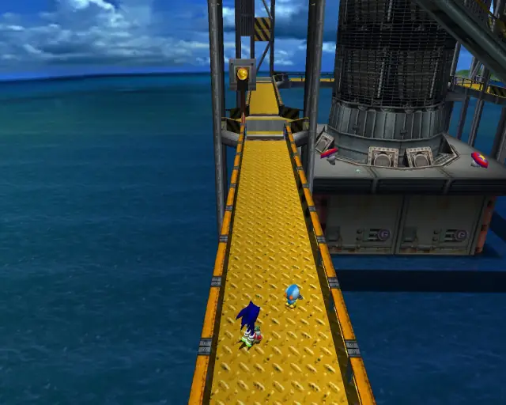

[Back to Top](#)

# Green Forest

## Green Forest Chao Box 1

[Back to Top](#)

## Green Forest Pipe 1

[Back to Top](#)

## Green Forest Gold Beetle

[Back to Top](#)

## Green Forest Hidden 1

[Back to Top](#)

## Green Forest Chao Box 2
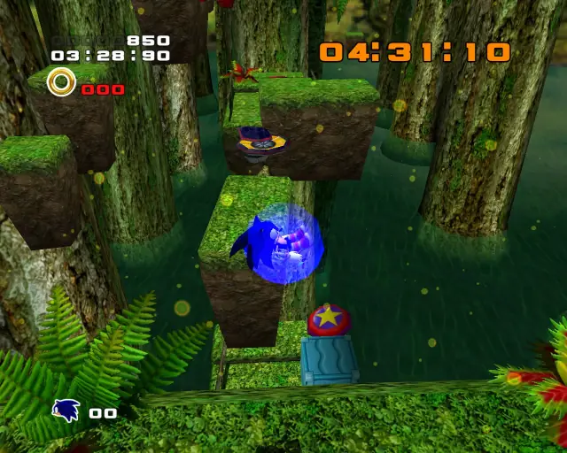

[Back to Top](#)

## Green Forest Hidden 2

[Back to Top](#)

## Green Forest Hidden 3

[Back to Top](#)

## Green Forest Hidden 4

[Back to Top](#)

## Green Forest Chao Box 3

[Back to Top](#)

## Green Forest Pipe 2

[Back to Top](#)

# Pyramid Cave

## Pyramid Cave Omochao 1

[Back to Top](#)

## Pyramid Cave Animal 1

[Back to Top](#)

## Pyramid Cave Chao Box 1

[Back to Top](#)

## Pyramid Cave Animal 2

[Back to Top](#)

## Pyramid Cave Animal 3

[Back to Top](#)

## Pyramid Cave Pipe 1 & Animal 4

[Back to Top](#)

## Pyramid Cave Pipe 2 & Animal 5

[Back to Top](#)

## Pyramid Cave Animal 6

[Back to Top](#)

## Pyramid Cave Pipe 3 & Animal 7

[Back to Top](#)

## Pyramid Cave Pipe 4 & Animal 8

[Back to Top](#)

## Pyramid Cave Chao Box 2

[Back to Top](#)

## Pyramid Cave Omochao 2

[Back to Top](#)

## Pyramid Cave Animal 9

[Back to Top](#)

## Pyramid Cave Omochao 3

[Back to Top](#)

## Pyramid Cave Animal 10

[Back to Top](#)

## Pyramid Cave Animal 11

[Back to Top](#)

## Pyramid Cave Omochao 4

[Back to Top](#)

## Pyramid Cave Animal 12

[Back to Top](#)

## Pyramid Cave Animal 13

[Back to Top](#)

## Pyramid Cave Animal 14

[Back to Top](#)

## Pyramid Cave Chao Box 3

[Back to Top](#)

## Pyramid Cave Animal 15

[Back to Top](#)

## Pyramid Cave Animal 16

[Back to Top](#)

## Pyramid Cave Animal 17

[Back to Top](#)

## Pyramid Cave Gold Beetle

[Back to Top](#)

## Pyramid Cave Animal 18

[Back to Top](#)

## Pyramid Cave Animal 19

[Back to Top](#)

# Crazy Gadget

## Crazy Gadget Omochao 1

[Back to Top](#)

## Crazy Gadget Pipe 1 & Animal 1

[Back to Top](#)

## Crazy Gadget Omochao 2

[Back to Top](#)

## Crazy Gadget Omochao 3

[Back to Top](#)

## Crazy Gadget Animal 2

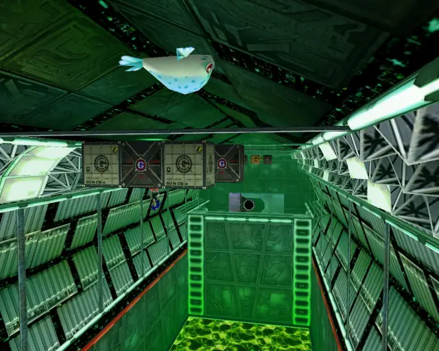

[Back to Top](#)

## Crazy Gadget Omochao 4

[Back to Top](#)

## Crazy Gadget Omochao 5

[Back to Top](#)

## Crazy Gadget Animal 3

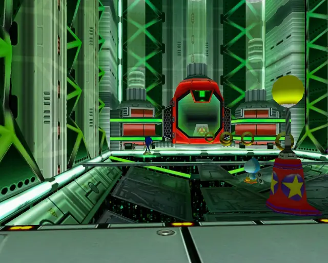

[Back to Top](#)

## Crazy Gadget Omochao 6

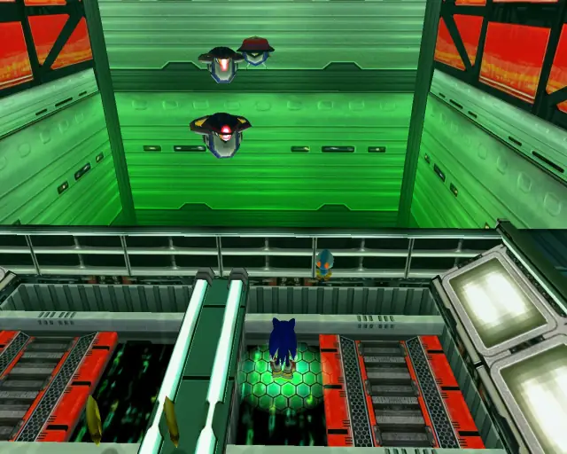

[Back to Top](#)

## Crazy Gadget Pipe 2 & Animal 4

[Back to Top](#)

## Crazy Gadget Omochao 7

(It's inside the crate, need to place it near its home to interact)

[Back to Top](#)

## Crazy Gadget Omochao 8

[Back to Top](#)

## Crazy Gadget Animal 5

[Back to Top](#)

## Crazy Gadget Animal 6

[Back to Top](#)

## Crazy Gadget Animal 7

[Back to Top](#)

## Crazy Gadget Omochao 9

[Back to Top](#)

## Crazy Gadget Omochao 10

[Back to Top](#)

## Crazy Gadget Pipe 3 & Animal 8
(this is a backtrack from the previous check)  

[Back to Top](#)

## Crazy Gadget Animal 9

[Back to Top](#)

## Crazy Gadget Chao Box 1

[Back to Top](#)

## Crazy Gadget Hidden 1 & Animal 10

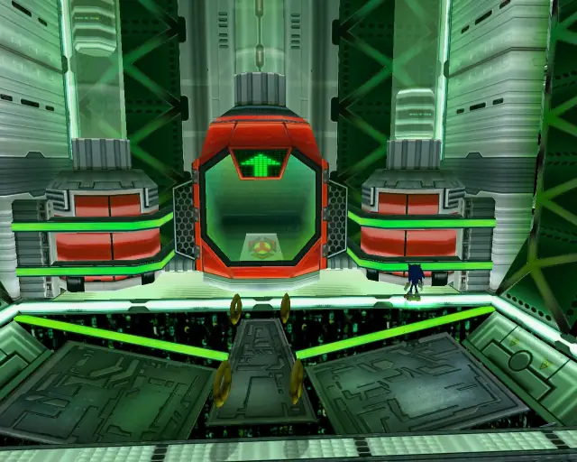

[Back to Top](#)

## Crazy Gadget Animal 11

[Back to Top](#)

## Crazy Gadget Omochao 11

[Back to Top](#)

## Crazy Gadget Chao Box 2

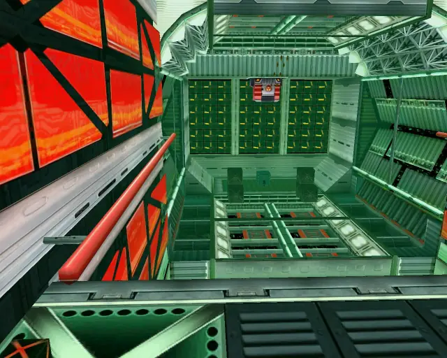

[Back to Top](#)

## Crazy Gadget Animal 12
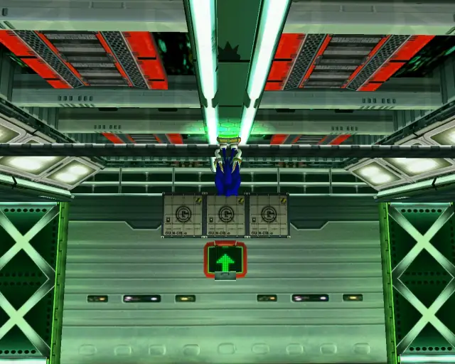

[Back to Top](#)

## Crazy Gadget Pipe 4 & Animal 13

[Back to Top](#)

## Crazy Gadget Gold Beetle

[Back to Top](#)

## Crazy Gadget Animal 14

[Back to Top](#)

## Crazy Gadget Chao Box 3

[Back to Top](#)

## Crazy Gadget Animal 15

[Back to Top](#)

## Crazy Gadget Omochao 12

[Back to Top](#)

## Crazy Gadget Animal 16

[Back to Top](#)

## Crazy Gadget Omochao 13

[Back to Top](#)

# Final Rush

## Final Rush Omochao 1

[Back to Top](#)

## Final Rush Animal 1

[Back to Top](#)

## Final Rush Chao Box 1

[Back to Top](#)

## Final Rush Animal 2

[Back to Top](#)

## Final Rush Omochao 2

[Back to Top](#)

## Final Rush Chao Box 2

[Back to Top](#)

## Final Rush Pipe 1 & Animal 3

[Back to Top](#)

## Final Rush Animal 4

[Back to Top](#)

## Final Rush Pipe 2 & Animal 5

[Back to Top](#)

## Final Rush Animal 6

[Back to Top](#)

## Final Rush Animal 7

[Back to Top](#)

## Final Rush Animal 8

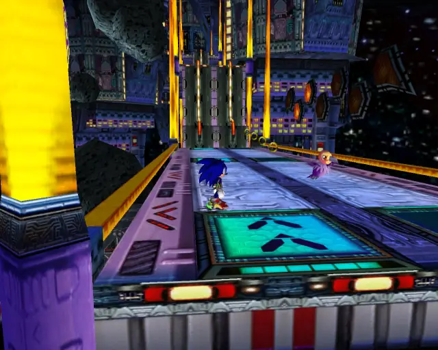

[Back to Top](#)

## Final Rush Gold Beetle

[Back to Top](#)

## Final Rush Omochao 3

[Back to Top](#)

## Final Rush Animal 9

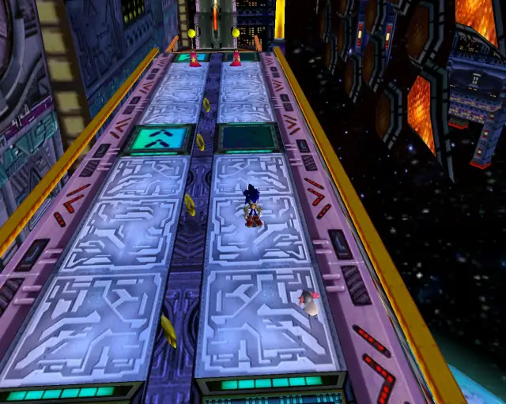

[Back to Top](#)

## Final Rush Animal 10

[Back to Top](#)

## Final Rush Chao Box 3

[Back to Top](#)

## Final Rush Animal 11

[Back to Top](#)

## Final Rush Animal 12

[Back to Top](#)

## Final Rush Animal 13

[Back to Top](#)

## Final Rush Animal 14
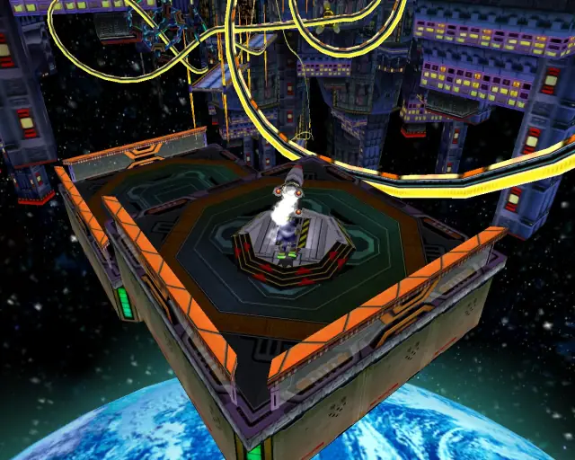

[Back to Top](#)

## Final Rush Animal 15

[Back to Top](#)

## Final Rush Animal 16

[Back to Top](#)

# Green Hill

## Green Hill Chao Box 1

[Back to Top](#)
