# Sonic Stages (Chronological)

## Table of Contents:

1. [ City Escape ](#city-escape)
1. [ Metal Harbor ](#metal-harbor)
1. [ Green Forest ](#green-forest)
1. [ Pyramid Cave ](#pyramid-cave)
1. [ Crazy Gadget ](#crazy-gadget)
1. [ Final Rush ](#final-rush)
1. [ Green Hill ](#green-hill)

# City Escape

## City Escape Omochao 1

[Back to Top](#)

## City Escape Pipe 1

[Back to Top](#)

## City Escape Omochao 2

[Back to Top](#)

## City Escape Omochao 3

[Back to Top](#)

## City Escape Omochao 4

[Back to Top](#)

## City Escape Omochao 5

[Back to Top](#)

## City Escape Pipe 2

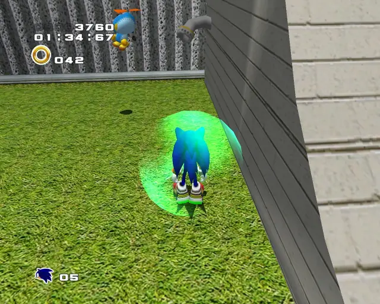

[Back to Top](#)

## City Escape Omochao 6

[Back to Top](#)

## City Escape Omochao 7

[Back to Top](#)

## City Escape Omochao 8

[Back to Top](#)

## City Escape Chao Box 1
  

[Back to Top](#)

## City Escape Hidden 1

[Back to Top](#)

## City Escape Pipe 3

[Back to Top](#)

## City Escape Gold Beetle
  

[Back to Top](#)

## City Escape Omochao 10

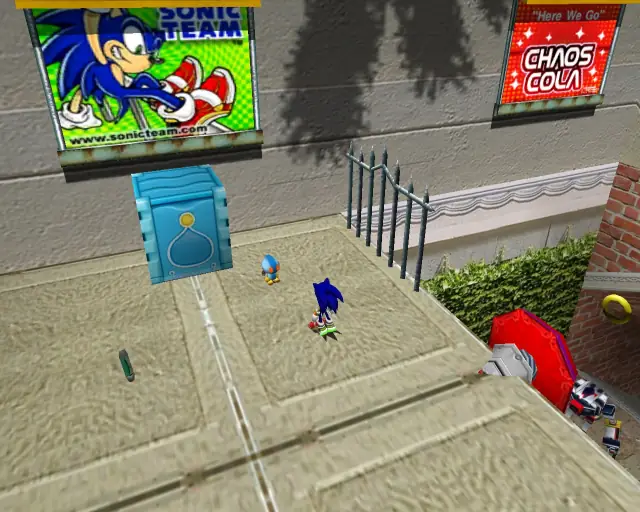

[Back to Top](#)

## City Escape Chao Box 2
  

[Back to Top](#)

## City Escape Omochao 9

[Back to Top](#)

## City Escape Hidden 2

[Back to Top](#)

## City Escape Hidden 3

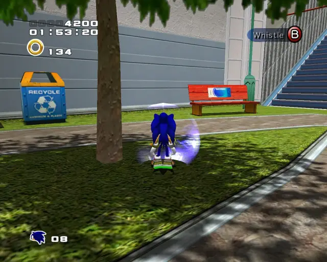

[Back to Top](#)

## City Escape Hidden 4

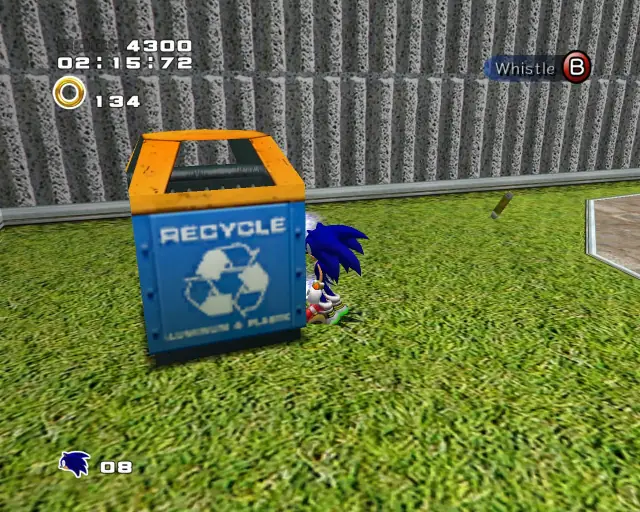

[Back to Top](#)

## City Escape Omochao 11

[Back to Top](#)

## City Escape Chao Box 3
  

[Back to Top](#)

## City Escape Omochao 12

[Back to Top](#)

## City Escape Pipe 4
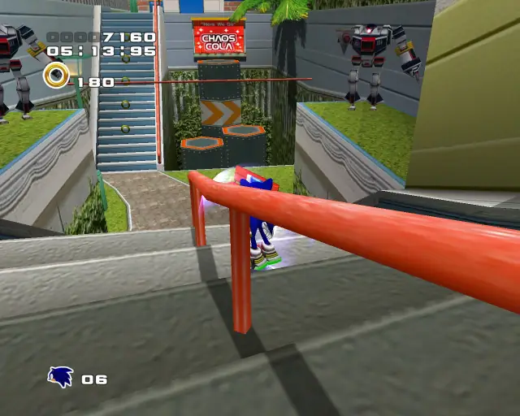
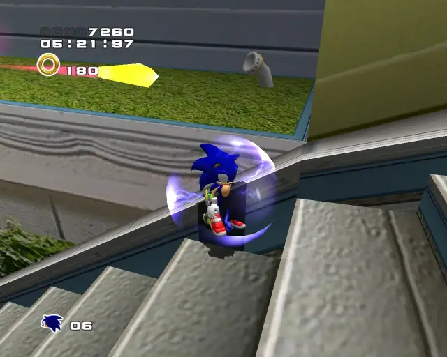

[Back to Top](#)

## City Escape Omochao 13

[Back to Top](#)

## City Escape Hidden 5

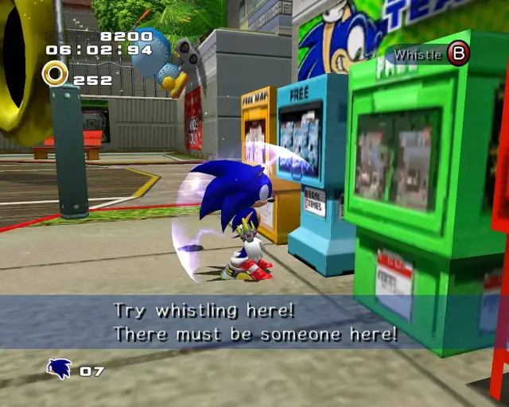

[Back to Top](#)

## City Escape Omochao 14

[Back to Top](#)

# Metal Harbor

## Metal Harbor Pipe 1

[Back to Top](#)

## Metal Harbor Chao Box 1

[Back to Top](#)

## Metal Harbor Omochao 1

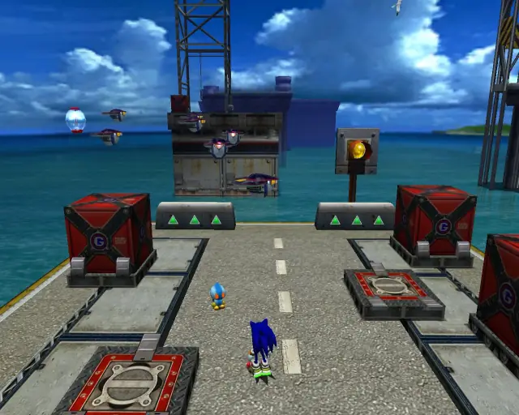

[Back to Top](#)

## Metal Harbor Gold Beetle

[Back to Top](#)

## Metal Harbor Omochao 2

[Back to Top](#)

## Metal Harbor Omochao 3

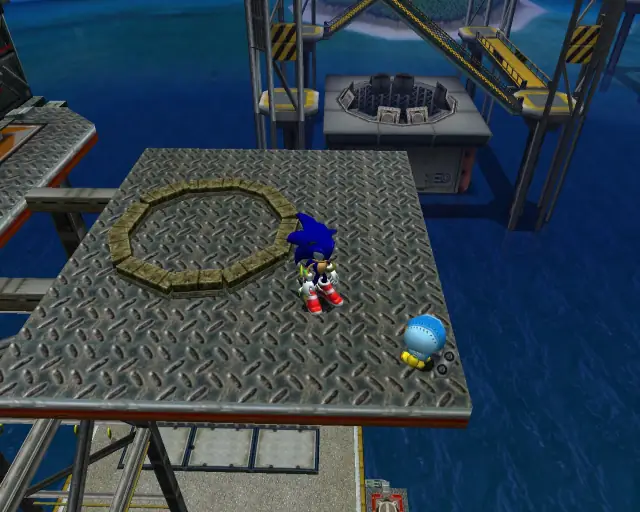

[Back to Top](#)

## Metal Harbor Chao Box 2

[Back to Top](#)

## Metal Harbor Omochao 4

[Back to Top](#)

## Metal Harbor Chao Box 3
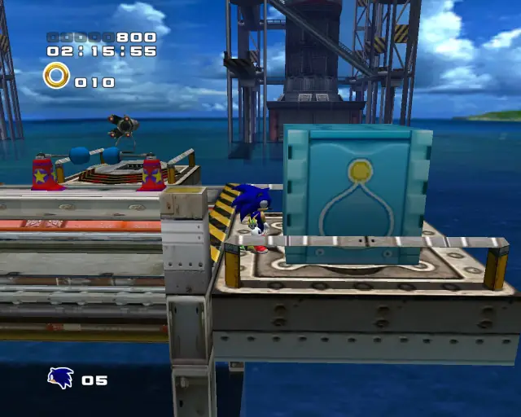

[Back to Top](#)

## Metal Harbor Omochao 5

[Back to Top](#)

# Green Forest

## Green Forest Chao Box 1

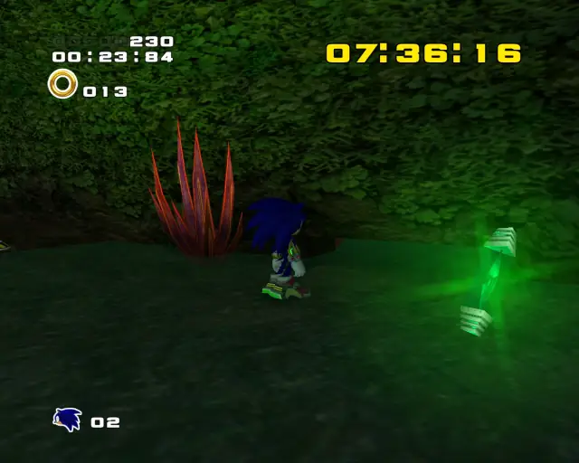
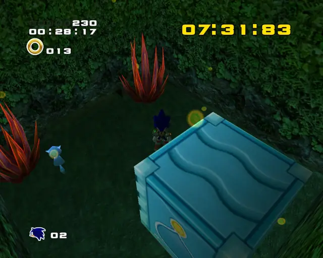

[Back to Top](#)

## Green Forest Pipe 1

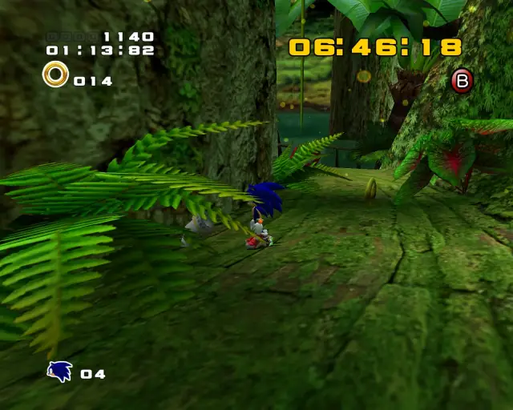

[Back to Top](#)

## Green Forest Gold Beetle

[Back to Top](#)

## Green Forest Hidden 1

[Back to Top](#)

## Green Forest Chao Box 2

[Back to Top](#)

## Green Forest Hidden 2

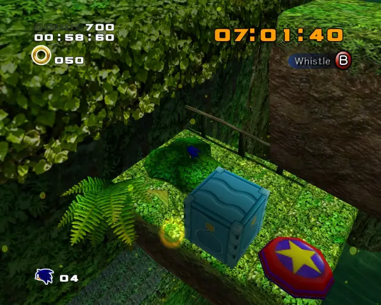

[Back to Top](#)

## Green Forest Hidden 3

[Back to Top](#)

## Green Forest Hidden 4

[Back to Top](#)

## Green Forest Chao Box 3

[Back to Top](#)

## Green Forest Pipe 2

[Back to Top](#)

# Pyramid Cave

## Pyramid Cave Omochao 1

[Back to Top](#)

## Pyramid Cave Chao Box 1

[Back to Top](#)

## Pyramid Cave Pipe 1

[Back to Top](#)

## Pyramid Cave Pipe 2

[Back to Top](#)

## Pyramid Cave Pipe 3

[Back to Top](#)

## Pyramid Cave Pipe 4

[Back to Top](#)

## Pyramid Cave Chao Box 2

[Back to Top](#)

## Pyramid Cave Omochao 2

[Back to Top](#)

## Pyramid Cave Omochao 3

[Back to Top](#)

## Pyramid Cave Omochao 4

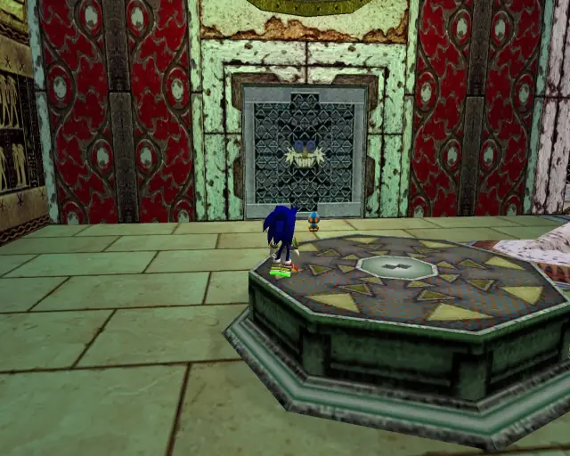

[Back to Top](#)

## Pyramid Cave Chao Box 3

[Back to Top](#)

## Pyramid Cave Gold Beetle

[Back to Top](#)

# Crazy Gadget

## Crazy Gadget Omochao 1

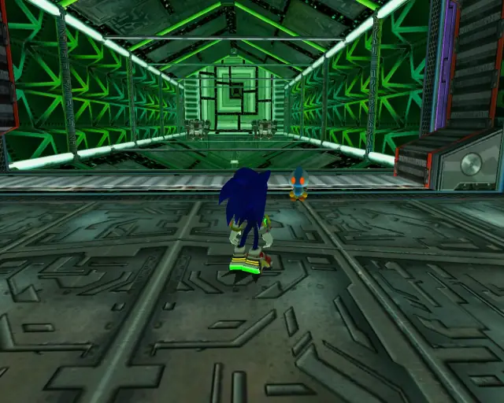

[Back to Top](#)

## Crazy Gadget Pipe 1

[Back to Top](#)

## Crazy Gadget Omochao 2

[Back to Top](#)

## Crazy Gadget Omochao 3

[Back to Top](#)

## Crazy Gadget Omochao 4

[Back to Top](#)

## Crazy Gadget Omochao 5

[Back to Top](#)

## Crazy Gadget Omochao 6

[Back to Top](#)

## Crazy Gadget Pipe 2

[Back to Top](#)

## Crazy Gadget Omochao 7

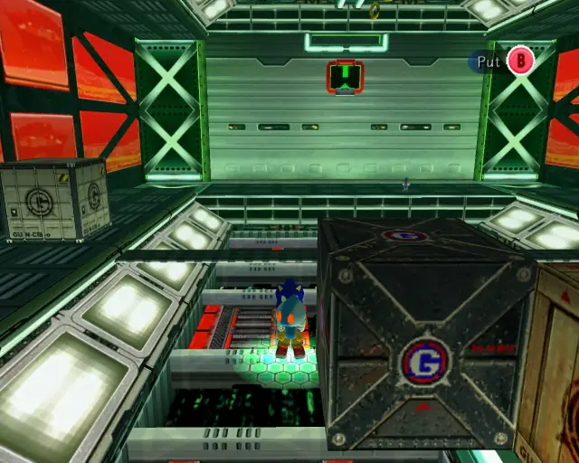

[Back to Top](#)

## Crazy Gadget Omochao 8

[Back to Top](#)

## Crazy Gadget Pipe 3
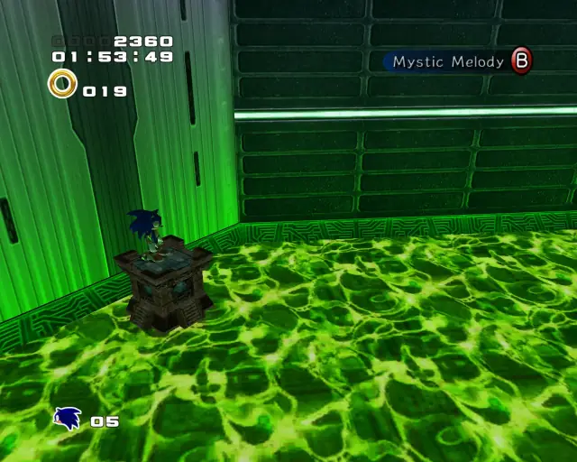
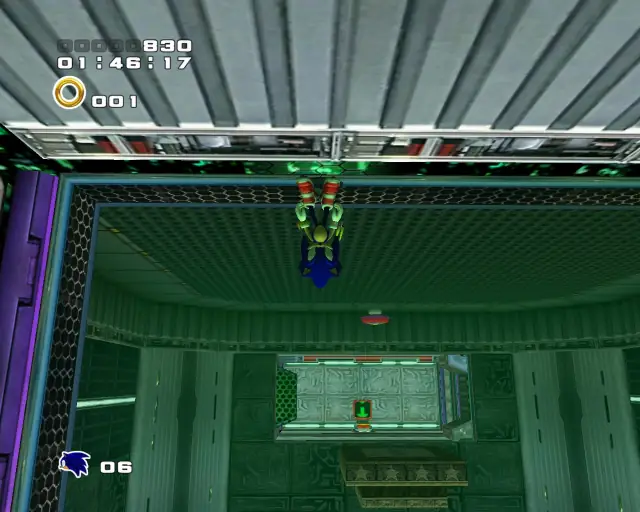

[Back to Top](#)

## Crazy Gadget Omochao 9

[Back to Top](#)

## Crazy Gadget Omochao 10

[Back to Top](#)

## Crazy Gadget Chao Box 1

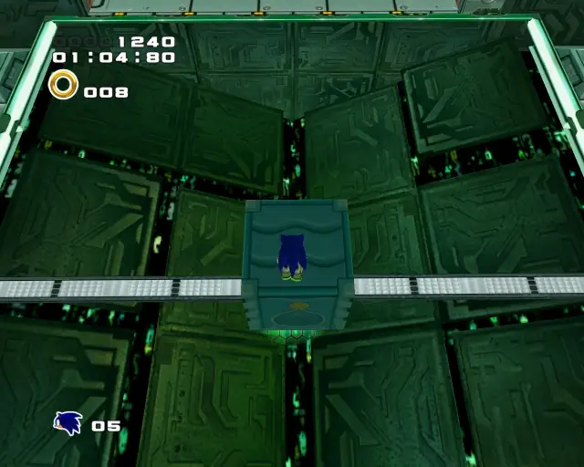

[Back to Top](#)

## Crazy Gadget Hidden 1

[Back to Top](#)

## Crazy Gadget Omochao 11

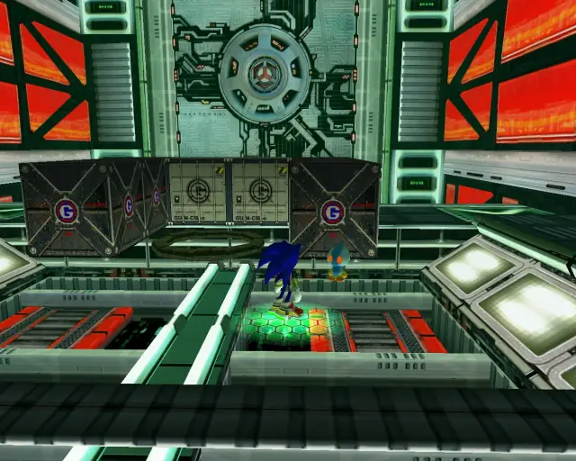

[Back to Top](#)

## Crazy Gadget Chao Box 2

[Back to Top](#)

## Crazy Gadget Pipe 4
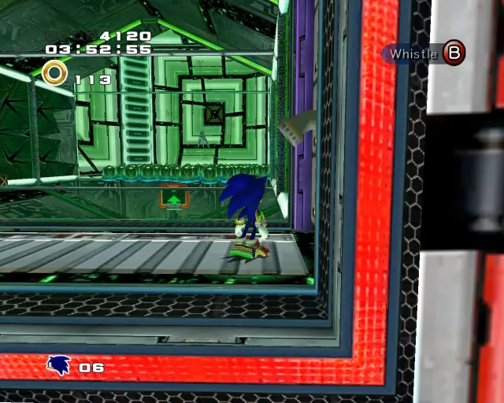

[Back to Top](#)

## Crazy Gadget Gold Beetle

[Back to Top](#)

## Crazy Gadget Omochao 12

[Back to Top](#)

## Crazy Gadget Chao Box 3

[Back to Top](#)

## Crazy Gadget Omochao 13

[Back to Top](#)

# Final Rush

## Final Rush Omochao 1

[Back to Top](#)

## Final Rush Chao Box 1
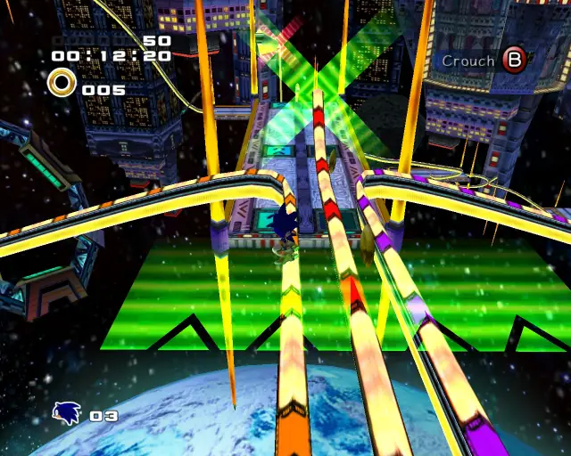

[Back to Top](#)

## Final Rush Omochao 2

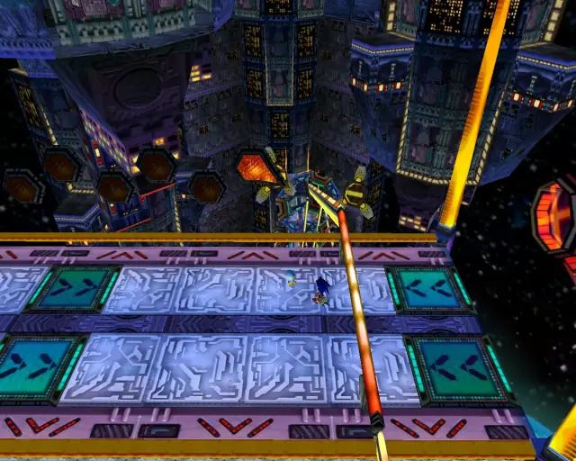

[Back to Top](#)

## Final Rush Chao Box 2

[Back to Top](#)

## Final Rush Pipe 1

[Back to Top](#)

## Final Rush Pipe 2

[Back to Top](#)

## Final Rush Gold Beetle

[Back to Top](#)

## Final Rush Omochao 3

[Back to Top](#)

## Final Rush Chao Box 3

[Back to Top](#)

# Green Hill

## Green Hill Chao Box 1

[Back to Top](#)
