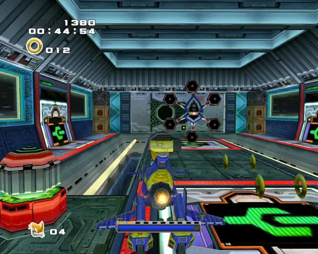
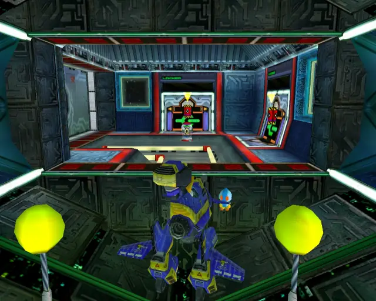
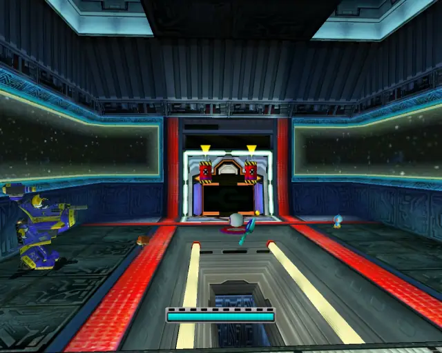
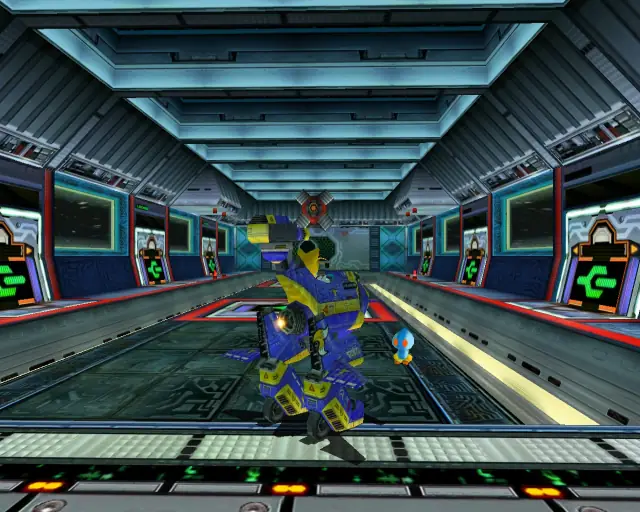
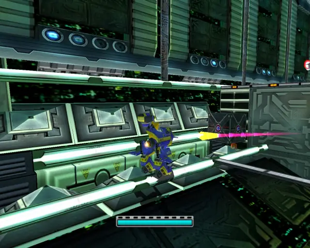
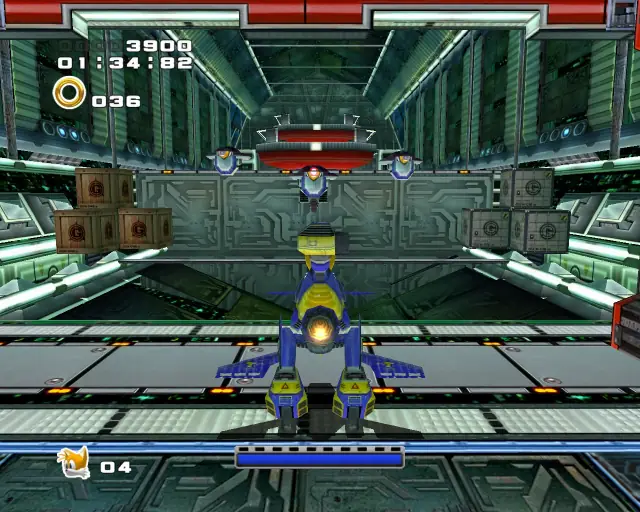
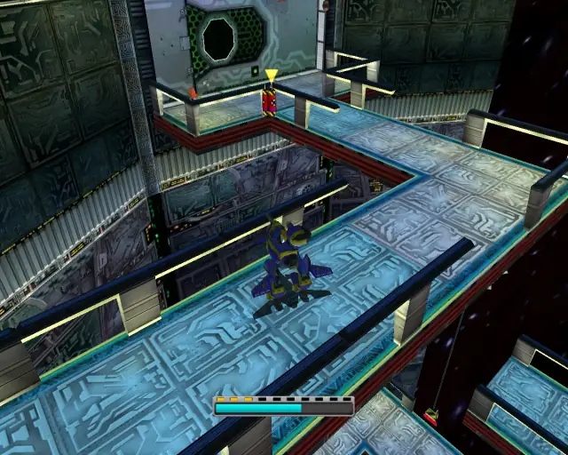

# Eternal Engine (Chronological)

## Eternal Engine Animal 1

[Back to Top](#)

## Eternal Engine Pipe 1 & Animal 2

[Back to Top](#)

## Eternal Engine Pipe 2 & Animal 3

[Back to Top](#)

## Eternal Engine Omochao 1

[Back to Top](#)

## Eternal Engine Animal 4

[Back to Top](#)

## Eternal Engine Omochao 2

[Back to Top](#)

## Eternal Engine Chao Box 1

  

[Back to Top](#)

## Eternal Engine Omochao 3

[Back to Top](#)

## Eternal Engine Animal 5

[Back to Top](#)

## Eternal Engine Omochao 4

[Back to Top](#)

## Eternal Engine Omochao 5

[Back to Top](#)

## Eternal Engine Omochao 6

[Back to Top](#)

## Eternal Engine Animal 6

[Back to Top](#)

## Eternal Engine Omochao 7

[Back to Top](#)

## Eternal Engine Animal 7

[Back to Top](#)

## Eternal Engine Chao Box 2
  
  

[Back to Top](#)

## Eternal Engine Chao Box 3
  
  
  

[Back to Top](#)

## Eternal Engine Pipe 3 & Animal 8

[Back to Top](#)

## Eternal Engine Animal 9

[Back to Top](#)

## Eternal Engine Omochao 8

[Back to Top](#)

## Eternal Engine Animal 10

[Back to Top](#)

## Eternal Engine Omochao 9

[Back to Top](#)

## Eternal Engine Pipe 4 & Animal 11

[Back to Top](#)

## Eternal Engine Omochao 10

[Back to Top](#)

## Eternal Engine Animal 12

[Back to Top](#)

## Eternal Engine Animal 13

[Back to Top](#)

## Eternal Engine Omochao 11

[Back to Top](#)

## Eternal Engine Gold Beetle
  

[Back to Top](#)

## Eternal Engine Animal 14

[Back to Top](#)

## Eternal Engine Omochao 12

[Back to Top](#)

## Eternal Engine Pipe 5 & Animal 15

[Back to Top](#)
