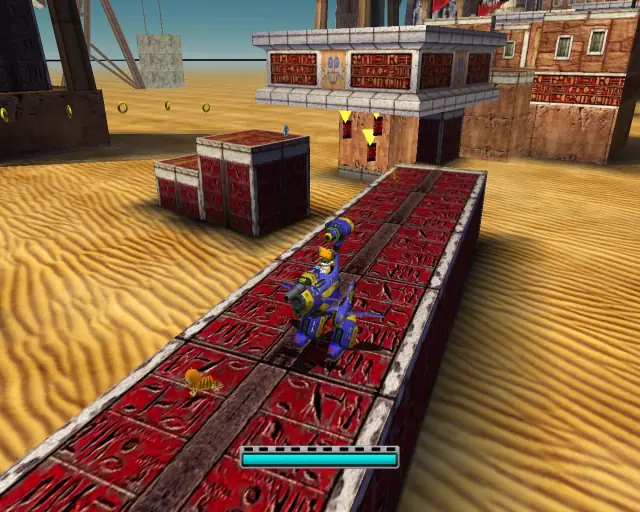
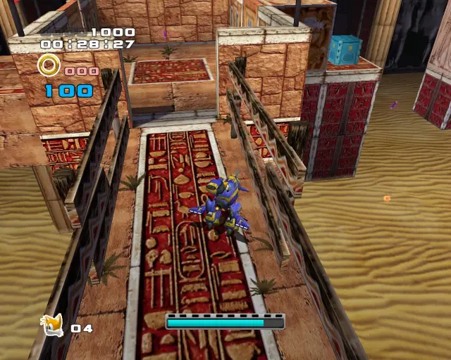
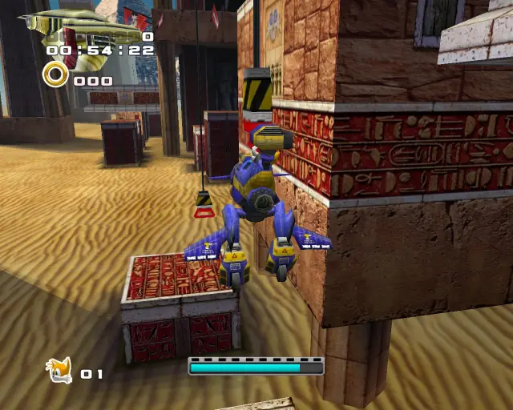
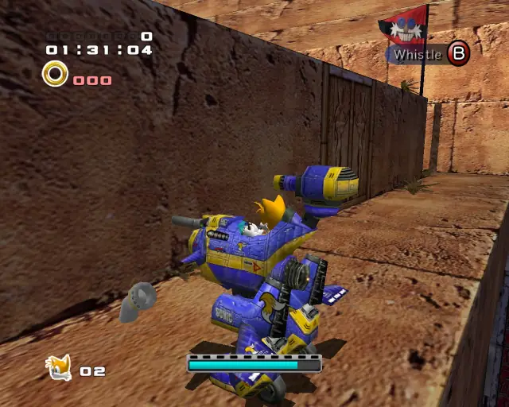
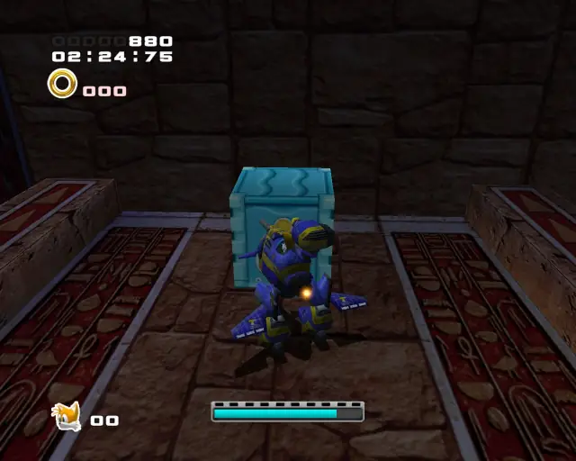
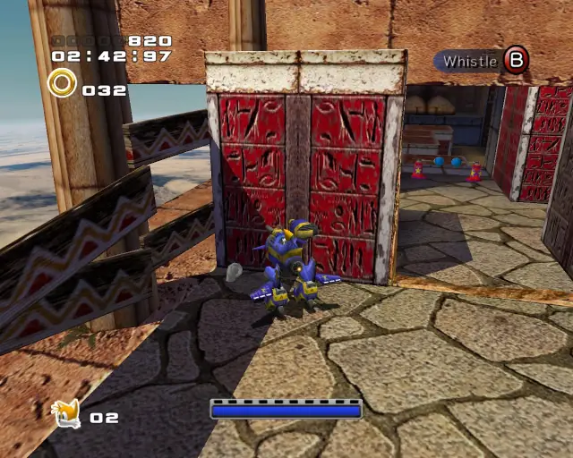
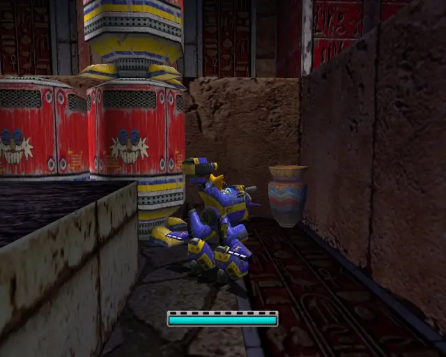
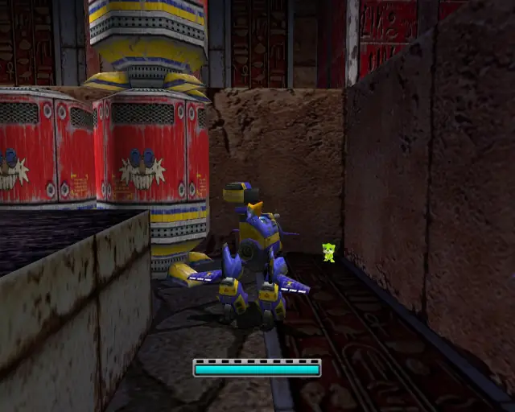

# Hidden Base (Chronological)

## Hidden Base Omochao 1

[Back to Top](#)

## Hidden Base Animal 1

[Back to Top](#)

## Hidden Base Animal 2

[Back to Top](#)

## Hidden Base Omochao 2

[Back to Top](#)

## Hidden Base Omochao 3

[Back to Top](#)

## Hidden Base Animal 3

[Back to Top](#)

## Hidden Base Animal 4

[Back to Top](#)

## Hidden Base Animal 5

[Back to Top](#)

## Hidden Base Pipe 1 & Animal 6

[Back to Top](#)

## Hidden Base Chao Box 1

  

[Back to Top](#)

## Hidden Base Gold Beetle
  
  

[Back to Top](#)

## Hidden Base Animal 7

[Back to Top](#)

## Hidden Base Animal 8

[Back to Top](#)

## Hidden Base Pipe 2 & Animal 9

[Back to Top](#)

## Hidden Base Pipe 3 & Animal 10

[Back to Top](#)

## Hidden Base Chao Box 2
  
  

[Back to Top](#)

## Hidden Base Pipe 4 & Animal 11

[Back to Top](#)

## Hidden Base Pipe 5 & Animal 12

[Back to Top](#)

## Hidden Base Animal 13

[Back to Top](#)

## Hidden Base Animal 14

[Back to Top](#)

## Hidden Base Omochao 4

[Back to Top](#)

## Hidden Base Animal 15

[Back to Top](#)
