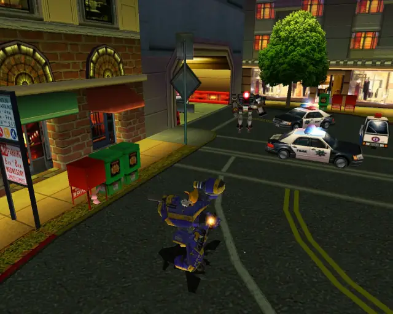
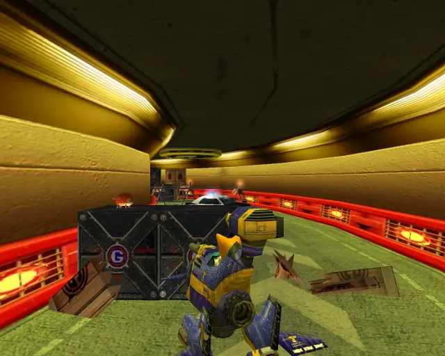
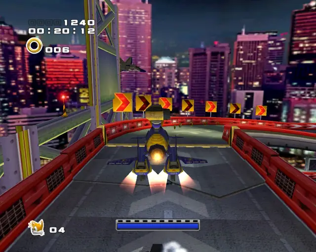
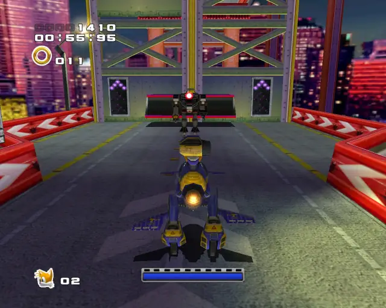
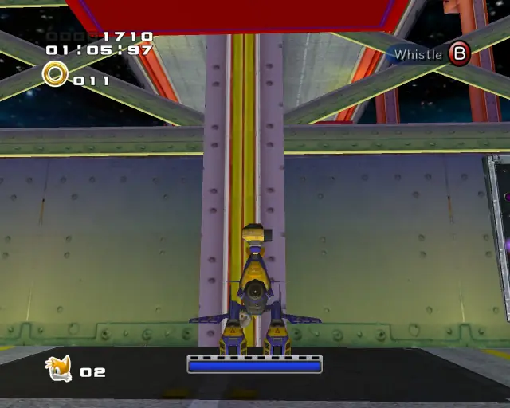
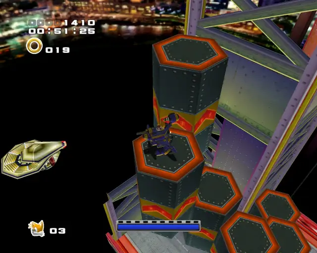
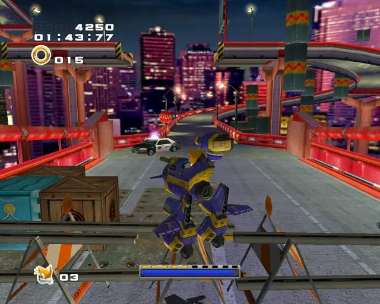
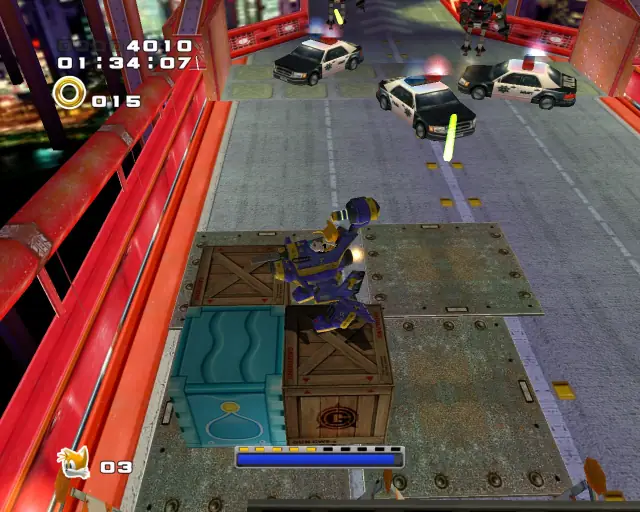
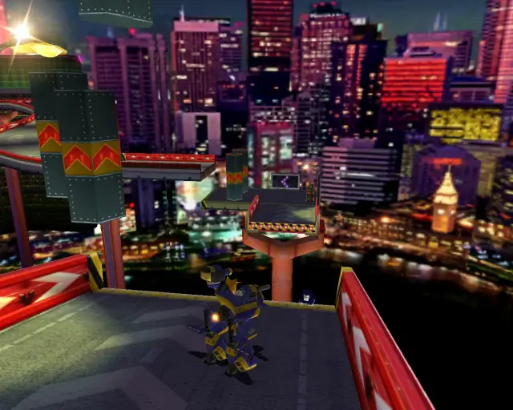
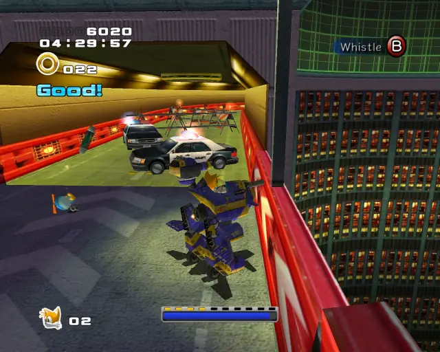

# Mission Street (Chronological)

## Mission Street Hidden 1 & Animal 1

[Back to Top](#)

## Mission Street Animal 2

[Back to Top](#)

## Mission Street Hidden 2 & Animal 3

[Back to Top](#)

## Mission Street Animal 4

[Back to Top](#)

## Mission Street Omochao 1

[Back to Top](#)

## Mission Street Omochao 2

[Back to Top](#)

## Mission Street Chao Box 1

  

[Back to Top](#)

## Mission Street Pipe 1 & Animal 5

[Back to Top](#)

## Mission Street Omochao 3

[Back to Top](#)

## Mission Street Animal 6

[Back to Top](#)

## Mission Street Chao Box 2
  
  

[Back to Top](#)

## Mission Street Gold Beetle
  

[Back to Top](#)

## Mission Street Omochao 4

[Back to Top](#)

## Mission Street Animal 7

[Back to Top](#)

## Mission Street Pipe 2 & Animal 8

[Back to Top](#)

## Mission Street Chao Box 3
  

[Back to Top](#)

## Mission Street Omochao 5

[Back to Top](#)

## Mission Street Animal 9

[Back to Top](#)

## Mission Street Animal 10

[Back to Top](#)

## Mission Street Omochao 6

[Back to Top](#)

## Mission Street Animal 11

[Back to Top](#)

## Mission Street Animal 12

[Back to Top](#)

## Mission Street Pipe 3 & Animal 13

[Back to Top](#)

## Mission Street Omochao 7

[Back to Top](#)

## Mission Street Hidden 3 & Animal 14

[Back to Top](#)

## Mission Street Omochao 8

[Back to Top](#)

## Mission Street Hidden 4 & Animal 15

[Back to Top](#)

## Mission Street Animal 16

[Back to Top](#)
