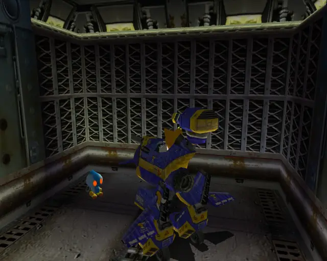
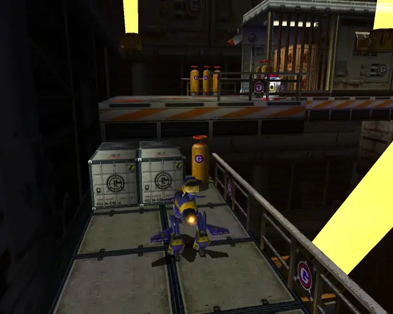
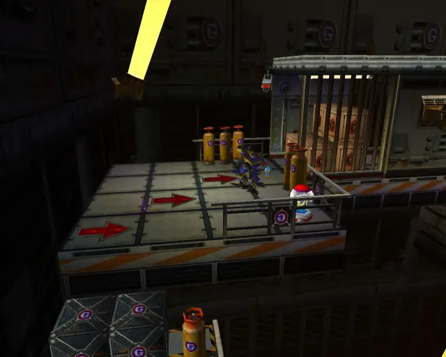
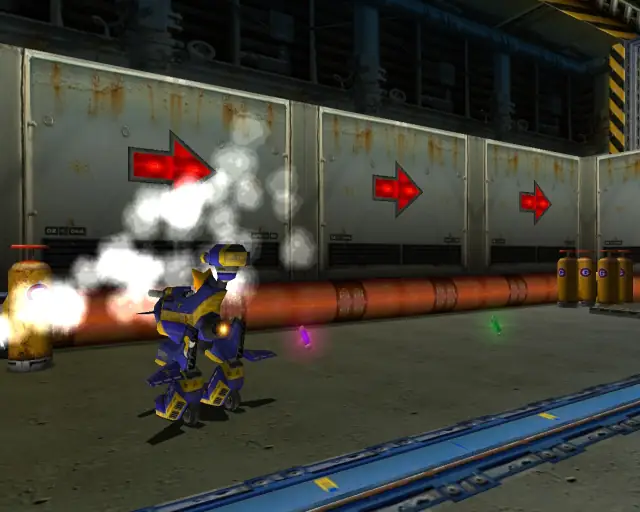
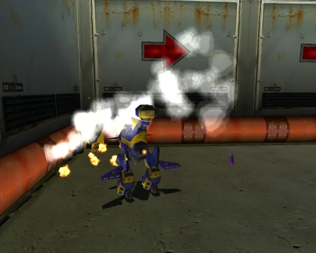
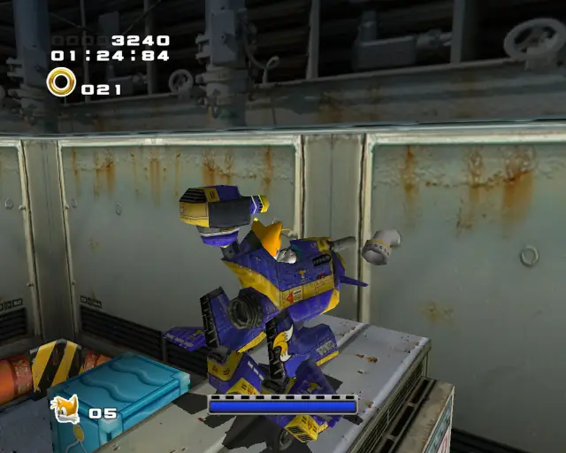
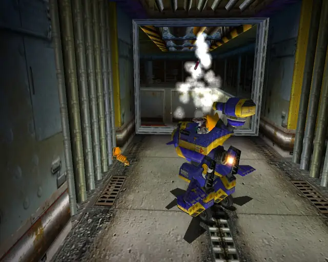
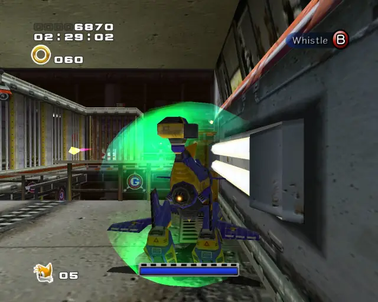

# Prison Lane (Chronological)

## Prison Lane Omochao 1

[Back to Top](#)

## Prison Lane Omochao 2

[Back to Top](#)

## Prison Lane Pipe 1 & Animal 1

[Back to Top](#)

## Prison Lane Chao Box 1

  

[Back to Top](#)

## Prison Lane Omochao 3

[Back to Top](#)

## Prison Lane Animal 2

[Back to Top](#)

## Prison Lane Omochao 4

[Back to Top](#)

## Prison Lane Chao Box 2
  
  
  

[Back to Top](#)

## Prison Lane Animal 3

[Back to Top](#)

## Prison Lane Omochao 5

[Back to Top](#)

## Prison Lane Omochao 6

[Back to Top](#)

## Prison Lane Animal 4

[Back to Top](#)

## Prison Lane Omochao 7

[Back to Top](#)

## Prison Lane Chao Box 3
  

[Back to Top](#)

## Prison Lane Pipe 2 & Animal 5

[Back to Top](#)

## Prison Lane Animal 6

[Back to Top](#)

## Prison Lane Animal 7

[Back to Top](#)

## Prison Lane Omochao 8

[Back to Top](#)

## Prison Lane Animal 8

[Back to Top](#)

## Prison Lane Hidden 1 & Animal 9

[Back to Top](#)

## Prison Lane Omochao 9

[Back to Top](#)

## Prison Lane Animal 10

[Back to Top](#)

## Prison Lane Pipe 3 & Animal 11

[Back to Top](#)

## Prison Lane Hidden 2 & Animal 12

[Back to Top](#)

## Prison Lane Gold Beetle
  

[Back to Top](#)

## Prison Lane Animal 13

[Back to Top](#)

## Prison Lane Animal 14

[Back to Top](#)

## Prison Lane Hidden 3 & Animal 15

[Back to Top](#)

## Prison Lane Omochao 10

[Back to Top](#)
