
## animal 1

## pipe 1
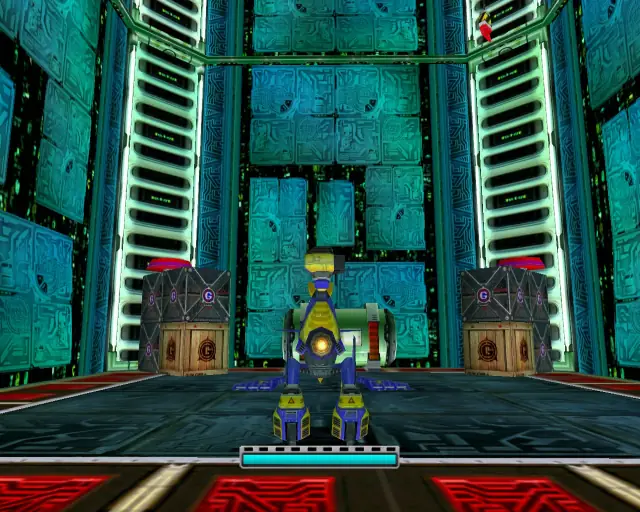
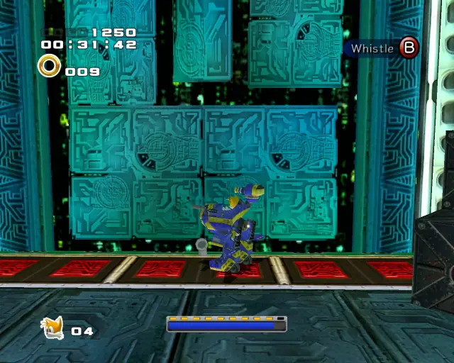

## animal 2

## pipe 2

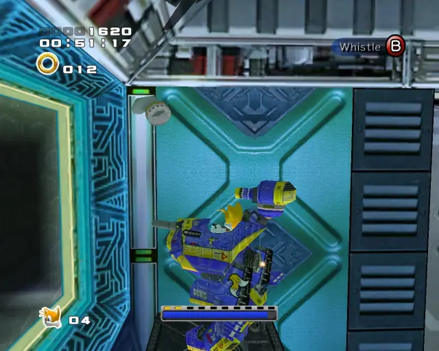

## animal 3
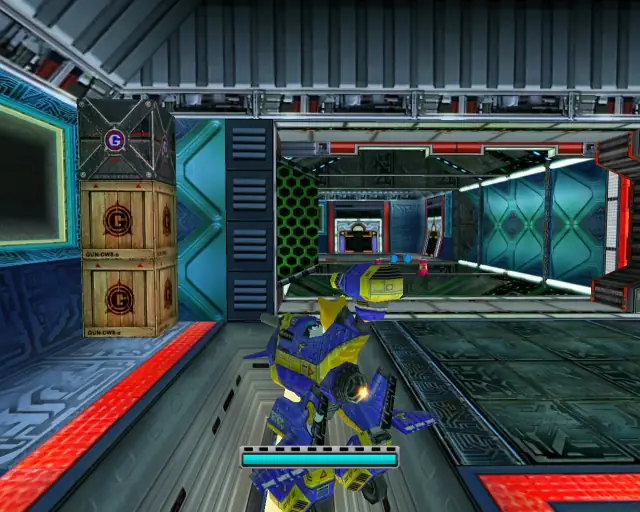

## omochao 1
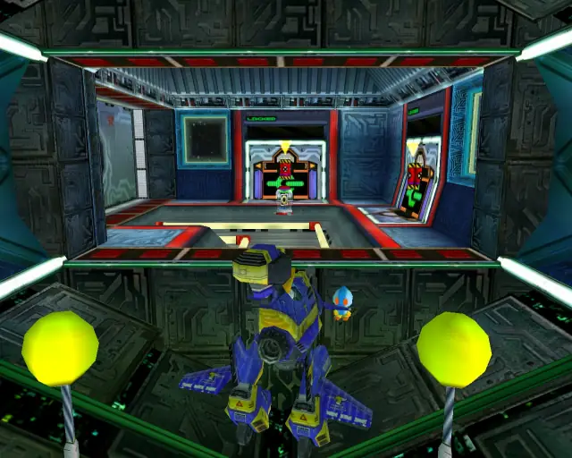

## animal 4

## omochao 2

## chaobox 1

## omochao 3

## animal 5
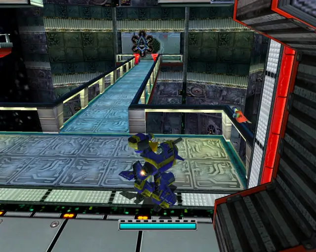

## omochao 4

## omochao 5
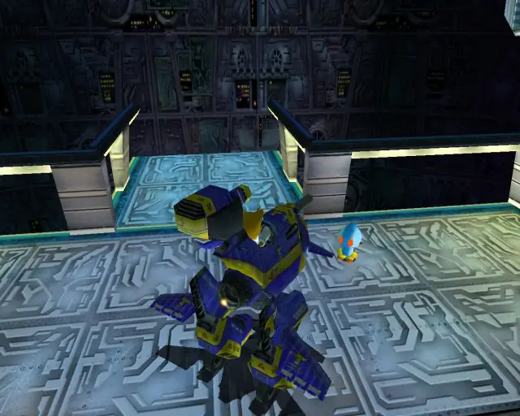

## omochao 6

## animal 6

## omochao 7

## animal 7

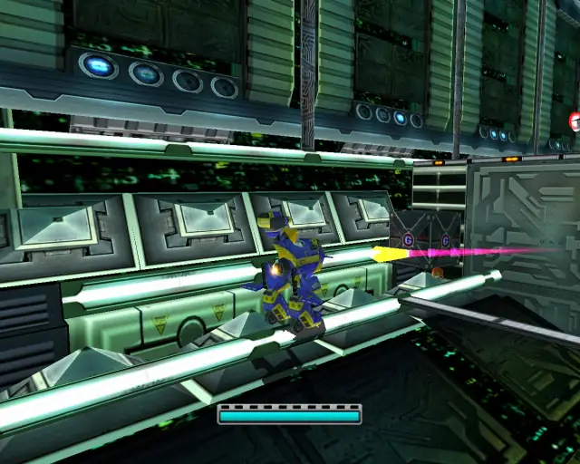

## chaobox 2

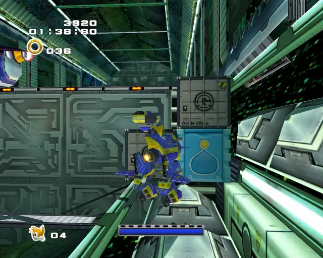

## chaobox 3
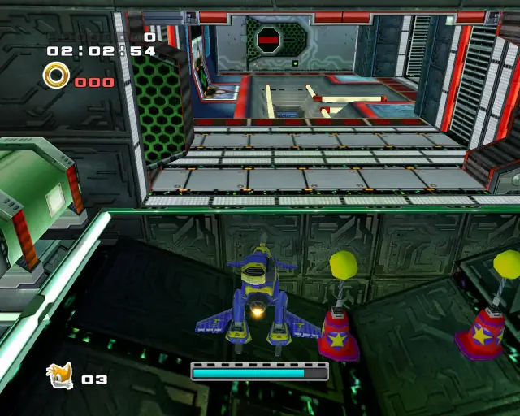
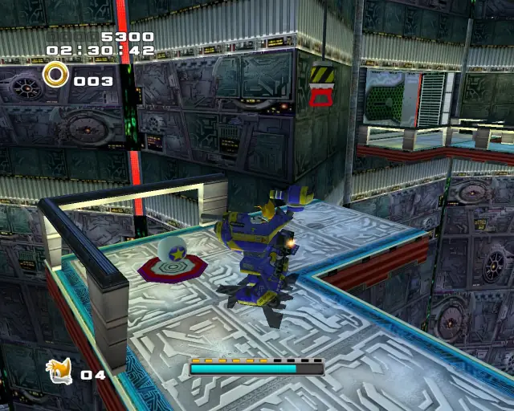

## pipe 3
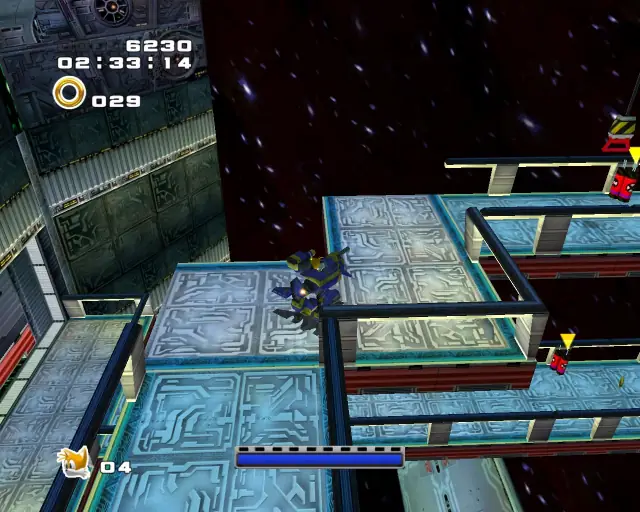
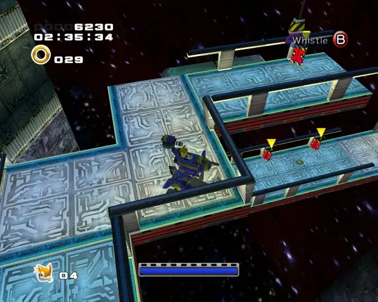

## animal 8

## animal 9

## omochao 8

## animal 10

## omochao 9
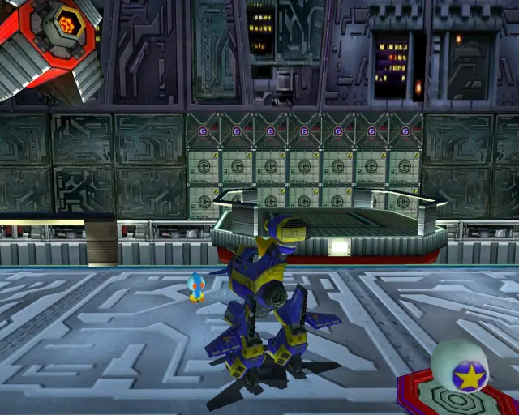

## pipe 4
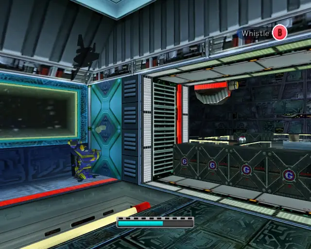
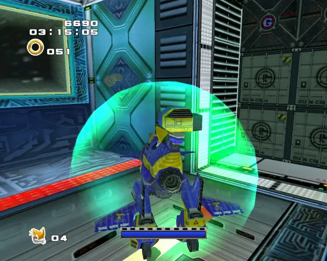

## animal 11

## omochao 10
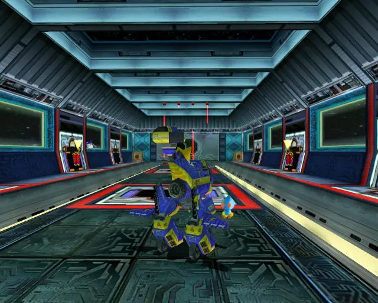

## animal 12

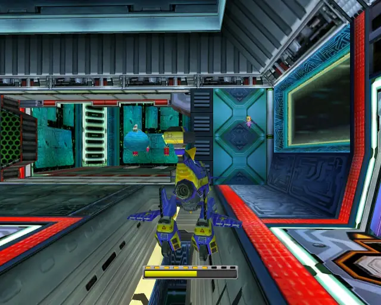

## animal 13

## omochao 11
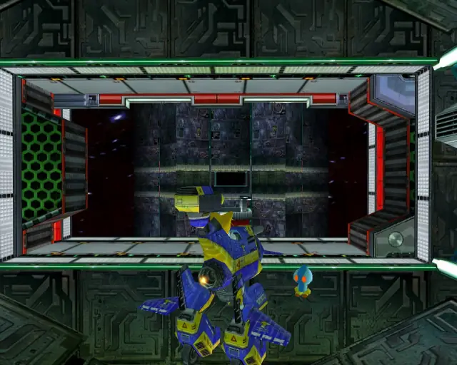

## goldbeetle 1

## animal 14

## omochao 12
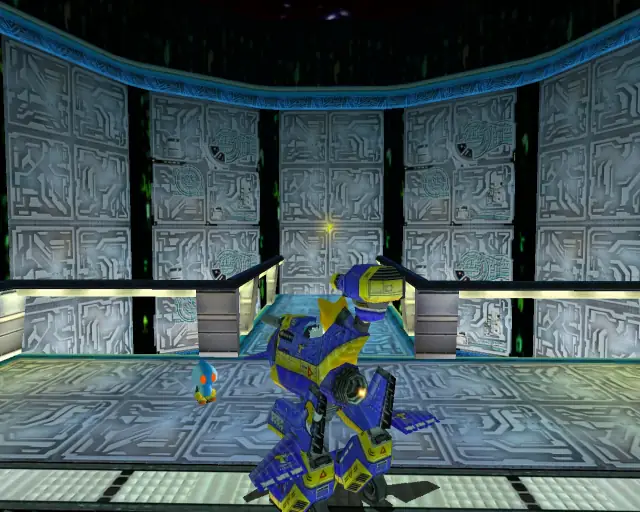

## pipe 5
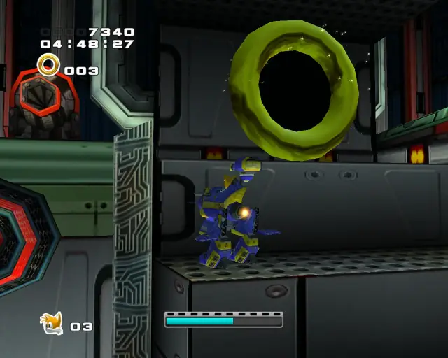
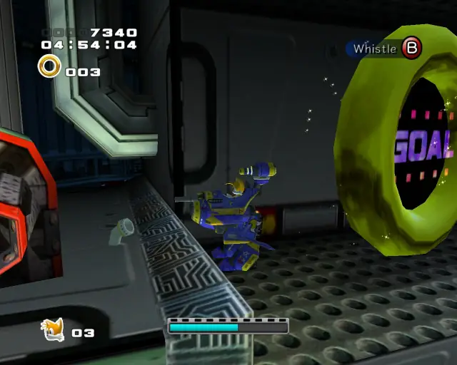

## animal 15

