
## animal 1
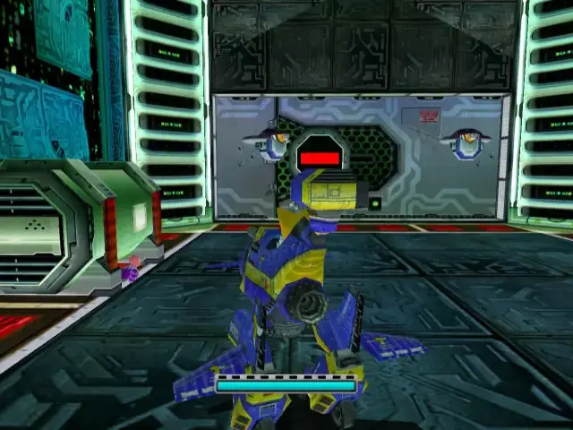

## pipe 1

## animal 2

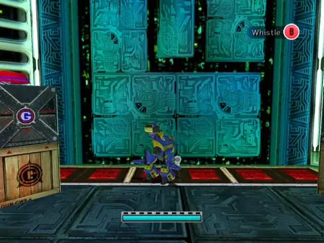

## pipe 2

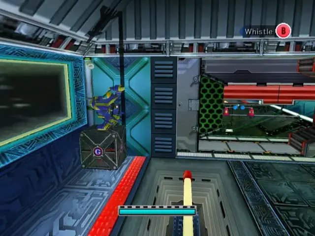

## animal 3

## omochao 1

## animal 4
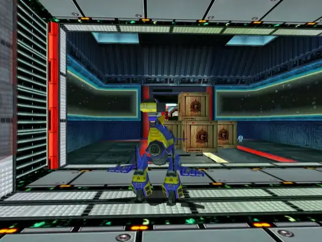
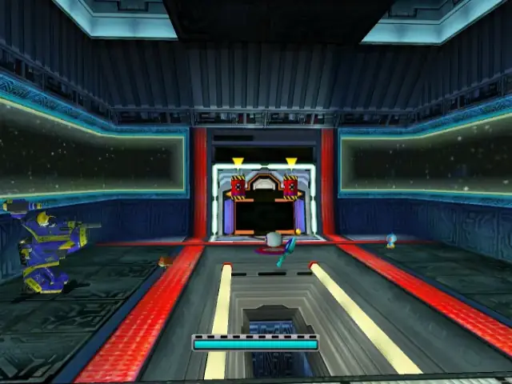

## omochao 2
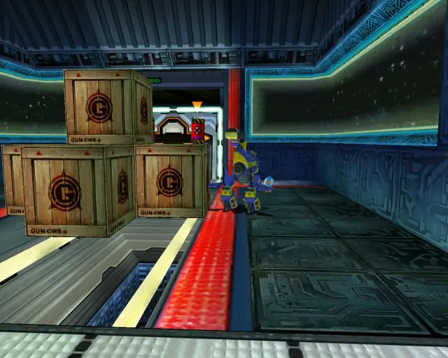

## chaobox 1
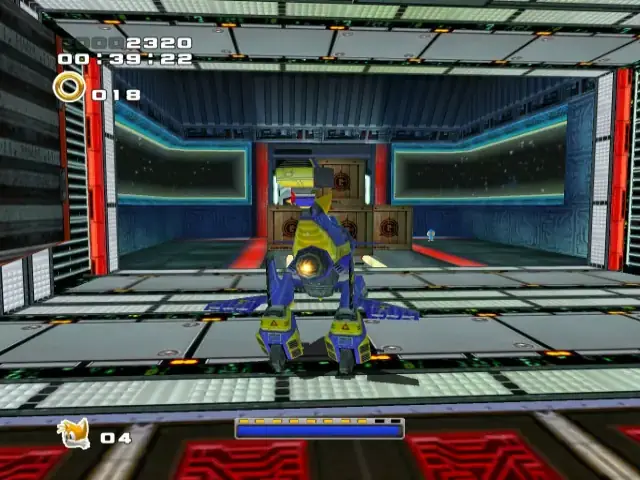
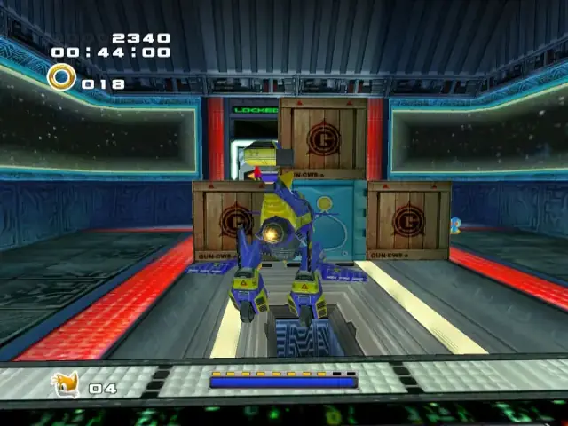

## omochao 3
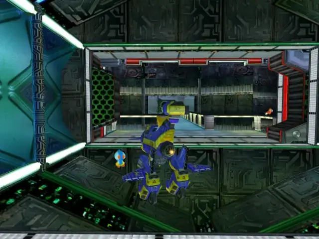

## animal 5
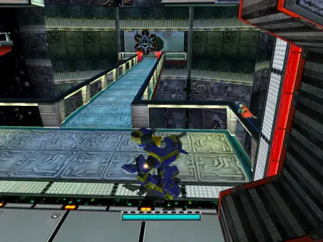

## omochao 4
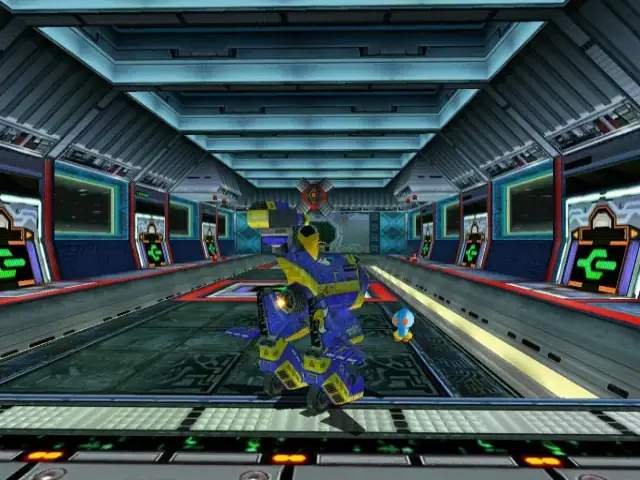

## omochao 5

## omochao 6
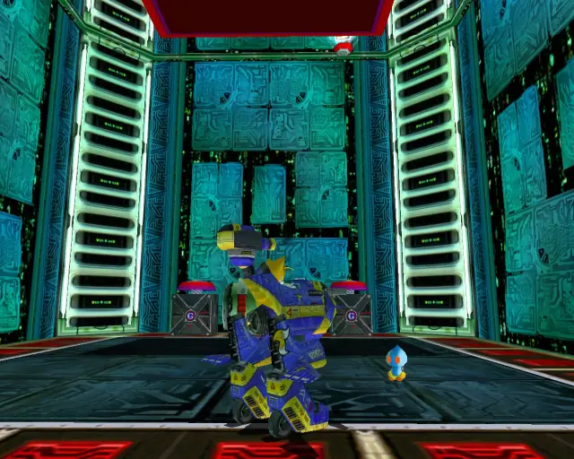

## animal 6
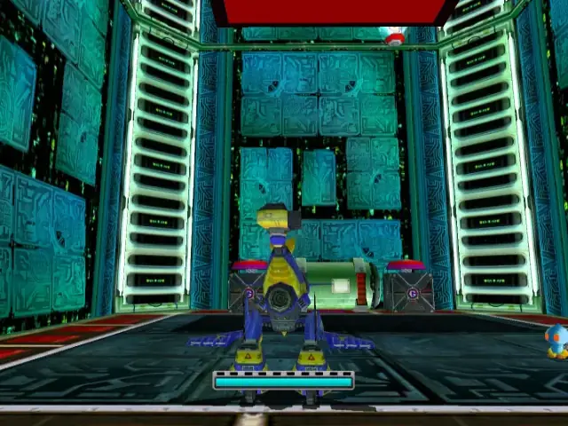
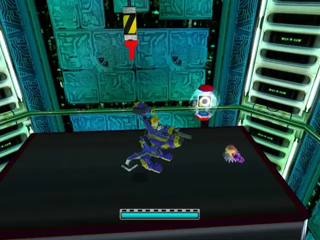

## omochao 7
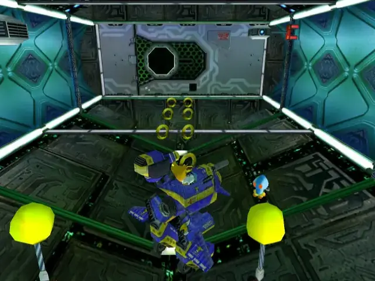

## animal 7
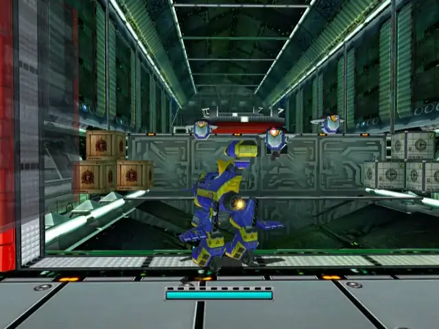
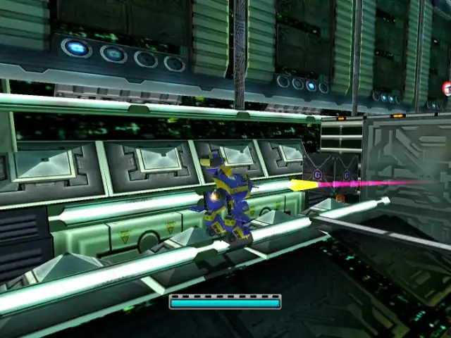

## chaobox 2

## chaobox 3

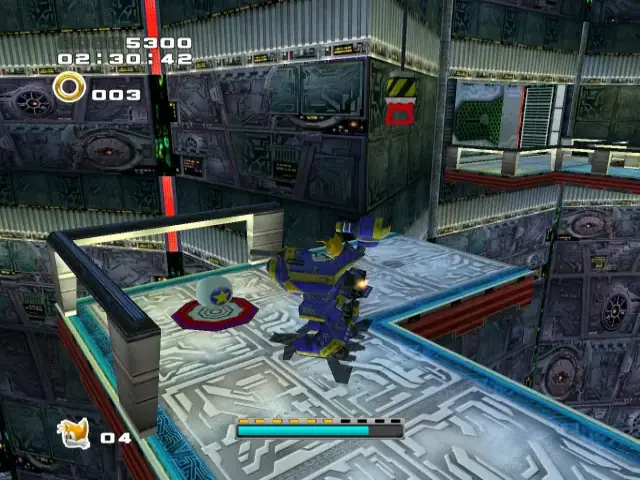
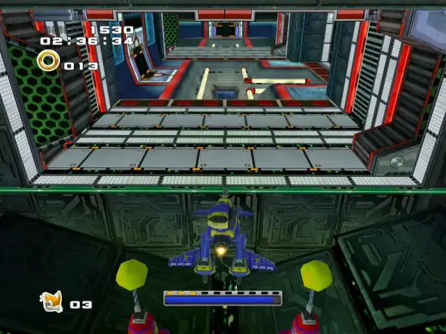
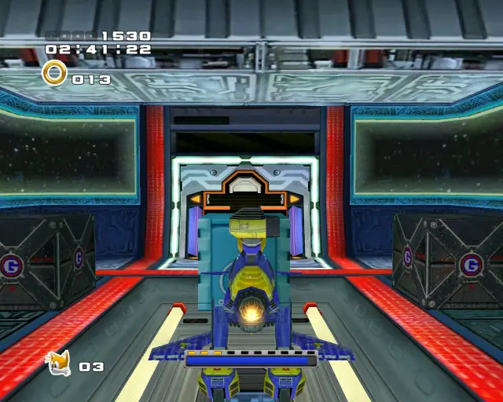

## pipe 3
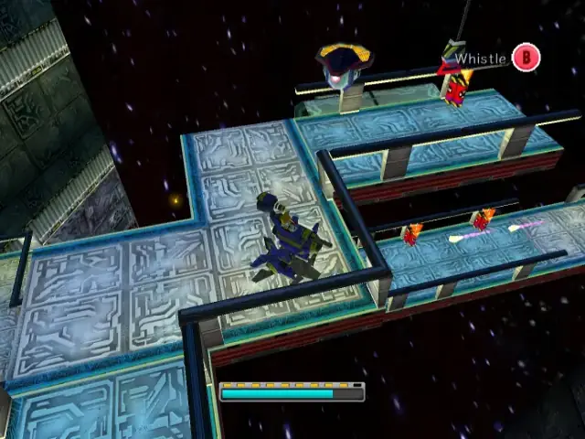

## animal 8

## animal 9
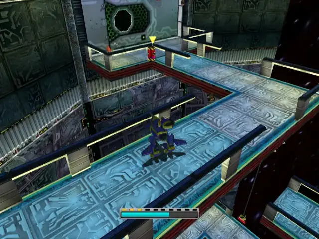

## omochao 8
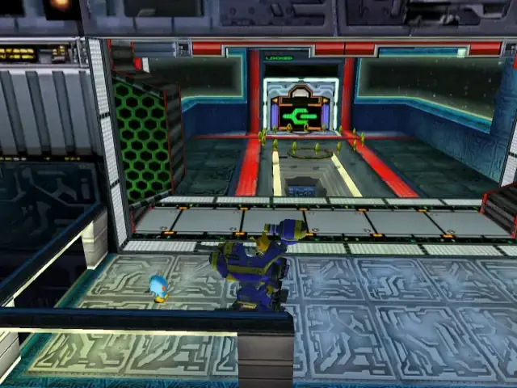

## animal 10
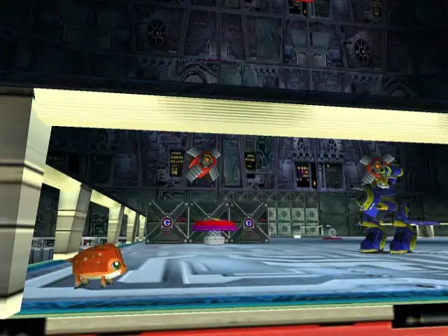

## omochao 9
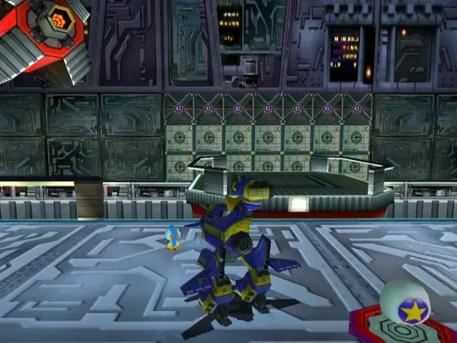

## pipe 4
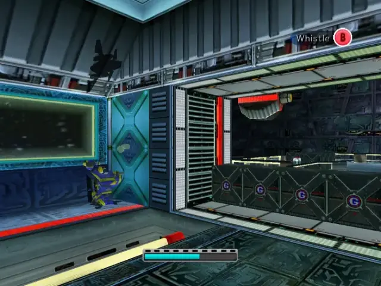

## animal 11

## omochao 10

## animal 12
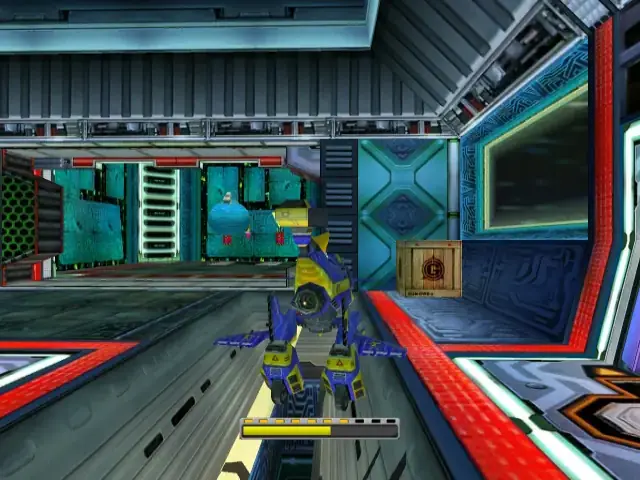
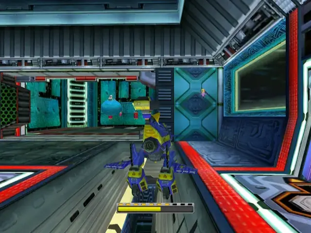

## animal 13
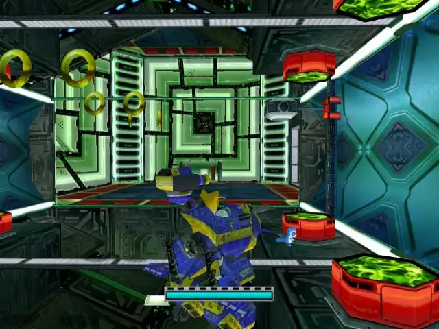

## omochao 11

## goldbeetle 1
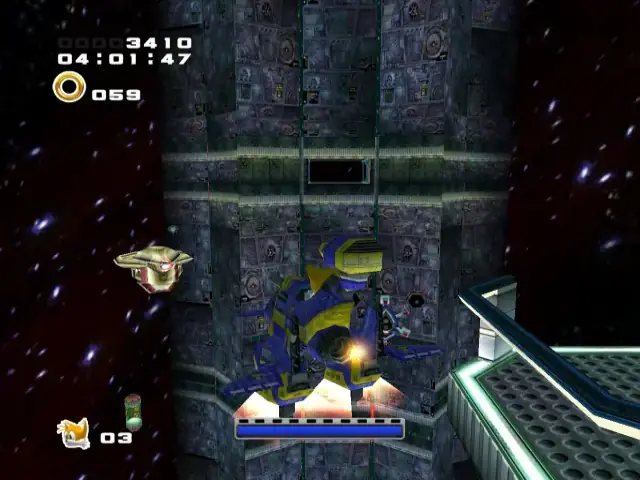

## animal 14
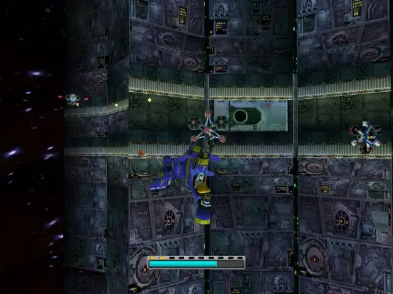

## omochao 12
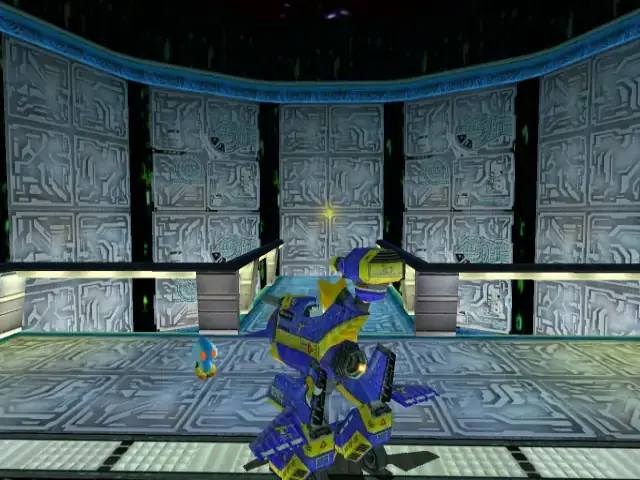

## pipe 5
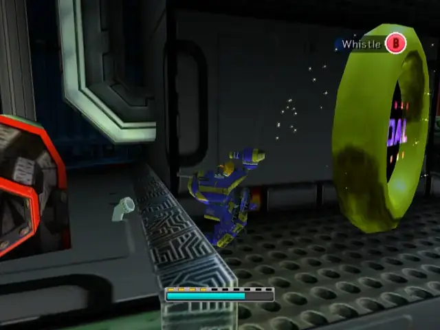

## animal 15

