
## big 1
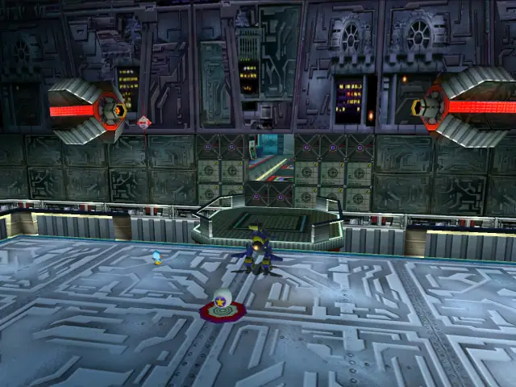
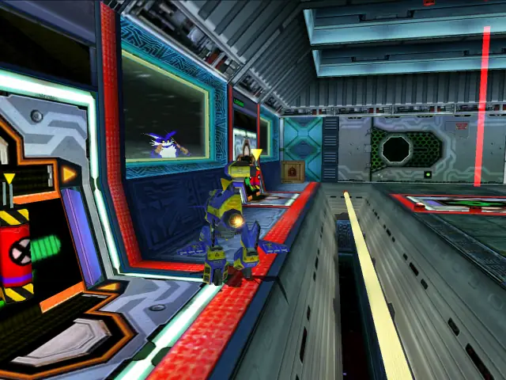

## item 1
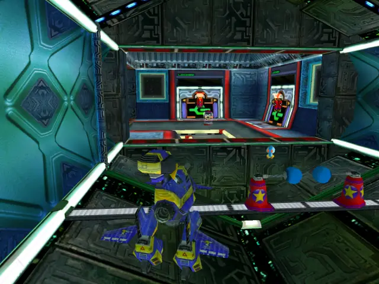

## item 2
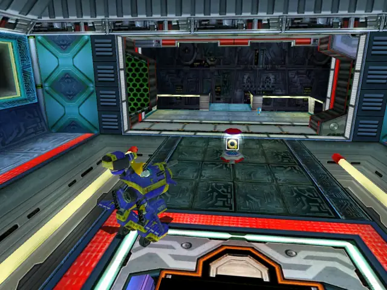

## item 3
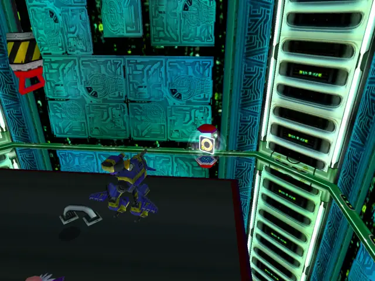

## item 4

## item 5

## item 6
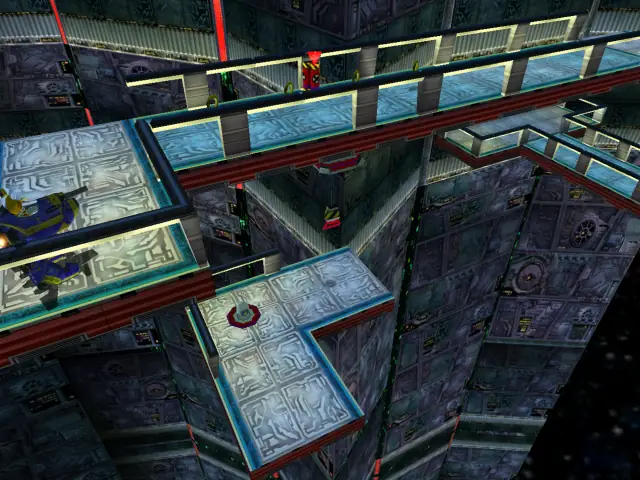
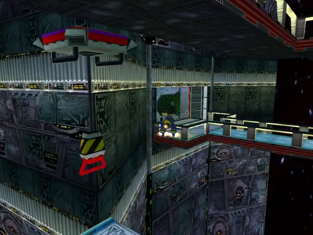
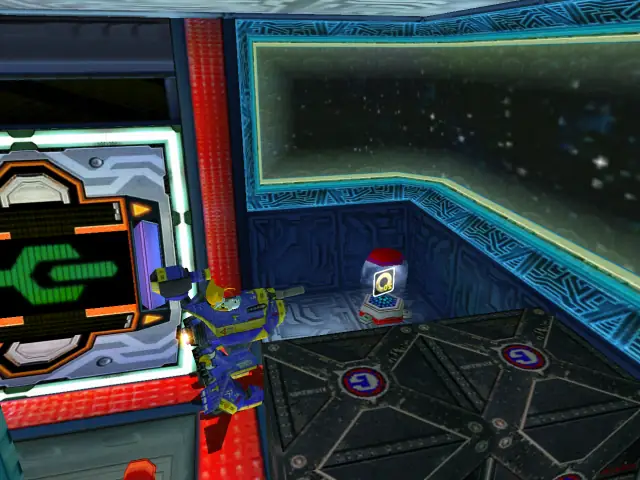

## item 7
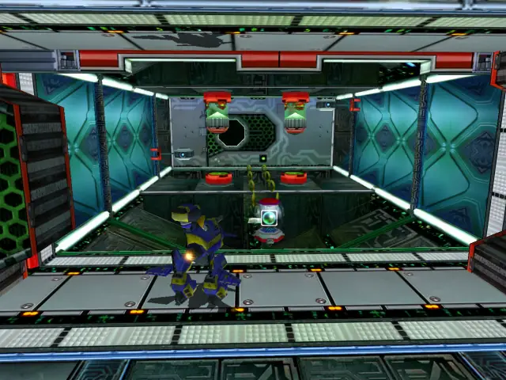

## item 8
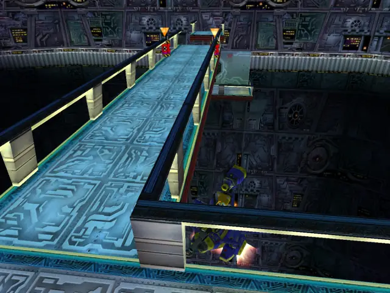

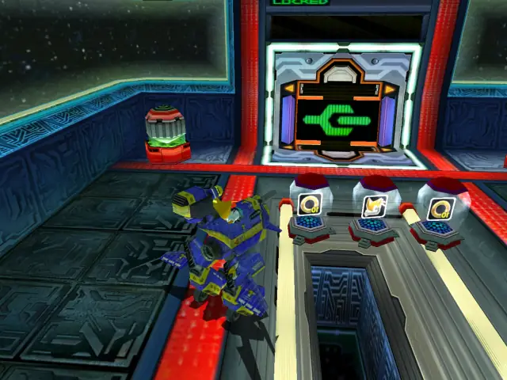

## item 9

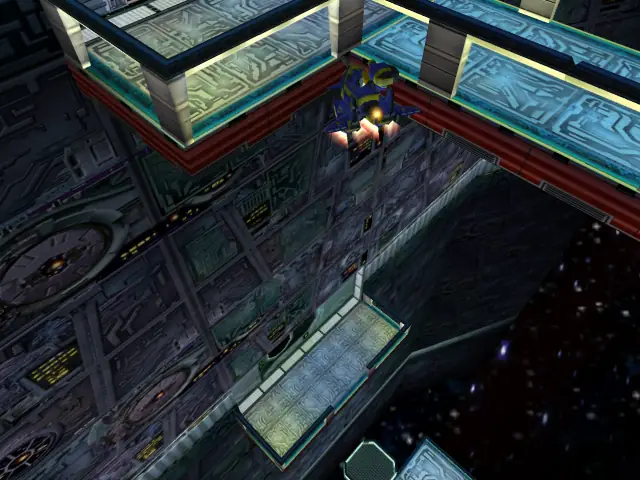
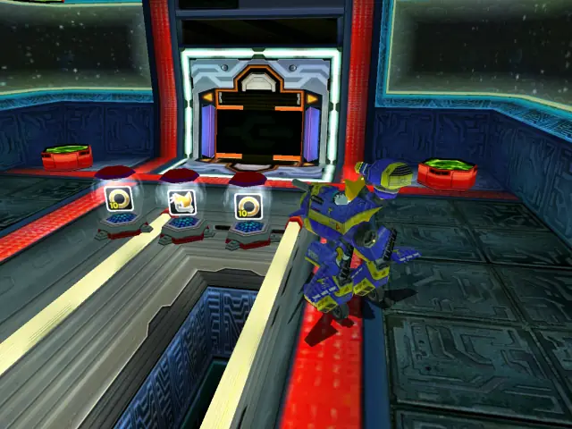

## item 10

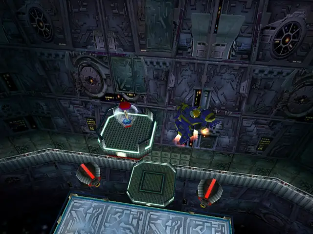

## item 11
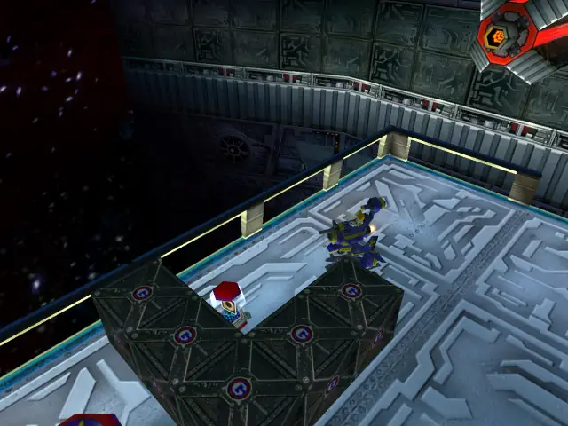

## item 12

## item 13

## item 14
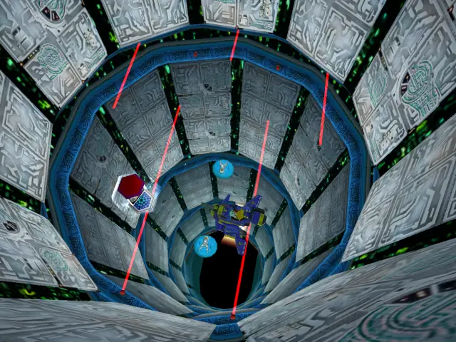

## life 1

## life 2

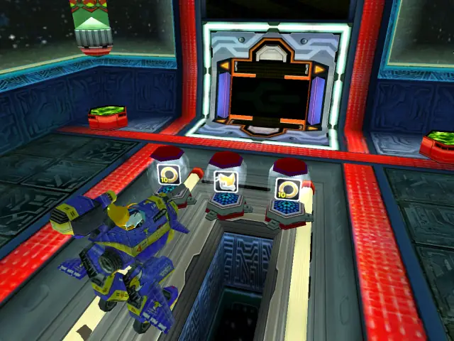

