
## omochao 1

## animal 1
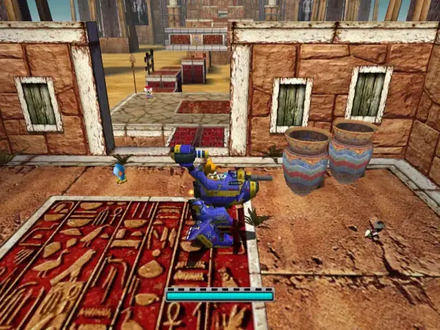

## animal 2

## omochao 2
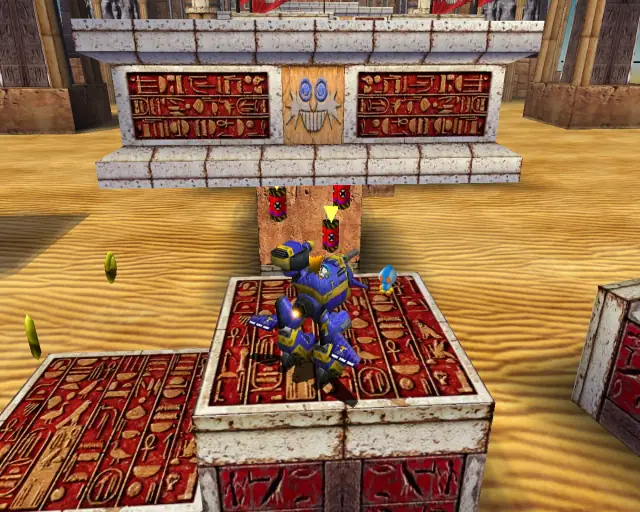

## omochao 3
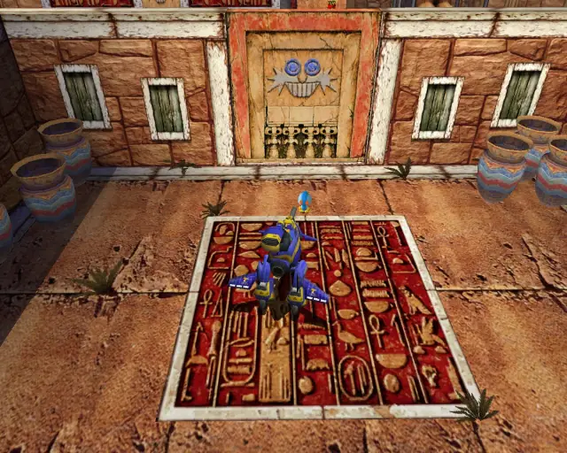

## animal 3
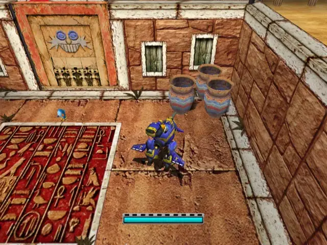
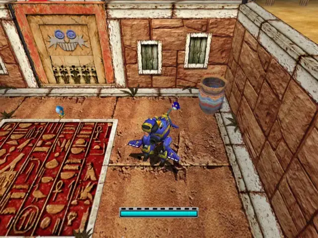

## animal 4
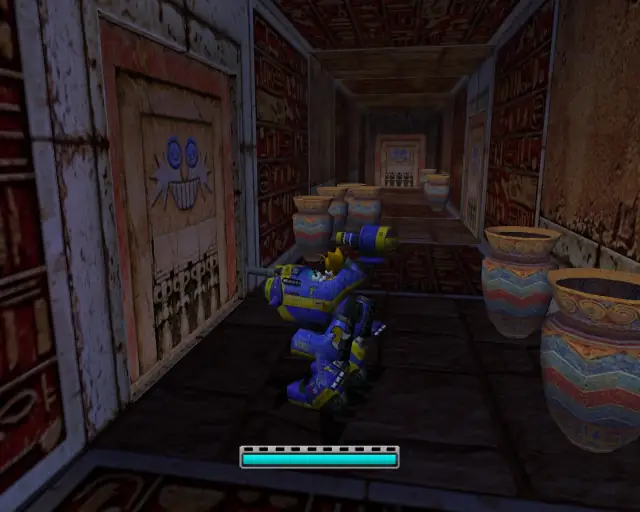

## animal 5
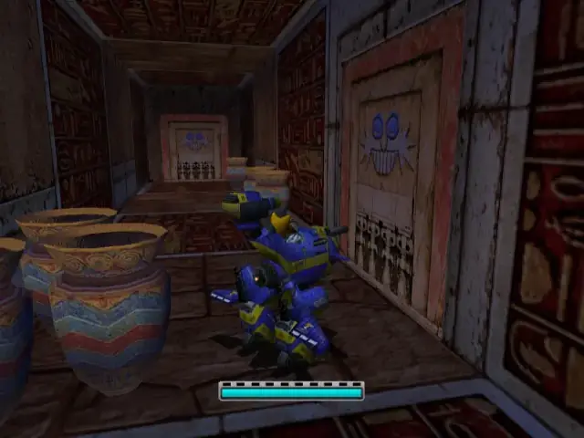

## pipe 1

## animal 6

## chaobox 1
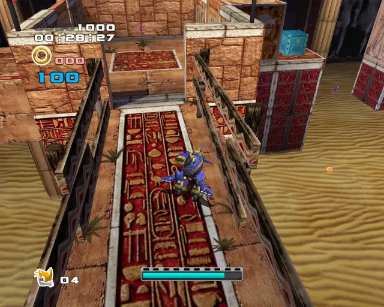
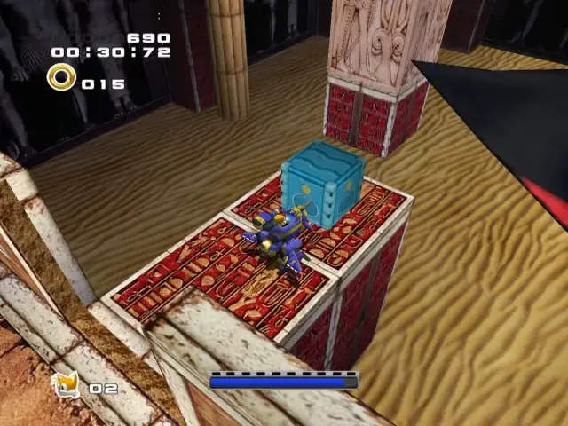

## goldbeetle 1

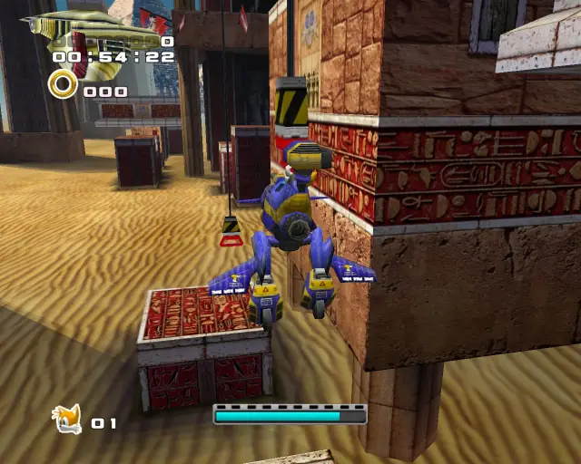

## animal 7
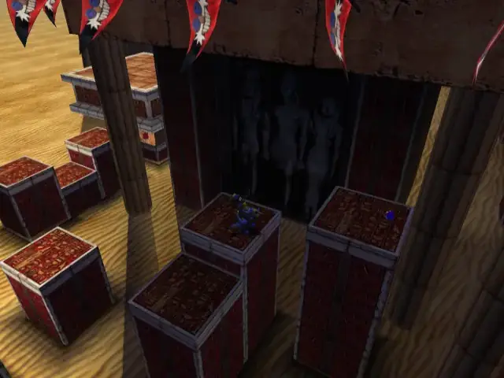

## animal 8
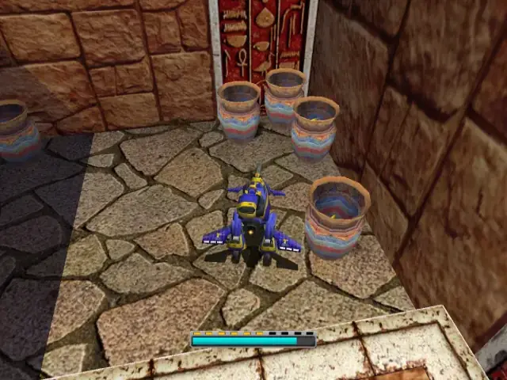
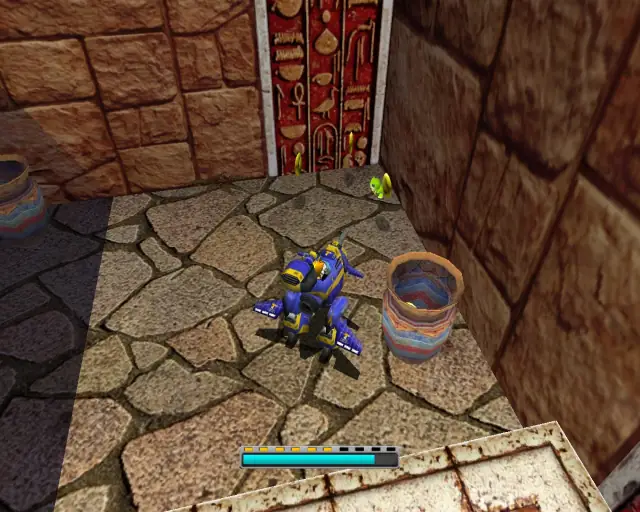

## pipe 2

## animal 9

## pipe 3
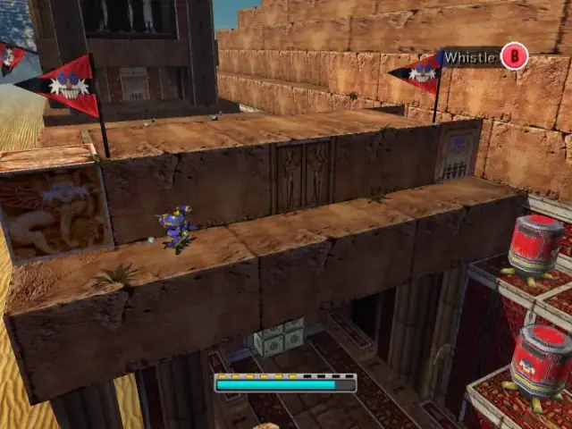

## animal 10

## chaobox 2
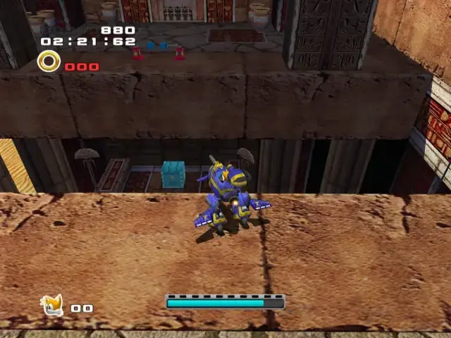
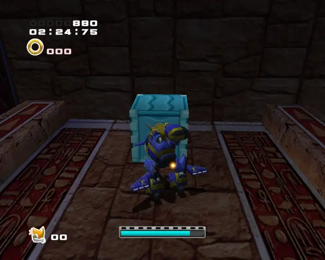

## pipe 4
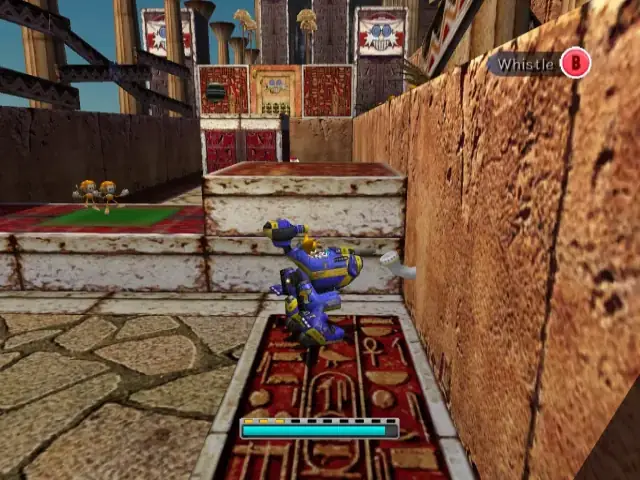

## animal 11

## pipe 5
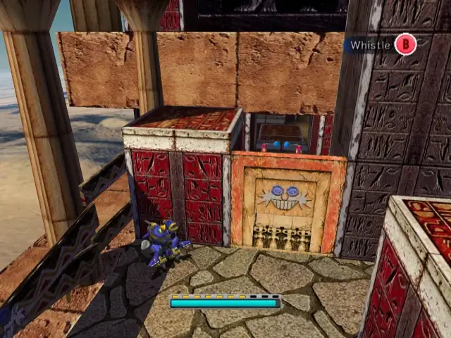

## animal 12

## animal 13

## animal 14
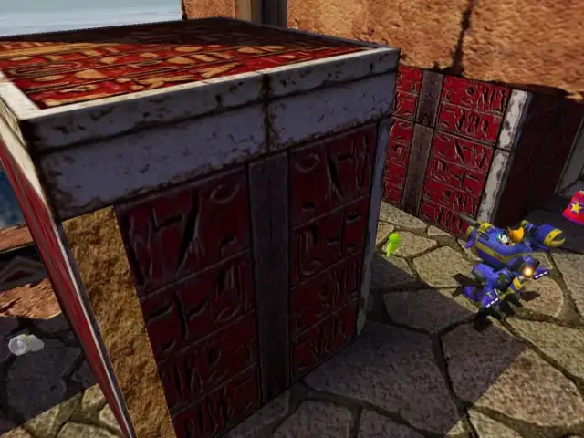

## omochao 4

## animal 15
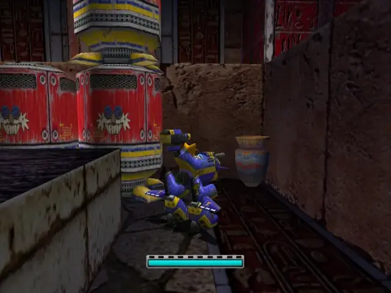

