
## omochao 1
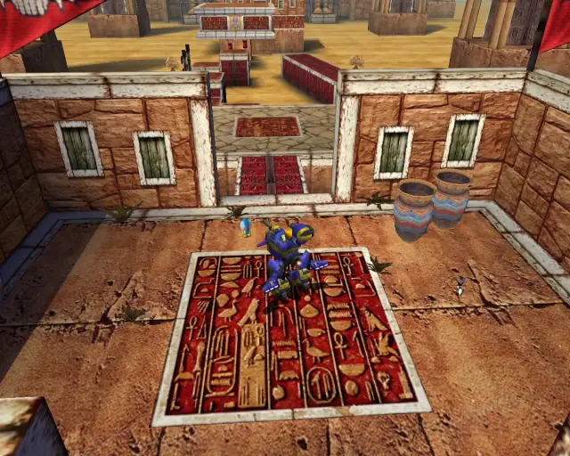

## animal 1

## animal 2
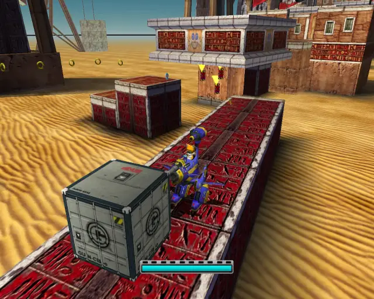
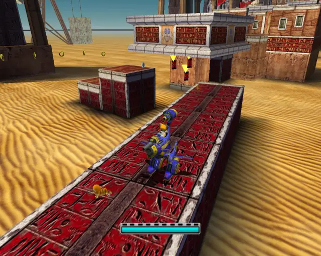

## omochao 2

## omochao 3
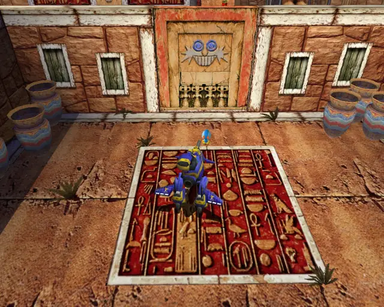

## animal 3

## animal 4
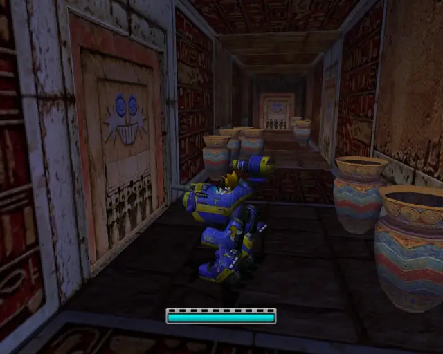
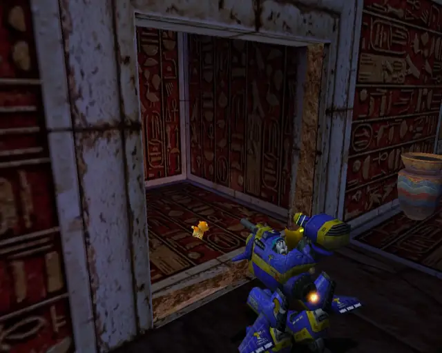

## animal 5
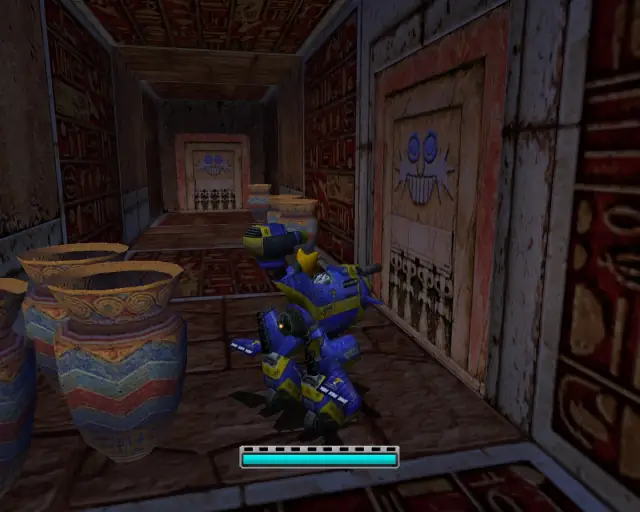
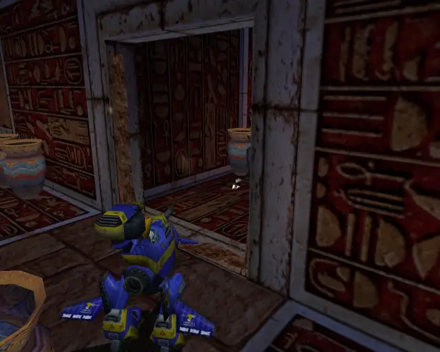

## pipe 1
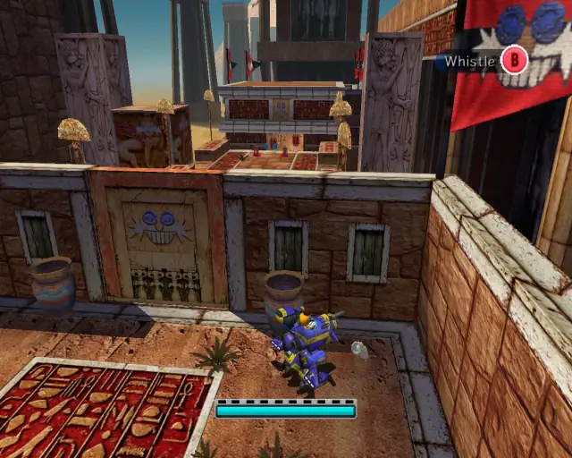
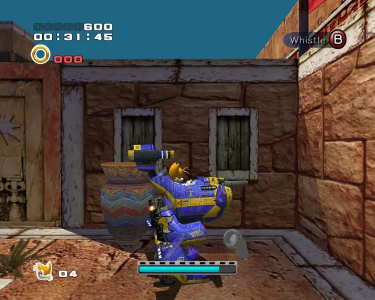

## animal 6

## chaobox 1

## goldbeetle 1
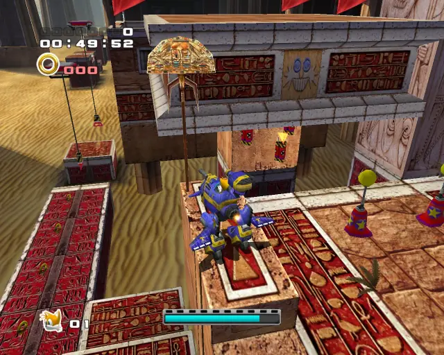

## animal 7

## animal 8

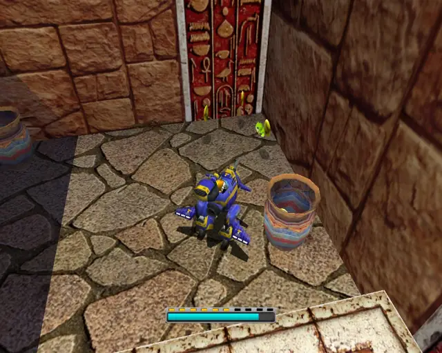

## pipe 2
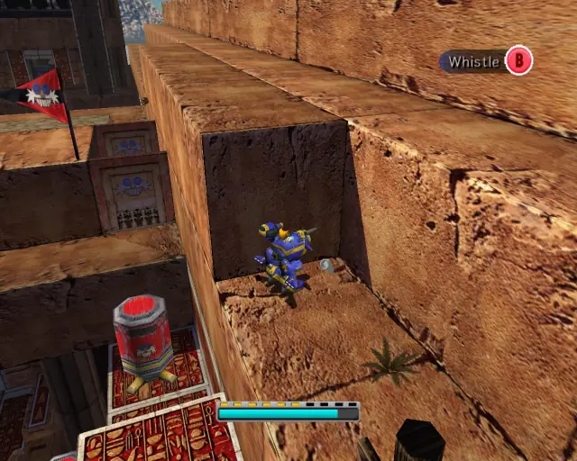
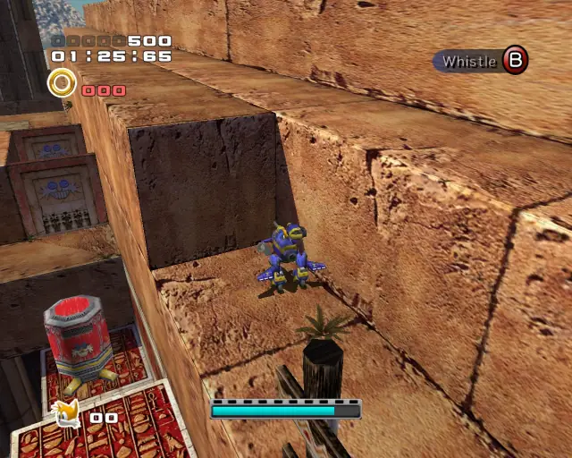

## animal 9

## pipe 3

## animal 10

## chaobox 2

## pipe 4

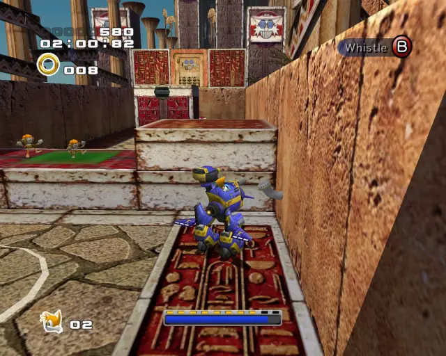

## animal 11

## pipe 5

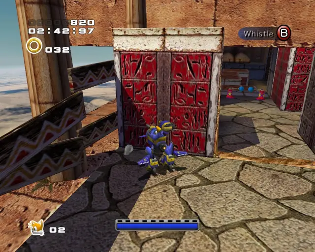

## animal 12

## animal 13
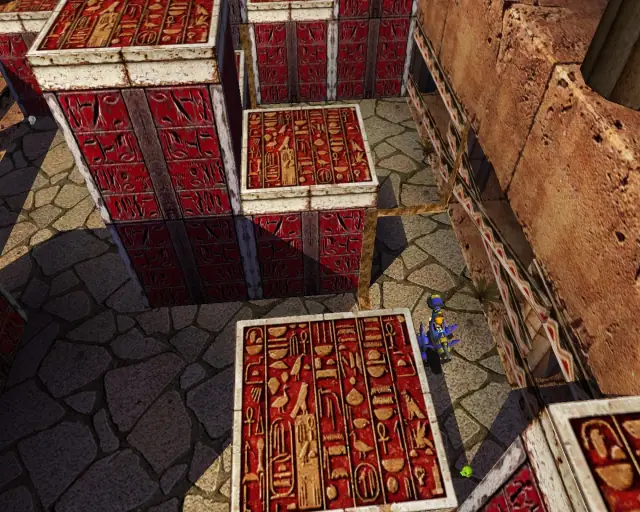

## animal 14

## omochao 4
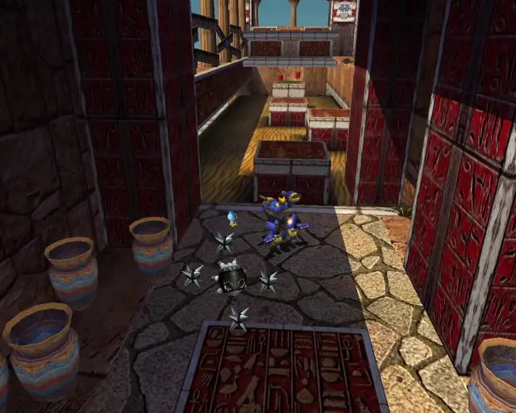

## animal 15

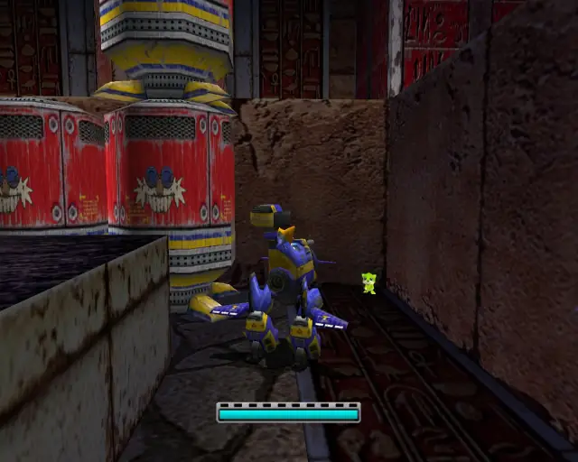

