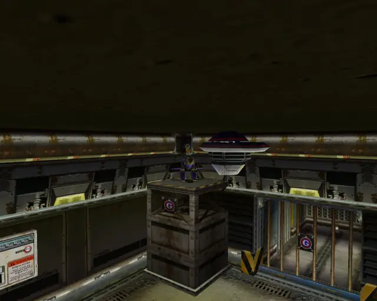
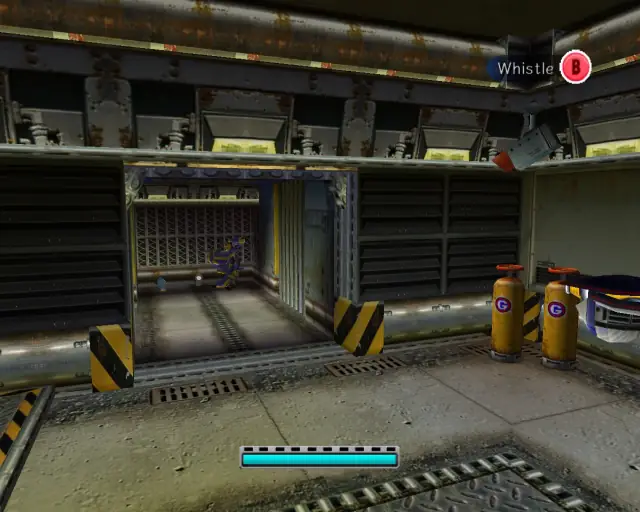
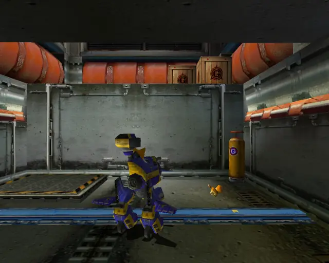
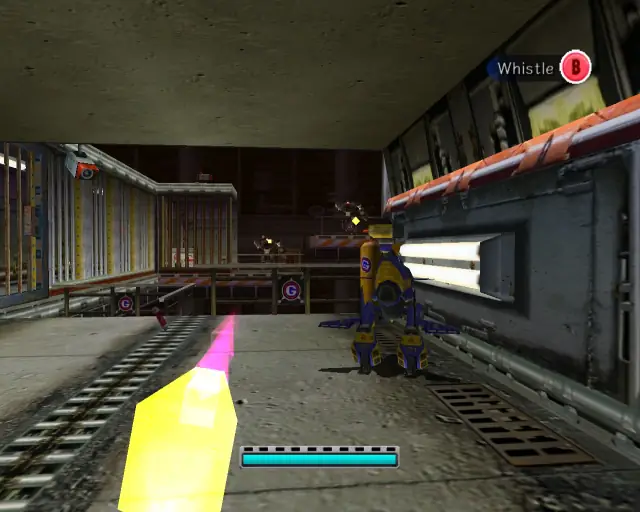
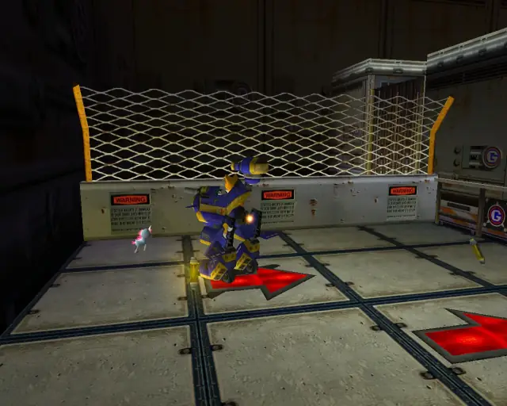
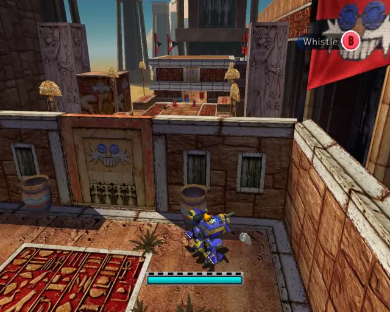
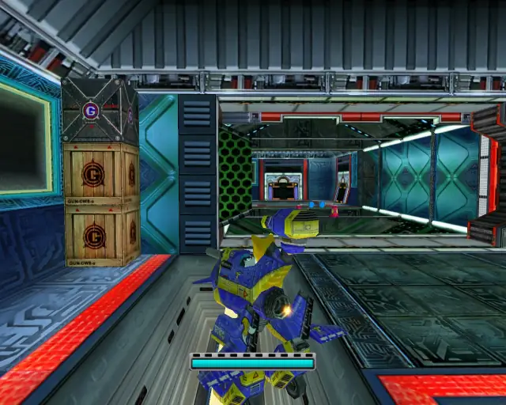

# Tails Stages (Animalsanity)

## Table of Contents:
1. [ Prison Lane ](#prison-lane)
1. [ Mission Street ](#mission-street)
1. [ Hidden Base ](#hidden-base)
1. [ Eternal Engine ](#eternal-engine)

# Prison Lane

## Prison Lane Animal 1

[Back to Top](#)

## Prison Lane Animal 2

[Back to Top](#)

## Prison Lane Animal 3

[Back to Top](#)

## Prison Lane Animal 4

[Back to Top](#)

## Prison Lane Animal 5

[Back to Top](#)

## Prison Lane Animal 6

[Back to Top](#)

## Prison Lane Animal 7

[Back to Top](#)

## Prison Lane Animal 8

[Back to Top](#)

## Prison Lane Animal 9

[Back to Top](#)

## Prison Lane Animal 10

[Back to Top](#)

## Prison Lane Animal 11

[Back to Top](#)

## Prison Lane Animal 12

[Back to Top](#)

## Prison Lane Animal 13

[Back to Top](#)

## Prison Lane Animal 14

[Back to Top](#)

## Prison Lane Animal 15

[Back to Top](#)

# Mission Street

## Mission Street Animal 1

[Back to Top](#)

## Mission Street Animal 2

[Back to Top](#)

## Mission Street Animal 3

[Back to Top](#)

## Mission Street Animal 4

[Back to Top](#)

## Mission Street Animal 5

[Back to Top](#)

## Mission Street Animal 6

[Back to Top](#)

## Mission Street Animal 7

[Back to Top](#)

## Mission Street Animal 8

[Back to Top](#)

## Mission Street Animal 9

[Back to Top](#)

## Mission Street Animal 10

[Back to Top](#)

## Mission Street Animal 11

[Back to Top](#)

## Mission Street Animal 12

[Back to Top](#)

## Mission Street Animal 13

[Back to Top](#)

## Mission Street Animal 14

[Back to Top](#)

## Mission Street Animal 15

[Back to Top](#)

## Mission Street Animal 16

[Back to Top](#)

# Hidden Base

## Hidden Base Animal 1

[Back to Top](#)

## Hidden Base Animal 2

[Back to Top](#)

## Hidden Base Animal 3

[Back to Top](#)

## Hidden Base Animal 4

[Back to Top](#)

## Hidden Base Animal 5

[Back to Top](#)

## Hidden Base Animal 6

[Back to Top](#)

## Hidden Base Animal 7

[Back to Top](#)

## Hidden Base Animal 8

[Back to Top](#)

## Hidden Base Animal 9

[Back to Top](#)

## Hidden Base Animal 10

[Back to Top](#)

## Hidden Base Animal 11

[Back to Top](#)

## Hidden Base Animal 12

[Back to Top](#)

## Hidden Base Animal 13

[Back to Top](#)

## Hidden Base Animal 14

[Back to Top](#)

## Hidden Base Animal 15

[Back to Top](#)

# Eternal Engine

## Eternal Engine Animal 1

[Back to Top](#)

## Eternal Engine Animal 2

[Back to Top](#)

## Eternal Engine Animal 3

[Back to Top](#)

## Eternal Engine Animal 4

[Back to Top](#)

## Eternal Engine Animal 5

[Back to Top](#)

## Eternal Engine Animal 6

[Back to Top](#)

## Eternal Engine Animal 7

[Back to Top](#)

## Eternal Engine Animal 8

[Back to Top](#)

## Eternal Engine Animal 9

[Back to Top](#)

## Eternal Engine Animal 10

[Back to Top](#)

## Eternal Engine Animal 11

[Back to Top](#)

## Eternal Engine Animal 12

[Back to Top](#)

## Eternal Engine Animal 13

[Back to Top](#)

## Eternal Engine Animal 14

[Back to Top](#)

## Eternal Engine Animal 15

[Back to Top](#)
