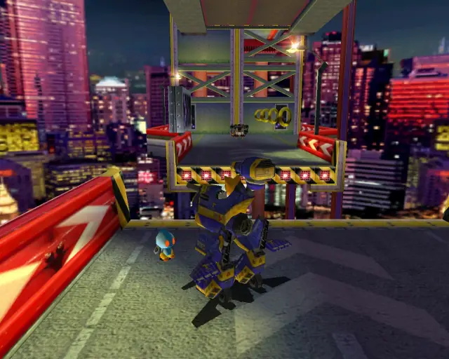
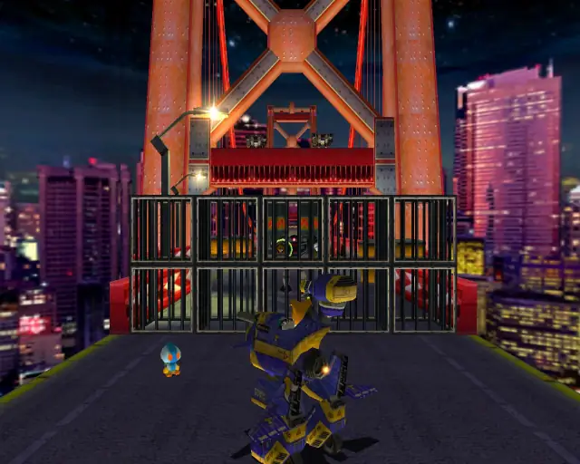
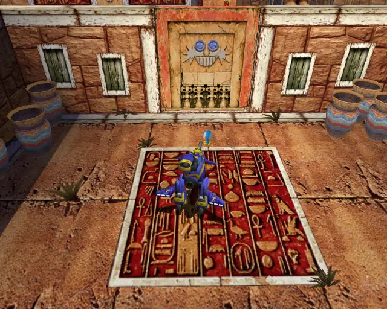
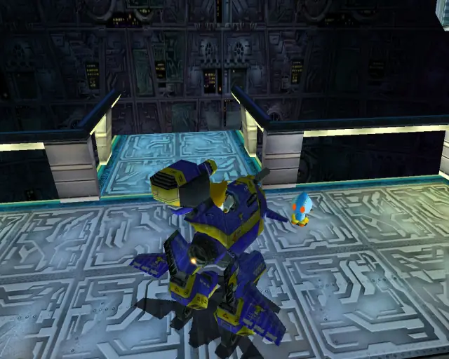
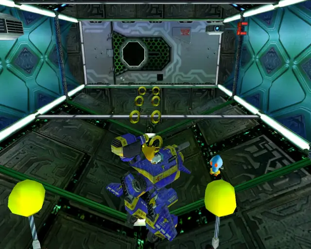
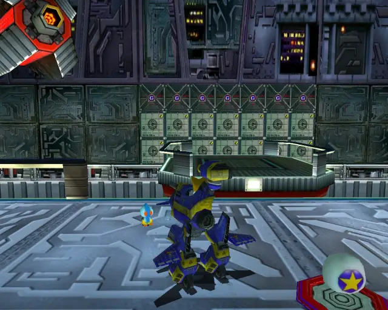
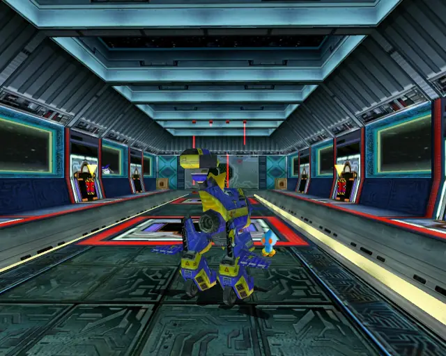
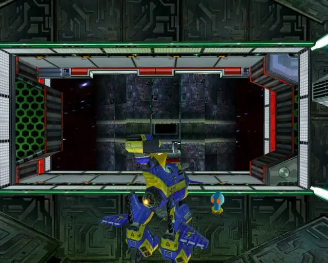

# Tails Stages (Chronological)

## Table of Contents:
1. [ Prison Lane ](#prison-lane)
1. [ Mission Street ](#mission-street)
1. [ Hidden Base ](#hidden-base)
1. [ Eternal Engine ](#eternal-engine)

# Prison Lane

## Prison Lane Omochao 1

[Back to Top](#)

## Prison Lane Omochao 2

[Back to Top](#)

## Prison Lane Pipe 1

[Back to Top](#)

## Prison Lane Chao Box 1

  

[Back to Top](#)

## Prison Lane Omochao 3

[Back to Top](#)

## Prison Lane Omochao 4

[Back to Top](#)

## Prison Lane Chao Box 2
  
  
  

[Back to Top](#)

## Prison Lane Omochao 5

[Back to Top](#)

## Prison Lane Omochao 6

[Back to Top](#)

## Prison Lane Omochao 7

[Back to Top](#)

## Prison Lane Chao Box 3
  

[Back to Top](#)

## Prison Lane Pipe 2

[Back to Top](#)

## Prison Lane Omochao 8

[Back to Top](#)

## Prison Lane Hidden 1

[Back to Top](#)

## Prison Lane Omochao 9

[Back to Top](#)

## Prison Lane Pipe 3

[Back to Top](#)

## Prison Lane Hidden 2

[Back to Top](#)

## Prison Lane Gold Beetle
  

[Back to Top](#)

## Prison Lane Hidden 3

[Back to Top](#)

## Prison Lane Omochao 10

[Back to Top](#)

# Mission Street

## Mission Street Hidden 1

[Back to Top](#)

## Mission Street Hidden 2

[Back to Top](#)

## Mission Street Omochao 1

[Back to Top](#)

## Mission Street Omochao 2

[Back to Top](#)

## Mission Street Chao Box 1

  

[Back to Top](#)

## Mission Street Pipe 1

[Back to Top](#)

## Mission Street Omochao 3

[Back to Top](#)

## Mission Street Chao Box 2
  
  

[Back to Top](#)

## Mission Street Gold Beetle
  

[Back to Top](#)

## Mission Street Omochao 4

[Back to Top](#)

## Mission Street Pipe 2

[Back to Top](#)

## Mission Street Chao Box 3
  

[Back to Top](#)

## Mission Street Omochao 5

[Back to Top](#)

## Mission Street Omochao 6

[Back to Top](#)

## Mission Street Pipe 3

[Back to Top](#)

## Mission Street Omochao 7

[Back to Top](#)

## Mission Street Hidden 3

[Back to Top](#)

## Mission Street Omochao 8

[Back to Top](#)

## Mission Street Hidden 4

[Back to Top](#)

# Hidden Base

## Hidden Base Omochao 1

[Back to Top](#)

## Hidden Base Omochao 2

[Back to Top](#)

## Hidden Base Omochao 3

[Back to Top](#)

## Hidden Base Pipe 1

[Back to Top](#)

## Hidden Base Chao Box 1

  

[Back to Top](#)

## Hidden Base Gold Beetle
  
  

[Back to Top](#)

## Hidden Base Pipe 2

[Back to Top](#)

## Hidden Base Pipe 3

[Back to Top](#)

## Hidden Base Chao Box 2
  
  

[Back to Top](#)

## Hidden Base Pipe 4

[Back to Top](#)

## Hidden Base Pipe 5

[Back to Top](#)

## Hidden Base Omochao 4

[Back to Top](#)

# Eternal Engine

## Eternal Engine Pipe 1

[Back to Top](#)

## Eternal Engine Pipe 2

[Back to Top](#)

## Eternal Engine Omochao 1

[Back to Top](#)

## Eternal Engine Omochao 2

[Back to Top](#)

## Eternal Engine Chao Box 1

  

[Back to Top](#)

## Eternal Engine Omochao 3

[Back to Top](#)

## Eternal Engine Omochao 4

[Back to Top](#)

## Eternal Engine Omochao 5

[Back to Top](#)

## Eternal Engine Chao Box 2
  
  

[Back to Top](#)

## Eternal Engine Chao Box 3
  
  
  

[Back to Top](#)

## Eternal Engine Pipe 3

[Back to Top](#)

## Eternal Engine Omochao 6

[Back to Top](#)

## Eternal Engine Omochao 7

[Back to Top](#)

## Eternal Engine Omochao 8

[Back to Top](#)

## Eternal Engine Omochao 9

[Back to Top](#)

## Eternal Engine Pipe 4

[Back to Top](#)

## Eternal Engine Omochao 10

[Back to Top](#)

## Eternal Engine Omochao 11

[Back to Top](#)

## Eternal Engine Gold Beetle
  

[Back to Top](#)

## Eternal Engine Omochao 12

[Back to Top](#)

## Eternal Engine Pipe 5

[Back to Top](#)
